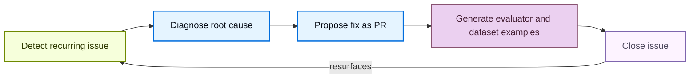

LangSmith Engine helps you ship more reliable agents without manually searching through traces. It is the LangSmith Agent for agent engineering: working from your production traces, it surfaces recurring issues, diagnoses their root cause, and drives the fix across every stage of the development lifecycle. For a product overview, see [Engine](/langsmith/engine-overview).

Each issue moves through a closed loop in which Engine:

1. Detects a recurring issue in your traces.
2. Diagnoses the root cause against your traces and connected source code.
3. Proposes a fix as a pull request.
4. Generates an evaluator and ground truth [dataset examples](/langsmith/manage-datasets) to catch regressions.
5. Reopens the issue automatically if it resurfaces after being closed.



This page covers how to set up Engine, work through the fix and evaluation loop, control costs, and route notifications.

## Set up Engine

Setting up Engine is a two-step process: an [Organization Admin](/langsmith/rbac#organization-admin) first enables Engine for the [workspace](/langsmith/administration-overview#workspaces), then any user can configure Engine for each tracing project.

### Enable Engine for your organization

<Note>You must be an [**Organization Admin**](/langsmith/rbac#organization-admin) to enable Engine. To find your admins, open **Settings**, select **Members** under **Access and Security**, and look for members with the **Organization Admin** role.</Note>

<Steps>
  <Step title="Open Engine enablement">
    In the [LangSmith console](https://smith.langchain.com?utm_source=docs&utm_medium=cta&utm_campaign=langsmith-signup&utm_content=langsmith-engine), click **Settings** in the bottom-left corner, then select **Engine enablement** under **Engine**.
  </Step>
  <Step title="Toggle Enable Engine">
    Toggle **Enable Engine** on and acknowledge the AI features terms of use. The dialog displays the following in-product notice verbatim:

    > LangSmith AI features, powered by LangChain-managed inference, bring intelligence to your observability workflow. With LangSmith AI enabled, your team can surface issues faster, run smarter evaluations, and build more reliable LLM applications. By enabling this feature, your organization's trace data will be processed using LangChain-managed LLM keys. Subject to our Terms of Service.
  </Step>
</Steps>

Once Engine is enabled, any team member in your organization can set it up for their tracing projects.

<Tip>
  If you want to turn off Engine, toggle the same setting to off. This will stop all automatic runs of Engine and discontinue future billing in your account.
</Tip>

### Understand LCU costs

Engine charges in **LangChain Compute Units (LCUs)**, a normalized unit of work combining compute, storage, memory, and LLM spend. LCU consumption scales with the number of traces analyzed, the number and complexity of the LLM calls Engine makes to diagnose and fix issues, and the size of any connected repository. LCUs cost **$1.50 USD each**. For an estimate of your expected LCU usage, see the [LangSmith Usage Calculator](https://www.langchain.com/pricing#pricing-calc).

Engine runs in two phases:

| Phase | Trigger | Typical LCU usage |
|---|---|---|
| **Initialization** | First time you enable Engine on a project | 30–40 LCUs |
| **Recurring scans** | Every 6 hours automatically | 10–15 LCUs |

On initialization, Engine audits past traces, clusters and prioritizes issues by severity, and proposes fixes to your prompts or code (if a repository is connected). Recurring scans run on the 6-hour schedule whether or not new issues are found, and surface new issues not previously detected.

### Set spend limits and monitor usage

Organization Admins can set spend limits at two levels:

- **Org-wide limit**: Open **Settings**, select **Engine enablement** under **Engine**, then enter a value under **Monthly LCU spend limit**.
- **Per-project limit**: Open the **Engine** tab in a tracing project, click the **Engine Settings** <Icon icon="settings"/> icon, and set a limit under **Monthly LCU spend limit**.

You can enter limits in LCU or USD (1 LCU = $1.50). When a limit is reached, LangSmith pauses new Engine runs until the limit is raised or the next monthly billing period begins.

Leave the limit blank to allow unlimited Engine spend. To stop Engine entirely, use the **Enable Engine** toggle in **Settings > Engine enablement**.

To monitor usage, you can view your organization's monthly LCU spend on the **Engine enablement** page in **Settings**, or view per-project spend in the [**Engine Settings**](#configure-engine) panel for each tracing project.

### Set up Engine for a tracing project

<Steps>
  <Step title="Open the Engine tab">
    In the [LangSmith console](https://smith.langchain.com?utm_source=docs&utm_medium=cta&utm_campaign=langsmith-signup&utm_content=langsmith-engine), navigate to **Tracing** in the UI sidebar, select a project, then click the **Engine** tab in the project navigation.
  </Step>
  <Step title="Connect a code repository (optional)">
    Although optional, connecting a code repository is recommended. Engine reads your source code to locate the code path behind a failing trace, ground its proposed fixes in the actual implementation, and open pull requests directly from issues. Under **Connect your agent's code repository**, select a repository in the **GitHub Repository** field. Only repositories the GitHub app can access are shown. Click **Manage app access →** to update permissions. To give Engine additional project context, select a repository in the **Context Hub repository** field. You can update either repository at any time from the [**Engine Settings**](#configure-engine) panel.
  </Step>
  <Step title="Select preference categories (optional)">
    Under **What matters most to you?**, select categories to prioritize for your review (for example, **Tool Call Failures** or **Latency**). Click **+ Add something specific** to describe a custom concern. You can update **Preferences** at any time from the [**Engine Settings**](#configure-engine) panel.
  </Step>
  <Step title="Focus on specific traces (optional)">
    Under **Focus on specific traces**, narrow Engine's attention to a subset of runs by run name or metadata. Leave it empty to analyze all traces. You can update the scope at any time from the [**Engine Settings**](#configure-engine) panel. For more information, see [Focus on specific traces](#focus-on-specific-traces).
  </Step>
  <Step title="Start analyzing">
    Click **Start Analyzing**. The dialog may show an estimated monthly cost range based on your project's usage. Engine can take up to 20 minutes to analyze your project’s traces and begin making suggestions. While you wait, you can [set up notifications](#get-notified-about-new-issues) in the settings panel to be alerted in Slack or via webhook when issues of different priority levels are found.
  </Step>
  <Step title="Review the agent overview document">
    Before surfacing issues, Engine generates an agent overview document describing your project's purpose, architecture, and key metrics based on your traces. Review and edit the document, then click **Accept & Continue** to proceed. If the overview is inaccurate, edit it before continuing, since Engine uses it as context for all analysis, so accuracy here affects the quality of detected issues. You can update it at any time from the [**Engine Settings**](#configure-engine) panel.
  </Step>
</Steps>

<Frame caption="Setup dialog">
  
  
</Frame>

### Focus on specific traces

Focus Engine on the traces that matter to keep analysis precise and reduce wasted LCU spend. Use trace scope (the **Focus on specific traces** control) when a project mixes several agents or workloads and you want Engine to analyze only some of them. For example, if a project runs both a production chatbot and a nightly batch job, scope to `Run Name is chatbot` so Engine ignores the batch runs. By default, Engine analyzes all of a project's traces.

Set the scope in either of two places, using the same control:

- **Engine setup**: In the **Find and fix your agent's issues** panel, under **Focus on specific traces**.
- **Engine Settings**: In the **Focus on specific traces** section of the [**Engine Settings**](#configure-engine) panel. Edits here save automatically.

Add scope conditions with the same [filter editor](/langsmith/filter-traces-in-application#create-and-apply-filters) used on the tracing project's **Tracing** tab. You can add one condition of each kind, **up to two**:

- **Run Name**: Pick a run or agent name. The value field autocompletes from the run names in your project's recent traces.
- **Metadata**: Pick a metadata key, then a value. Both autocomplete from the metadata present on your project's recent runs.

To add a condition, choose its kind from the field selector, fill in the values, then click **Add**. Each condition appears as a chip, for example `Run Name is chatbot` or `env is prod`. Click the **×** on a chip to remove that condition.

Scope determines which traces Engine analyzes to detect issues and build the agent overview document. Scope set during initial setup applies to Engine's first scan. Scope changed later in the [**Engine Settings**](#configure-engine) panel does not re-run Engine immediately; it applies on the next scan, which runs every 6 hours.

## Browse and filter issues

Once setup is complete, the **Engine** tab displays a list of automatically detected issues in the left panel. Each entry shows a title, a short description, the number of contributing traces, and how recently the issue was observed. Each issue is tagged with a failure category, such as **Silent tool error** or **Hallucination**. For the full list of categories Engine assigns, with descriptions and detection methods, see [Engine issue categories](/langsmith/engine-issue-categories).

At the top of the list, you can click:

- **Filter issues** icon to filter by **Priority**, **Status** and **Tags**.
- **Sort issues** icon to sort by **Severity**, **Last Updated**, and **Created**.
- **Engine Settings** <Icon icon="settings"/> icon to [configure Engine](#configure-engine).

Click any issue to display its details in the right panel.

If no issues appear after setup completes, Engine found no recurring patterns in the analyzed traces. Try checking back after more traces have been collected.

## Review an issue

Click any issue in the list to open its detail panel. At the top, a diagnosis describes the problem and its impact.

The **Linked Traces** section lists the traces that support the diagnosis. Click any trace to open its detail panel. For more information, see [Manage a trace](/langsmith/manage-trace). Click [**Add offline examples**](#add-offline-examples) at the top right of this section to generate custom ground truth [dataset examples](/langsmith/manage-datasets) from the production trace inputs for offline evaluation.

The **Proposed Fix** section describes the issue and suggests how to address it, which may include specific code or prompt changes if a repository is connected.

The **Offline Examples** section proposes dataset examples generated from the production trace inputs that triggered the issue, for use in offline evaluation.

## Take action on an issue

Each issue has a toolbar for acting on it: fix it, watch it, or close it (resolve or mark as incorrectly flagged), and set its priority.

### Change priority

Select **Low**, **Medium**, or **High** from the priority dropdown to update an issue's priority. You can optionally provide a reason, which feeds back into Engine to help improve its analysis over time.

### Fix: work through the proposed fix

Click **Fix** to start working through the proposed fix. Fixing an issue has two steps, so the fix is both shipped and testable:

1. [**Apply the code change**](#open-a-pull-request): Open a pull request with the proposed fix.
2. [**Add offline examples**](#add-offline-examples): Capture the traces that surfaced the issue as evaluation examples.

When you are done, you can mark the issue resolved directly from here, a shortcut for [resolving from Close](#close-or-reopen-an-issue). To abandon the fix without resolving the issue, discard it. Discarding also stops watching the issue if it was being watched.

<Note>
Fixing is only available for open issues: [reopen](#close-or-reopen-an-issue) a resolved or incorrectly flagged issue first.
</Note>

#### Open a pull request

Applying the fix means opening a GitHub pull request with the proposed code change in your connected repository. Connect a repository first if you haven't. Once a pull request exists, Engine links directly to it (with its branch), and reflects the PR's status (open, merged, or closed) throughout the issue. You can also copy the issue's fix context to your clipboard for use with an LLM or coding assistant. Engine closes the loop across the LangChain stack: it can propose code changes to any connected repository, including agents built with [Deep Agents](/oss/python/deepagents/overview), [LangChain](/oss/python/langchain/overview), and [LangGraph](/oss/python/langgraph/overview).

#### Add offline examples

This step captures the traces that surfaced the issue as ground-truth [dataset examples](/langsmith/manage-datasets), so you can evaluate the fix offline before it reaches production. You can also start this from the **Linked Traces** section further down the page.

1. Click **Add offline examples** at the top right of the **Linked Traces** list to open the **Add as offline example** dialog.
2. Review each trace. The dialog shows the input, the wrong output the agent produced, and the proposed expected output as a custom ground truth example.
3. Click **Add to Dataset** to add them directly, or click **Edit in annotation queue** to review them first.
4. In the annotation queue, each example shows the run inputs alongside reference outputs proposed by Engine, structured as named [assertions](/langsmith/assertions) generated from trace analysis. Each assertion is a short claim describing what a correct answer should or shouldn't include. Edit the assertions as needed, add new ones with **+ Add assertion**, then click **Add to Dataset & Continue** to work through each example.

For more information, refer to [Manage datasets](/langsmith/manage-datasets), [Use annotation queues](/langsmith/annotation-queues), and [Use assertions](/langsmith/assertions).

### Watch: keep an eye on an issue

Watching keeps an issue open for monitoring without resolving it or marking it as incorrectly flagged. Click **Watch** when you are not ready to fix an issue but still want to know if it keeps happening.

To be alerted when a watched issue recurs, click **Alert me via Slack**, which opens the **Notifications** section of the [Engine Settings](#configure-engine) panel.

When new traces link to a watched issue, Engine moves it to the top of your list and shows how many new traces arrived, so you can pick up the fix or keep watching.

<Note>
Watching is only available for open issues without a pull request in flight: discard the fix to watch an issue again. Resolving a watched issue, or marking it as incorrectly flagged, automatically stops watching it.
</Note>

### Close or reopen an issue

Closing records the outcome of your review. Click:

- **Close** to mark the issue as resolved.
- **Incorrectly Flagged** to dismiss the issue as not real or not worth fixing.

For either outcome, you can optionally provide a reason, which feeds back into Engine's analysis.

You can reopen a closed issue at any time. Click **Reopen** to clear any fix in progress and stop watching the issue if it was being watched. Engine also reopens an issue automatically when it detects the same problem recurring in a later trace.

## List issues via the CLI

You can list issues programmatically using the [LangSmith CLI](/langsmith/cli).

```bash
# List issues for a project
langsmith project issues list --project <project-name>
```

## Get notified about new issues

Engine can notify you when it opens a new issue, links a new trace to an existing issue, or fails to complete a run. Deliver these notifications to a **Slack channel**, an **HTTP webhook endpoint**, or both. Each destination has its own event types and minimum priority level, so you can route urgent issues to a paging webhook while sending every issue to a Slack channel.

Manage notification destinations from the [**Engine Settings**](#configure-engine) panel: open the **Engine** tab for a tracing project, click the **Engine Settings** <Icon icon="settings"/> icon, and under **Notifications** click **+ Add destination**.

### Notify a Slack channel

<Steps>
  <Step title="Connect a Slack workspace">
    Connecting a Slack workspace is an organization-level action you perform once, not per project. Connecting or disconnecting a workspace requires the `organization:manage` permission. In the [LangSmith console](https://smith.langchain.com?utm_source=docs&utm_medium=cta&utm_campaign=langsmith-signup&utm_content=langsmith-engine), open **Settings**, go to your organization's **General** settings, and under **Slack** click **Connect Slack**. Authorize the LangSmith app in Slack. You can connect more than one Slack workspace to an organization.
  </Step>
  <Step title="Add a Slack destination">
    On the **Engine** tab of a tracing project, click the **Engine Settings** <Icon icon="settings"/> icon, then click **Add destination**. Set the **Deliver to** field to **Slack**, then choose the workspace and channel under **Channel**.
  </Step>
  <Step title="Choose events and priority">
    Under **Notify when**, select which [event types](/langsmith/engine-webhooks#event-types) post a message to the channel. Under **Minimum priority**, choose the lowest [severity](/langsmith/engine-webhooks#severity-filtering) that triggers a notification. Click **Add destination** to save.
  </Step>
</Steps>

LangSmith automatically joins the public channel you select. To post to a private channel, invite the LangSmith app to that channel in Slack first.

Each Slack message includes the issue title, description, and severity, a **View issue** link back to LangSmith, and (for issue events) a chart of the issue's recurrence over time. If a workspace's connection becomes invalid, for example, the app is removed from Slack, its destinations stop delivering until you reconnect it from your organization's **General** settings.

### Send to a webhook

To forward Engine events to your own incident-management, paging, or chat tooling, add a destination and set the **Deliver to** field to **Webhook**. Enter a URL and, optionally, custom headers. Webhook deliveries are signed so you can verify their authenticity. For the full event payload reference, signing-secret verification, and delivery semantics, see [Engine webhook events](/langsmith/engine-webhooks).

## Configure Engine

<Note>
Engine uses **LangChain-managed inference** exclusively. Bring Your Own Key (BYOK) is not supported; you cannot supply your own provider API keys for Engine.
</Note>

Within a tracing project, click the **Engine Settings** <Icon icon="settings"/> icon on the **Engine** tab to open the **Edit Engine Settings** panel. From here you can configure:

- **Agent overview**: Edit your agent overview document to keep Engine's understanding of your project accurate as your application evolves.
- **Preferences**: Areas Engine should focus on, prioritize, or ignore. Engine treats these as authoritative and folds them into the agent overview document on the next scan. Select category chips such as **Cost & Tokens**, **Latency**, or **Tool Call Failures**, or click **+ Add something specific** to describe a custom concern. Changes take effect on the next scan.
- **Engine spend**: View the month-to-date Engine LCU spend for this project. Click **Set limit** to cap monthly spend. New runs pause when the monthly limit is reached.
- **Focus on specific traces**: Narrow Engine's attention to a subset of runs by run name or metadata. Edits save automatically and take effect on the next scan. See [Focus on specific traces](#focus-on-specific-traces).
- **Notifications**: Click **Add destination** to add a Slack channel or webhook destination that receives a notification when Engine detects a new issue. Set a minimum priority level per destination to control which issues trigger a notification. See [Get notified about new issues](#get-notified-about-new-issues).
- **Code repository**: Connect or update a GitHub repository so the agent can reference source code when diagnosing issues. Optionally set a **Subfolder** and a **Branch** (defaults to the repository default).
- **Context repository**: Connect a Context Hub repository so Engine can propose fixes to instructions, docs, and linked skills.
- **Pause**: Engine scans your traces every 6 hours by default. Click **Pause** to stop scanning without deleting the existing issues, or **Resume** to resume scanning.
- **Delete all issues**: This action cannot be undone. All issues and settings will be permanently removed.

## See also

- [Engine](/langsmith/engine-overview): Product overview and where Engine fits in the development lifecycle.
- [Engine issue categories](/langsmith/engine-issue-categories): Reference for the failure categories Engine assigns to detected issues.
- [Engine webhook events](/langsmith/engine-webhooks): Event payload reference, signing-secret verification, and delivery semantics.
- [Engine on self-hosted](/langsmith/engine-self-hosted): Self-hosted architecture and data handling.
- [Manage datasets](/langsmith/manage-datasets), [Use annotation queues](/langsmith/annotation-queues), and [Use assertions](/langsmith/assertions): Work with the offline examples Engine generates.
- [LangSmith CLI](/langsmith/cli): List and manage issues programmatically.

---

<div className="source-links">
<Callout icon="terminal-2">
    [Connect these docs](/use-these-docs) to Claude, VSCode, and more via MCP for real-time answers.
</Callout>
<Callout icon="edit">
    [Edit this page on GitHub](https://github.com/langchain-ai/docs/edit/main/src/langsmith/engine.mdx) or [file an issue](https://github.com/langchain-ai/docs/issues/new/choose).
</Callout>
</div>
