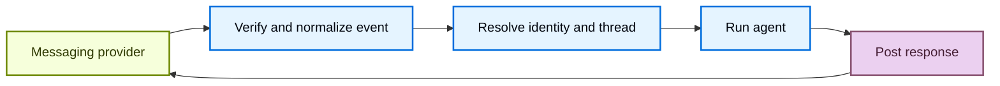

import ManagedDeepAgentsPrivateBetaNote from '/snippets/python/langsmith/managed-deep-agents-private-beta-note.mdx';

A channel connects a Managed Deep Agent to an external messaging service. Messages from the service can start agent runs, and the agent can respond through the same service without a separate application server.

<ManagedDeepAgentsPrivateBetaNote />

## Project structure

Channel declarations live in the project-level `channels/` directory, with one channel per file:

```text
my-agent/
  agent.py
  channels/
    support.py
```


## Understand channels

A channel combines three parts of an external messaging integration:

- **Inbound events**: Verify and normalize provider events, then start an agent run.
- **Outbound messaging**: Send the agent's response back to the originating conversation.
- **Deployment requirements**: Declare the secrets and provider configuration that the deployment needs.

In Managed Deep Agents, a channel connects a deployed agent to a messaging provider.

The managed runtime handles the channel lifecycle:



Provider adapters determine which events are accepted, how provider conversations map to Managed Deep Agents threads, and how responses are delivered. The channel declaration exposes the supported configuration for that provider.

## Declare channels in a project

Put each channel in a separate module under `channels/`.

Export a module-level `channel` from each file.


The file name becomes the configured channel name. It identifies the channel at runtime and forms part of its inbound route.

For example, a declaration in `channels/support.py` receives events at:


```text
POST /channels/support/events
```

Do not name a declaration `channels/channel.py`.


Channel names must be unique within a project.

The provider factory creates the declaration.

For example, `channels.slack()` creates a Slack channel.


See the provider guide for its complete declaration and setup procedure.

## Access the originating channel at runtime

Channel-originated runs expose `runtime.channel` to tools and middleware.


It contains the normalized event and conversation address, plus methods for posting and updating messages.

Ordinary HTTP runs and scheduled runs do not have an originating channel, so `runtime.channel` is absent for those runs.


By default, the managed runner posts the agent's final response to the originating conversation. Provider guides describe how to customize that behavior and send intermediate messages.

Scheduled runs can deliver results through a named channel even though they do not originate from one. See [Schedules](/langsmith/python/managed-deep-agents-schedules#deliver-results-to-slack).

## Distinguish channels from connectors

A channel receives messages that start agent runs and delivers responses. An [MCP connector](/langsmith/python/managed-deep-agents-mcp-connectors) gives the agent tools from a remote MCP server. A project can use either or both.

## Supported channels

<CardGroup cols={2}>
  <Card title="Slack" icon="brand-slack" href="/langsmith/python/managed-deep-agents-channels-slack">
    Start runs from Slack mentions, direct messages, and thread replies.
  </Card>
</CardGroup>

## See also

- [Identity](/langsmith/python/managed-deep-agents-identity): authenticate callers and scope channel runs to the resolved user.
- [Schedules](/langsmith/python/managed-deep-agents-schedules): deliver scheduled results through a configured channel.
- [Deploy an agent](/langsmith/python/managed-deep-agents-deploy): deploy project changes and configure secrets.
- [CLI reference](/langsmith/python/managed-deep-agents-cli): review channel project-file conventions.

---

<div className="source-links">
<Callout icon="terminal-2">
    [Connect these docs](/use-these-docs) to Claude, VSCode, and more via MCP for real-time answers.
</Callout>
<Callout icon="edit">
    [Edit this page on GitHub](https://github.com/langchain-ai/docs/edit/main/src/langsmith/managed-deep-agents-channels.mdx) or [file an issue](https://github.com/langchain-ai/docs/issues/new/choose).
</Callout>
</div>
