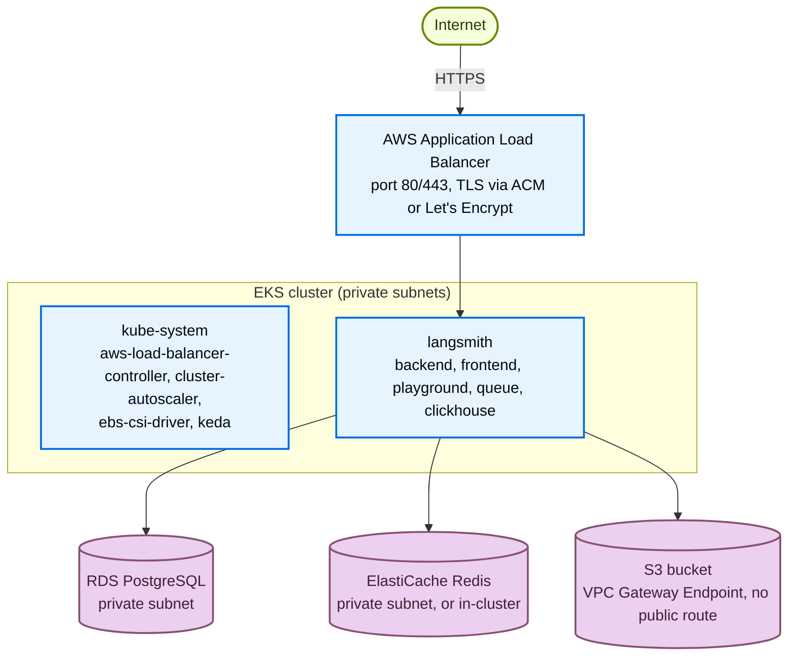
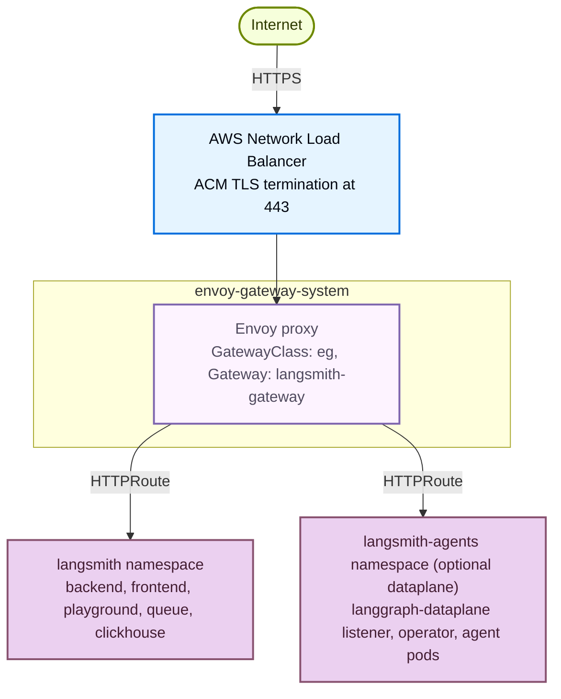

Understand what the [AWS Terraform modules](https://github.com/langchain-ai/terraform/tree/main/modules/aws) provision and how the pieces fit together, so you can size, secure, and customize your LangSmith deployment before running `make apply`.

Use this page as a reference while planning a rollout or troubleshooting an existing one. It covers:

- Platform layers and application core services.
- AWS managed services, IRSA roles, and cluster infrastructure.
- Network topology, ingress options, and TLS/DNS strategies.
- LangSmith Deployment add-on.
- Module dependency graph and opt-in security modules.

If you are ready to install, start with the [deployment walkthrough](/langsmith/self-host-terraform-aws-deploy).

## Platform layers

LangSmith on AWS deploys in two stages with one optional add-on. The infrastructure stage provisions the cloud foundation. The application stage installs the LangSmith Helm chart. The LangSmith Deployment add-on is opt-in and adds the host-backend, listener, and operator services for managing LangGraph applications from the UI.


| Stage | Layer | What it adds |
|---|---|---|
| Infrastructure | AWS infrastructure | VPC + private/public subnets + single NAT gateway, EKS cluster + managed node group + cluster autoscaler, RDS PostgreSQL, ElastiCache Redis, S3 bucket + VPC Gateway Endpoint, ALB controller + EBS CSI driver + metrics server, k8s-bootstrap (KEDA, ESO, optional Envoy Gateway). Optional: Network Firewall, WAF, CloudTrail, ALB access logs. |
| Application | LangSmith application | backend, frontend, playground, queue, ace-backend, clickhouse. Storage: RDS PostgreSQL (metadata) + S3 (trace blobs via VPC endpoint). Ingress: ALB, NGINX, Envoy Gateway, or Istio. |
| Add-on (`enable_deployments = true`) | LangSmith Deployment | host-backend, listener, operator. Per deployed graph: api-server, queue, redis, postgres (operator-managed). Requires KEDA (installed alongside infrastructure via k8s-bootstrap). |

## Component to storage mapping

| Component | Storage backend | Access method |
|---|---|---|
| `backend` | RDS PostgreSQL | Private subnet, security group |
| `backend` | S3 bucket | IRSA + VPC Gateway Endpoint |
| `clickhouse` | EBS volume (GP3, EKS PVC) | Local |
| `redis` | ElastiCache or in-cluster | Private subnet, security group |
| LGP operator | RDS PostgreSQL (shared) | Private subnet, security group |

## Application core services

These pods run on every deployment. All write logs and metrics; the busier components (backend, queue, ingest-queue) scale horizontally.

| Service | Purpose | Port | HPA | IRSA | Depends on |
|---|---|---|---|---|---|
| `langsmith-frontend` | React UI | 3000 | 1 to 10 | No | `backend`, `platform-backend` |
| `langsmith-backend` | Main API (traces, runs, projects, API keys, feedback) | 1984 | 3 to 10 | Yes (S3) | Postgres, Redis, ClickHouse, S3 |
| `langsmith-platform-backend` | Org and user management, auth, billing, settings | 1986 | 1 to 10 | Yes (S3) | Postgres, Redis, S3 |
| `langsmith-playground` | LLM prompt playground UI | 3001 | 1 to 10 | No | `backend` |
| `langsmith-queue` | Trace ingestion worker (Redis to ClickHouse + S3) | — | 3 to 10 + KEDA | Yes | Redis, ClickHouse, S3 |
| `langsmith-ingest-queue` | Dedicated high-throughput ingestion worker | — | 3 to 10 + KEDA | Yes | Redis, S3 |
| `langsmith-ace-backend` | Async compute (dataset runs, evaluations, background jobs) | — | 1 to 5 | No | Postgres, Redis |
| `langsmith-clickhouse` | Columnar store (trace spans, run metadata, eval results) | — | StatefulSet, single replica | No | EBS GP3 PVC |

<Warning>
In-cluster ClickHouse is dev/POC only (single pod, no replication, no backups). For production use [LangChain Managed ClickHouse](/langsmith/langsmith-managed-clickhouse) or a self-managed external cluster.
</Warning>

<Note>
[SmithDB](https://www.langchain.com/blog/introducing-smithdb?utm_source=docs) is LangSmith's purpose-built observability backend, available for Self-hosted starting with self-hosted version 0.16.0 (see [self-hosted support](/langsmith/smithdb-sdk-migration#about-self-hosted)). These Terraform modules provision ClickHouse, so the guidance in the previous sections applies to current deployments.
</Note>

### One-time jobs

The Helm chart runs three jobs at install and upgrade time:

| Job | Purpose |
|---|---|
| `langsmith-backend-migrations` | PostgreSQL schema migrations |
| `langsmith-backend-ch-migrations` | ClickHouse schema migrations |
| `langsmith-backend-auth-bootstrap` | Creates the initial org and admin account from `initial_org_admin_password` in `langsmith-config` |

## LangSmith Deployment add-on

When `enable_deployments = true`, three additional services are installed and a `LangGraphPlatform` CRD is registered. Each deployment the user creates in the LangSmith UI produces a Kubernetes Deployment in the `langsmith` namespace, managed by the operator.

| Service | Purpose |
|---|---|
| `langsmith-host-backend` | LangGraph control plane API. Manages deployment lifecycle, serves deployment metadata. IRSA for S3 access. |
| `langsmith-listener` | Watches host-backend for deployment state changes, creates and updates `LangGraphPlatform` CRDs. IRSA for S3 access. |
| `langsmith-operator` | Kubernetes operator. Reconciles `LangGraphPlatform` CRDs, creates and deletes Deployments and Services for each agent. |

## AWS managed services

When `postgres_source = "external"` and `redis_source = "external"` (the recommended production setting), Terraform provisions the following AWS managed services:

### RDS PostgreSQL

- Default size: `db.t3.large`, private subnets, port 5432.
- Holds orgs, users, projects, API keys, settings.
- Secret flow: SSM `/langsmith/{base_name}/postgres-password` → ESO → `langsmith-config`.

### ElastiCache Redis

- Default size: `cache.m6g.xlarge`, private subnets, TLS port 6379.
- Trace ingestion queue, pub/sub, short-lived cache.
- Secret flow: SSM `/langsmith/{base_name}/redis-auth-token` → ESO → `langsmith-config`.

### S3 bucket

- Trace payloads: large inputs and outputs, attachments.
- IRSA via `langsmith_irsa_role` (no static keys). VPC Gateway Endpoint, no public internet.
- Prefixes: `ttl_s/` (short TTL) and `ttl_l/` (long TTL).
- The S3 bucket is always required, regardless of tier. Disabling blob storage breaks the cluster on large payloads.

### SSM Parameter Store

- Centralized secret store for all LangSmith secrets.
- Flow: `source infra/scripts/setup-env.sh` writes secrets to SSM. The ESO `ClusterSecretStore` reads them and projects a `langsmith-config` Kubernetes Secret that the Helm chart mounts via `config.existingSecretName`.
- Prefix: `/langsmith/{name_prefix}-{environment}/`.

## Cluster infrastructure

Two Terraform modules install the cluster-level services LangSmith depends on. The `eks` module installs the AWS-integration controllers through `eks-blueprints-addons`; the `k8s-bootstrap` module installs the workload dependencies and the optional ingress gateways (see [Ingress options](#ingress-options)):

| Service | Installed by | Namespace | IRSA | Purpose |
|---|---|---|---|---|
| `aws-load-balancer-controller` | `eks` | `kube-system` | Yes | Provisions the AWS ALB from Kubernetes Ingress objects. Deleting the Ingress deprovisions the ALB and assigns a new DNS name on recreate, which breaks DNS records and OIDC redirect URIs. |
| `cluster-autoscaler` | `eks` | `kube-system` | Yes | Scales EC2 node groups based on pod scheduling pressure. |
| `ebs-csi-driver` | `eks` | `kube-system` | Yes | Provisions EBS volumes for PersistentVolumeClaims (used by ClickHouse). |
| KEDA | `k8s-bootstrap` | `keda` | No | Kubernetes Event-driven Autoscaling. Scales `queue` and `ingest-queue` on Redis queue depth. Required for the LangSmith Deployment add-on. |
| cert-manager | `k8s-bootstrap` | `cert-manager` | Optional | Automates TLS certificate issuance, using Route 53 IRSA for the DNS-01 challenge. Installed only when `tls_certificate_source = letsencrypt` or `create_cert_manager_irsa = true`. |
| External Secrets Operator | `k8s-bootstrap` | `external-secrets` | Yes | Syncs SSM parameters into the `langsmith-config` Kubernetes Secret. |

## IRSA roles

IRSA replaces static credentials. The EKS cluster's OIDC issuer is the trust anchor; service accounts in `langsmith` and `kube-system` are annotated with role ARNs and pods receive temporary credentials via the EKS token webhook.

| Role | Defined in | Used by | Permissions |
|---|---|---|---|
| `langsmith_irsa_role` | `modules/eks` | `backend`, `platform-backend`, `queue`, `ingest-queue`, host-backend, listener | `s3:GetObject`, `s3:PutObject`, `s3:DeleteObject`, `s3:ListBucket` on the LangSmith bucket |
| `aws_iam_role.eso` | `aws/infra/main.tf` | ESO controller | `ssm:GetParameter`, `ssm:GetParameters`, `ssm:GetParametersByPath` on `/langsmith/*` |

## Network topology

### Default ALB ingress



### Envoy Gateway (opt-in)

With the Terraform default (`enable_envoy_gateway = true`), the pre-provisioned ALB stays in front and binds to the Envoy service on port 8080 through a `TargetGroupBinding`, as shown in the [ingress options](#ingress-options) table. The standalone Network Load Balancer path below is an overlay variant (`helm/values/examples/langsmith-values-ingress-envoy-gateway.yaml`) in which the NLB terminates TLS directly:



Both `langsmith` and `langsmith-agents` attach to the shared `langsmith-gateway` through an `HTTPRoute` with `allowedRoutes: All`.

### Egress path with Network Firewall

When `create_firewall = true`, all outbound internet traffic from private subnets is inspected before reaching the NAT gateway:

```txt
EKS pods / RDS / ElastiCache (private subnets)
  → AWS Network Firewall (TLS SNI + HTTP Host inspection)
     ALLOWLIST: firewall_allowed_fqdns (default: beacon.langchain.com)
     DROP: all other established connections
  → NAT Gateway (public subnet)
  → Internet
```

Pod-to-pod, pod-to-RDS, and pod-to-ElastiCache traffic uses the local VPC route and never touches the firewall.

## Ingress options

Four mutually exclusive ingress options ship with the modules. The choice determines whether split dataplane (agent pods in a separate namespace) is supported.

| Option | Variable | Split | Traffic path | When to use |
|---|---|---|---|---|
| ALB (AWS LBC) | _default_ | No | `ALB → frontend NodePort` | Default. Single-namespace deployments, POC, simplest TLS via ACM. |
| NGINX Ingress | `enable_nginx_ingress = true` | No | `ALB → TGB → NGINX controller → frontend ClusterIP` | When NGINX is the standard ingress in your organization. |
| Envoy Gateway | `enable_envoy_gateway = true` | Yes | `ALB → TGB → Envoy service:8080 → HTTPRoute → services` | Cross-namespace HTTPRoute routing. Recommended for split dataplane on new AWS deployments. |
| Istio | `enable_istio_gateway = true` | Yes | `ALB → TGB → istio-ingressgateway:80 → VirtualService → services` | Clusters with Istio already installed, or when an mTLS mesh is required. |

### Why ALB cannot support split dataplane

Standard Kubernetes Ingress is namespace-scoped. The ALB controller routes only to services in the same namespace as the Ingress resource. Agent pods in `langsmith-agents` are invisible to an Ingress in `langsmith`. Envoy Gateway and Istio both support cross-namespace routing via the Kubernetes Gateway API.

### ALB plus Envoy Gateway (chained)

When the existing ALB already provides SSO (Okta or Cognito OIDC), WAF, and TLS, Envoy Gateway slots in behind it instead of replacing it:

```txt
Internet
  → ALB (unchanged: WAF, SSO, TLS, DNS)
    → Envoy Gateway NLB (internal-scheme, auto-provisioned by k8s-bootstrap)
       → HTTPRoute → langsmith namespace        (control plane)
       → HTTPRoute → langsmith-agents namespace (split dataplane)
```

The only change from the default ALB path is retargeting the ALB target group to the Envoy NLB. See `helm/values/examples/langsmith-values-ingress-envoy-gateway.yaml` in the modules repo for the values overlay.

## TLS and DNS

The `tls_certificate_source` variable controls the certificate strategy:

| Mode | Behavior | Compatible gateways |
|---|---|---|
| `none` | HTTP only, no certificate | Any |
| `acm` | HTTPS:443 with HTTP→HTTPS redirect. ACM certificate, auto-provisioned or BYO. | ALB, NGINX |
| `letsencrypt` | HTTPS via cert-manager and Let's Encrypt, using an HTTP-01 challenge solved through the ALB | ALB |

### Why ACM versus cert-manager

ACM certificates are non-exportable. AWS attaches them directly to the ALB, which makes ACM the right choice when TLS terminates at the ALB. ACM cannot be used when TLS terminates inside the cluster (Istio Gateway, Envoy Gateway) because those gateways require the certificate material as a Kubernetes Secret.

The `letsencrypt` source is a reference implementation for the ALB path: it installs cert-manager with a Let's Encrypt HTTP-01 `ClusterIssuer` bound to the ALB ingress class. For in-cluster TLS on Istio or Envoy, set `create_cert_manager_irsa = true` instead, which uses a DNS-01 `ClusterIssuer` validated through Route 53. HTTP-01 (via ALB) and DNS-01 (via Route 53) are mutually exclusive. In production, swap the `ClusterIssuer` for any cert-manager-compatible issuer.

| Issuer | When to use |
|---|---|
| Let's Encrypt _(default)_ | Public domain, internet access, free |
| ACM Private CA (`aws-privateca-issuer`) | AWS-native, air-gap friendly, private domains, paid |
| Venafi (`cert-manager-venafi`) | Enterprise PKI, regulated environments |
| HashiCorp Vault (`cert-manager-vault`) | Self-hosted PKI |
| DigiCert, Sectigo, others | ACME or custom issuer plugins |

The Terraform module provisions the cert-manager IRSA role and Route 53 permissions. Only the `ClusterIssuer` manifest changes between issuers.

### Auto-provisioned DNS

When `langsmith_domain` is set and `acm_certificate_arn` is empty, Terraform activates the `dns` module which creates:

- A Route 53 hosted zone for the domain.
- An ACM certificate with DNS validation records.
- A Route 53 alias record pointing the domain to the ALB.

**Staged deploy pattern:** Set `langsmith_domain` with `tls_certificate_source = "none"` first. Terraform creates the hosted zone and certificate without blocking on validation. Delegate the NS records at your registrar, then flip to `tls_certificate_source = "acm"` in a later apply. Terraform blocks until the certificate validates and wires it into the HTTPS listener.

### Bring your own certificate

Set `acm_certificate_arn` directly to skip the `dns` module. For in-cluster gateways, create a Kubernetes TLS Secret manually and reference it in the Gateway or VirtualService.

## Module dependency graph

```txt
vpc ─► firewall (optional, create_firewall = true)
│
├─► eks ─► k8s-bootstrap (KEDA, ESO, Envoy Gateway [opt-in])
│            └─► cert-manager (Let's Encrypt DNS-01 via Route 53 IRSA)
│
├─► postgres    (RDS, private subnets from VPC)
├─► redis       (ElastiCache, private subnets from VPC)
├─► storage     (S3 bucket + VPC Gateway Endpoint)
├─► alb         (pre-provisioned ALB, public subnets)
│     └─► alb_access_logs (S3 bucket for access logs, opt-in)
├─► dns         (Route 53 zone + ACM cert, optional)
├─► bastion     (jump host for private EKS access, optional)
├─► cloudtrail  (audit logging, optional)
├─► waf         (WAF ACL on ALB, optional)
└─► firewall    (Network Firewall egress filter, optional)
       all ─► langsmith (root module)
```

### Opt-in security modules

| Module | Variable | Default | Purpose |
|---|---|---|---|
| Network Firewall | `create_firewall` | `false` | FQDN-based egress filtering. Allows only domains in `firewall_allowed_fqdns` (TLS SNI + HTTP Host). Requires `create_vpc = true`. Cost ≈ `$0.40/hr/endpoint + $0.065/GB processed`. |
| ALB access logs | `alb_access_logs_enabled` | `false` | Traffic analysis and compliance |
| CloudTrail | `create_cloudtrail` | `false` | API call logging. Skip if an organization trail already exists. |
| WAF | `create_waf` | `false` | WAFv2 Web ACL: OWASP Top 10, IP reputation, known bad inputs |

## Default resource sizes

| Resource | Default | vCPU | Memory |
|---|---|---|---|
| EKS node | `m5.4xlarge` | 16 | 64 GB |
| RDS PostgreSQL | `db.t3.large` | 2 | 8 GB |
| ElastiCache Redis | `cache.m6g.xlarge` | 4 | 13.07 GB |
| RDS storage | 10 GB | — | — |

For production sizing recommendations, see the [scaling guide](/langsmith/self-host-scale) and the [AWS deployment guide](/langsmith/self-host-terraform-aws-deploy#cluster-sizing-reference).

## Validated behaviors and known constraints

These constraints were validated during the April 2026 gateway permutation test run.

| # | Area | Constraint or fix |
|---|---|---|
| 1 | ACM wildcard SANs | `langchain.com` has `0 issue "amazon.com"` CAA but not `0 issuewild "amazon.com"`. Wildcard SANs fail with `CAA_ERROR`. The `dns` module requests only the apex domain. |
| 2 | In-cluster Redis | The LangSmith Helm chart deploys Redis without `requirepass`. The `k8s_bootstrap` module writes `redis://langsmith-redis:6379`. Do not add an auth token unless you also configure the Helm chart Redis values. |
| 3 | `name_prefix` length | Maximum 15 characters. Names like `dz-nginx-tst` (12 characters) are valid. |
| 4 | Istio port | Istio 1.23+ ingressgateway listens on port 80 via `NET_BIND_SERVICE`, not port 8080. ALB TGB health check and security group rules must target port 80. |
| 5 | NGINX TGB port | NGINX ingress-nginx controller pods listen on port 80. The TargetGroupBinding target type is `ip`. |
| 6 | Envoy Gateway port | The Envoy Gateway proxy is exposed on a Kubernetes service at port 8080. The ALB TargetGroupBinding `servicePort` must be 8080, with target type `ip`. |
| 7 | Destroy order | Always run `terraform destroy` first and let Terraform handle namespace and Helm release lifecycle. Pre-deleting namespaces causes the `helm_release` resource to time out because Helm cannot uninstall cleanly into a terminating namespace. |
| 8 | Stuck terminating namespaces | KEDA's stale `external.metrics.k8s.io/v1beta1` API group causes `NamespaceDeletionDiscoveryFailure`. Fix: `kubectl delete apiservice v1beta1.external.metrics.k8s.io` before re-running `terraform destroy`. |

## Verification commands

```bash
# EKS cluster status
aws eks describe-cluster --name <cluster-name> --query "cluster.status"

# Node health
kubectl get nodes -o wide

# ALB status
kubectl get ingress -n langsmith

# RDS status
aws rds describe-db-instances \
  --query "DBInstances[?DBInstanceIdentifier=='<db-id>'].DBInstanceStatus"

# ElastiCache status
aws elasticache describe-replication-groups \
  --query "ReplicationGroups[?ReplicationGroupId=='<group-id>'].Status"

# S3 access from a pod (via VPC endpoint)
kubectl run s3-test --rm -it --image=amazon/aws-cli -n langsmith -- \
  aws s3 ls s3://<bucket-name>
```

---

<div className="source-links">
<Callout icon="terminal-2">
    [Connect these docs](/use-these-docs) to Claude, VSCode, and more via MCP for real-time answers.
</Callout>
<Callout icon="edit">
    [Edit this page on GitHub](https://github.com/langchain-ai/docs/edit/main/src/langsmith/self-host-terraform-aws-architecture.mdx) or [file an issue](https://github.com/langchain-ai/docs/issues/new/choose).
</Callout>
</div>
