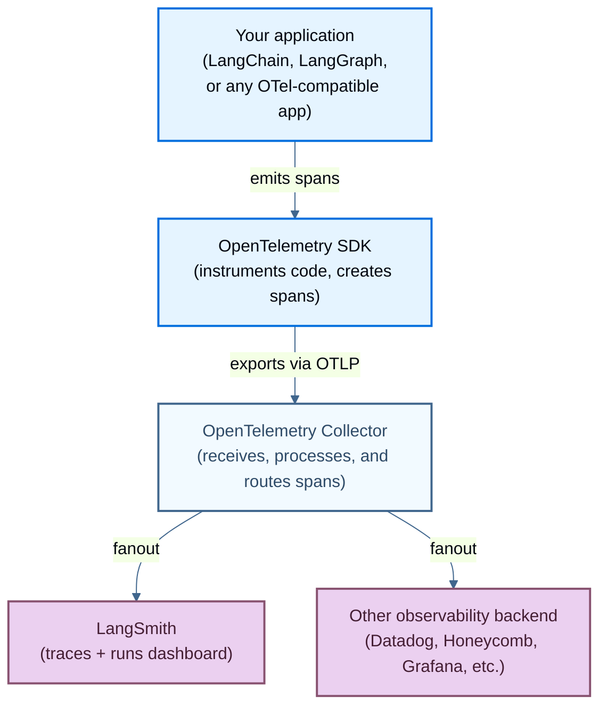

LangSmith supports OpenTelemetry-based tracing, allowing you to send traces from any OpenTelemetry-compatible application. This guide covers both automatic instrumentation for LangChain applications and manual instrumentation for other frameworks.

Learn how to trace your LLM applications using OpenTelemetry with LangSmith.

## How OTel tracing works

The following diagram shows the basic flow for OpenTelemetry tracing with LangSmith, including the fanout pattern where a single stream of spans is routed to multiple observability backends.



The OpenTelemetry SDK instruments your application code and emits spans. Spans travel via the OTLP protocol to an OpenTelemetry Collector, which batches and routes them to one or more destinations simultaneously  (_fanout_). LangSmith receives spans at its OTLP endpoint and displays them as traces in the dashboard.

<Note>
Update the LangSmith URL appropriately for self-hosted installations or regional SaaS in the requests below: GCP EU uses `eu.api.smith.langchain.com`; GCP APAC uses `apac.api.smith.langchain.com`; AWS US uses `aws.api.smith.langchain.com`.
</Note>

## Trace a LangChain application

If you're using LangChain or LangGraph, use the built-in integration to trace your application:

1. Install the LangSmith package with OpenTelemetry support:

   <CodeGroup>

   ```bash pip
   pip install "langsmith[otel]"
   pip install langchain
   ```

   </CodeGroup>

   <Info>
   Requires Python SDK version `langsmith>=0.3.18`. We recommend `langsmith>=0.4.25` to benefit from important OpenTelemetry fixes.
   </Info>

2. In your LangChain/LangGraph App, enable the OpenTelemetry integration by setting the `LANGSMITH_OTEL_ENABLED` environment variable:

   <CodeGroup>

   ```bash Shell
   LANGSMITH_OTEL_ENABLED=true
   LANGSMITH_TRACING=true
   LANGSMITH_ENDPOINT=https://api.smith.langchain.com
   LANGSMITH_API_KEY=<your_langsmith_api_key>
   # For LangSmith API keys linked to multiple workspaces, set the LANGSMITH_WORKSPACE_ID environment variable to specify which workspace to use.
   ```

   </CodeGroup>

3. Create a LangChain application with tracing. For example:

   ```python
   import os
   from langchain_openai import ChatOpenAI
   from langchain_core.prompts import ChatPromptTemplate

   # Create a chain
   prompt = ChatPromptTemplate.from_template("Tell me a joke about {topic}")
   model = ChatOpenAI()
   chain = prompt | model

   # Run the chain
   result = chain.invoke({"topic": "programming"})
   print(result.content)
   ```

4. View the traces in your LangSmith dashboard ([example](https://smith.langchain.com/public/a762af6c-b67d-4f22-90a0-728df16baeba/r)) once your application runs.

## Trace a non-LangChain application

For non-LangChain applications or custom instrumentation, you can trace your application in LangSmith with a standard OpenTelemetry client. (We recommend **langsmith ≥ 0.4.25**.)

1. Install the OpenTelemetry SDK, OpenTelemetry exporter packages, as well as the OpenAI package:

   <CodeGroup>

   ```bash pip
   pip install openai
   pip install opentelemetry-sdk
   pip install opentelemetry-exporter-otlp
   ```

   </CodeGroup>

2. Setup environment variables for the endpoint, substitute your specific values:

   <CodeGroup>

   ```bash Shell
   OTEL_EXPORTER_OTLP_ENDPOINT=https://api.smith.langchain.com/otel
   OTEL_EXPORTER_OTLP_HEADERS="x-api-key=<your langsmith api key>"
   ```

   </CodeGroup>

   <Note>
   Depending on how your otel exporter is configured, you may need to append `/v1/traces` to the endpoint if you are only sending traces.
   </Note>

   <Note>
   If you're self-hosting LangSmith, replace the base endpoint with your LangSmith api endpoint and append `/api/v1`. For example: `OTEL_EXPORTER_OTLP_ENDPOINT=https://ai-company.com/api/v1/otel`
   </Note>

   Optional: Specify a custom project name other than "default":

   <CodeGroup>

   ```bash Shell
   OTEL_EXPORTER_OTLP_ENDPOINT=https://api.smith.langchain.com/otel
   OTEL_EXPORTER_OTLP_HEADERS="x-api-key=<your langsmith api key>,Langsmith-Project=<project name>"
   ```

   </CodeGroup>

3. Log a trace.

   This code sets up an OTEL tracer and exporter that will send traces to LangSmith. It then calls OpenAI and sends the required OpenTelemetry attributes.

   ```python
   from openai import OpenAI
   from opentelemetry import trace
   from opentelemetry.sdk.trace import TracerProvider
   from opentelemetry.sdk.trace.export import (
       BatchSpanProcessor,
   )
   from opentelemetry.exporter.otlp.proto.http.trace_exporter import OTLPSpanExporter

   client = OpenAI(api_key=os.getenv("OPENAI_API_KEY"))

   otlp_exporter = OTLPSpanExporter(
       timeout=10,
   )

   trace.set_tracer_provider(TracerProvider())
   trace.get_tracer_provider().add_span_processor(
       BatchSpanProcessor(otlp_exporter)
   )

   tracer = trace.get_tracer(__name__)

   def call_openai():
       model = "gpt-5.4-mini"
       with tracer.start_as_current_span("call_open_ai") as span:
           span.set_attribute("langsmith.span.kind", "LLM")
           span.set_attribute("langsmith.metadata.user_id", "user_123")
           span.set_attribute("gen_ai.system", "OpenAI")
           span.set_attribute("gen_ai.request.model", model)
           span.set_attribute("llm.request.type", "chat")

           messages = [
               {"role": "system", "content": "You are a helpful assistant."},
               {
                   "role": "user",
                   "content": "Write a haiku about recursion in programming."
               }
           ]

           for i, message in enumerate(messages):
               span.set_attribute(f"gen_ai.prompt.{i}.content", str(message["content"]))
               span.set_attribute(f"gen_ai.prompt.{i}.role", str(message["role"]))

           completion = client.chat.completions.create(
               model=model,
               messages=messages
           )

           span.set_attribute("gen_ai.response.model", completion.model)
           span.set_attribute("gen_ai.completion.0.content", str(completion.choices[0].message.content))
           span.set_attribute("gen_ai.completion.0.role", "assistant")
           span.set_attribute("gen_ai.usage.prompt_tokens", completion.usage.prompt_tokens)
           span.set_attribute("gen_ai.usage.completion_tokens", completion.usage.completion_tokens)
           span.set_attribute("gen_ai.usage.total_tokens", completion.usage.total_tokens)

           return completion.choices[0].message

   if __name__ == "__main__":
       call_openai()
   ```

4. View the trace in your LangSmith dashboard ([example](https://smith.langchain.com/public/4f2890b1-f105-44aa-a6cf-c777dcc27a37/r)).

<Note>
If your spans reference a parent from another service or process, see [Context propagation in distributed tracing](#context-propagation-in-distributed-tracing) for how parent–child linking works and when a span can be dropped.
</Note>

## Send traces to an alternate provider

While LangSmith is the default destination for OpenTelemetry traces, you can also configure OpenTelemetry to send traces to other observability platforms.

<Info>
Available in LangSmith Python SDK **≥ 0.4.1**. We recommend **≥ 0.4.25** for fixes that improve OTEL export and hybrid fan-out stability.
</Info>

### Use environment variables for global configuration

By default, the LangSmith OpenTelemetry exporter will send data to the LangSmith API OTEL endpoint, but this can be customized by setting standard OTEL environment variables:

```bash
OTEL_EXPORTER_OTLP_ENDPOINT: Override the endpoint URL
OTEL_EXPORTER_OTLP_HEADERS: Add custom headers (LangSmith API keys and Project are added automatically)
OTEL_SERVICE_NAME: Set a custom service name (defaults to "langsmith")
```

LangSmith uses the HTTP trace exporter by default. If you'd like to use your own tracing provider, you can either:

1. Set the OTEL environment variables as shown above, or
2. Set a global trace provider before initializing LangChain components, which LangSmith will detect and use instead of creating its own.

### Configure alternate OTLP endpoints

To send traces to a different provider, configure the OTLP exporter with your provider's endpoint:

```python
import os

from langchain_core.prompts import ChatPromptTemplate
from langchain_openai import ChatOpenAI
from opentelemetry import trace
from opentelemetry.exporter.otlp.proto.http.trace_exporter import OTLPSpanExporter
from opentelemetry.sdk.trace import TracerProvider
from opentelemetry.sdk.trace.export import BatchSpanProcessor

# Set environment variables for LangChain
os.environ["LANGSMITH_OTEL_ENABLED"] = "true"
os.environ["LANGSMITH_TRACING"] = "true"

# Configure the OTLP exporter for your custom endpoint
provider = TracerProvider()
otlp_exporter = OTLPSpanExporter(
    # Change to your provider's endpoint
    endpoint="https://otel.your-provider.com/v1/traces",
    # Add any required headers for authentication
    headers={"api-key": "your-api-key"},
)
processor = BatchSpanProcessor(otlp_exporter)
provider.add_span_processor(processor)
trace.set_tracer_provider(provider)

# Create and run a LangChain application
prompt = ChatPromptTemplate.from_template("Tell me a joke about {topic}")
model = ChatOpenAI()
chain = prompt | model
result = chain.invoke({"topic": "programming"})
print(result.content)
```

<Info>
Hybrid tracing is available in version **≥ 0.4.1**. To send traces **only** to your OTEL endpoint, set:

`LANGSMITH_OTEL_ONLY="true"`
(Recommendation: use **langsmith ≥ 0.4.25**.)
</Info>

## Supported OpenTelemetry attribute and event mapping

When sending traces to LangSmith via OpenTelemetry, the following attributes are mapped to LangSmith fields:

### Core LangSmith attributes

| OpenTelemetry attribute        | LangSmith field  | Notes                                                                        |
| ------------------------------ | ---------------- | ---------------------------------------------------------------------------- |
| `langsmith.trace.name`         | Run name         | Overrides the span name for the run                                          |
| `langsmith.span.kind`          | [Run type](/langsmith/run-data-format#run-types) | Values: `llm`, `chain`, `tool`, `retriever`, `embedding`, `prompt`, `parser` |
| `langsmith.trace.id`           | Trace ID         | The trace (root run) the span belongs to; set to attach to an existing trace |
| `langsmith.span.id`            | Run ID           | This span's run ID (a UUID); overrides the ID derived from the OTLP span ID   |
| `langsmith.span.parent_id`     | Parent run ID    | Nests the span under an existing run by its run ID                            |
| `langsmith.span.dotted_order`  | Dotted order     | Position in the trace tree: `<parent.dotted_order>.<timestamp><span.id>`. See [`dotted_order`](https://docs.langchain.com/langsmith/run-data-format#what-is-dotted_order). |
| `langsmith.trace.session_id`   | Session ID       | Session identifier for related traces                                        |
| `langsmith.trace.session_name` | Session name     | Name of the session                                                          |
| `langsmith.span.tags`          | Tags             | Custom tags attached to the span (comma-separated)                           |
| `langsmith.metadata.{key}`     | `metadata.{key}` | Custom metadata with langsmith prefix                                        |

### GenAI standard attributes

| OpenTelemetry attribute                 | LangSmith field               | Notes                                                         |
| --------------------------------------- | ----------------------------- | ------------------------------------------------------------- |
| `gen_ai.system`                         | `metadata.ls_provider`        | The GenAI system (e.g., "openai", "anthropic")                |
| `gen_ai.operation.name`                 | Run type                      | Maps "chat"/"completion" to "llm", "embedding" to "embedding" |
| `gen_ai.prompt`                         | `inputs`                      | The input prompt sent to the model                            |
| `gen_ai.completion`                     | `outputs`                     | The output generated by the model                             |
| `gen_ai.prompt.{n}.role`                | `inputs.messages[n].role`     | Role for the nth input message                                |
| `gen_ai.prompt.{n}.content`             | `inputs.messages[n].content`  | Content for the nth input message                             |
| `gen_ai.prompt.{n}.message.role`        | `inputs.messages[n].role`     | Alternative format for role                                   |
| `gen_ai.prompt.{n}.message.content`     | `inputs.messages[n].content`  | Alternative format for content                                |
| `gen_ai.completion.{n}.role`            | `outputs.messages[n].role`    | Role for the nth output message                               |
| `gen_ai.completion.{n}.content`         | `outputs.messages[n].content` | Content for the nth output message                            |
| `gen_ai.completion.{n}.message.role`    | `outputs.messages[n].role`    | Alternative format for role                                   |
| `gen_ai.completion.{n}.message.content` | `outputs.messages[n].content` | Alternative format for content                                |
| `gen_ai.input.messages`                 | `inputs.messages`             | Array of input messages                                       |
| `gen_ai.output.messages`                | `outputs.messages`            | Array of output messages                                      |
| `gen_ai.tool.name`                      | `invocation_params.tool_name` | Tool name, also sets run type to "tool"                       |

### GenAI request parameters

| OpenTelemetry attribute            | LangSmith field                       | Notes                                   |
| ---------------------------------- | ------------------------------------- | --------------------------------------- |
| `gen_ai.request.model`             | `invocation_params.model`             | The model name used for the request     |
| `gen_ai.response.model`            | `invocation_params.model`             | The model name returned in the response |
| `gen_ai.request.temperature`       | `invocation_params.temperature`       | Temperature setting                     |
| `gen_ai.request.top_p`             | `invocation_params.top_p`             | Top-p sampling setting                  |
| `gen_ai.request.max_tokens`        | `invocation_params.max_tokens`        | Maximum tokens setting                  |
| `gen_ai.request.frequency_penalty` | `invocation_params.frequency_penalty` | Frequency penalty setting               |
| `gen_ai.request.presence_penalty`  | `invocation_params.presence_penalty`  | Presence penalty setting                |
| `gen_ai.request.seed`              | `invocation_params.seed`              | Random seed used for generation         |
| `gen_ai.request.stop_sequences`    | `invocation_params.stop`              | Sequences that stop generation          |
| `gen_ai.request.top_k`             | `invocation_params.top_k`             | Top-k sampling parameter                |
| `gen_ai.request.encoding_formats`  | `invocation_params.encoding_formats`  | Output encoding formats                 |

### GenAI usage metrics

| OpenTelemetry attribute          | LangSmith field                | Notes                                     |
| -------------------------------- | ------------------------------ | ----------------------------------------- |
| `gen_ai.usage.input_tokens`      | `usage_metadata.input_tokens`  | Number of input tokens used               |
| `gen_ai.usage.output_tokens`     | `usage_metadata.output_tokens` | Number of output tokens used              |
| `gen_ai.usage.total_tokens`      | `usage_metadata.total_tokens`  | Total number of tokens used               |
| `gen_ai.usage.prompt_tokens`     | `usage_metadata.input_tokens`  | Number of input tokens used (deprecated)  |
| `gen_ai.usage.completion_tokens` | `usage_metadata.output_tokens` | Number of output tokens used (deprecated) |
| `gen_ai.usage.details.reasoning_tokens` | `usage_metadata.reasoning_tokens` | Number of reasoning tokens used |

### TraceLoop attributes

| OpenTelemetry attribute                  | LangSmith field  | Notes                                            |
| ---------------------------------------- | ---------------- | ------------------------------------------------ |
| `traceloop.entity.input`                 | `inputs`         | Full input value from TraceLoop                  |
| `traceloop.entity.output`                | `outputs`        | Full output value from TraceLoop                 |
| `traceloop.entity.name`                  | Run name         | Entity name from TraceLoop                       |
| `traceloop.span.kind`                    | Run type         | Maps to LangSmith run types                      |
| `traceloop.llm.request.type`             | Run type         | "embedding" maps to "embedding", others to "llm" |
| `traceloop.association.properties.{key}` | `metadata.{key}` | Custom metadata with traceloop prefix            |

### OpenInference attributes

| OpenTelemetry attribute   | LangSmith field          | Notes                                     |
| ------------------------- | ------------------------ | ----------------------------------------- |
| `input.value`             | `inputs`                 | Full input value, can be string or JSON   |
| `output.value`            | `outputs`                | Full output value, can be string or JSON  |
| `openinference.span.kind` | Run type                 | Maps various kinds to LangSmith run types |
| `llm.system`              | `metadata.ls_provider`   | LLM system provider                       |
| `llm.model_name`          | `metadata.ls_model_name` | Model name from OpenInference             |
| `tool.name`               | Run name                 | Tool name when span kind is "TOOL"        |
| `metadata`                | `metadata.*`             | JSON string of metadata to be merged      |

### LLM attributes

| OpenTelemetry attribute      | LangSmith field                       | Notes                                |
| ---------------------------- | ------------------------------------- | ------------------------------------ |
| `llm.input_messages`         | `inputs.messages`                     | Input messages                       |
| `llm.output_messages`        | `outputs.messages`                    | Output messages                      |
| `llm.token_count.prompt`     | `usage_metadata.input_tokens`         | Prompt token count                   |
| `llm.token_count.completion` | `usage_metadata.output_tokens`        | Completion token count               |
| `llm.token_count.total`      | `usage_metadata.total_tokens`         | Total token count                    |
| `llm.usage.total_tokens`     | `usage_metadata.total_tokens`         | Alternative total token count        |
| `llm.invocation_parameters`  | `invocation_params.*`                 | JSON string of invocation parameters |
| `llm.presence_penalty`       | `invocation_params.presence_penalty`  | Presence penalty                     |
| `llm.frequency_penalty`      | `invocation_params.frequency_penalty` | Frequency penalty                    |
| `llm.request.functions`      | `invocation_params.functions`         | Function definitions                 |

### Prompt template attributes

| OpenTelemetry attribute         | LangSmith field | Notes                                            |
| ------------------------------- | --------------- | ------------------------------------------------ |
| `llm.prompt_template.variables` | Run type        | Sets run type to "prompt", used with input.value |

### Retriever attributes

| OpenTelemetry attribute                     | LangSmith field                     | Notes                                         |
| ------------------------------------------- | ----------------------------------- | --------------------------------------------- |
| `retrieval.documents.{n}.document.content`  | `outputs.documents[n].page_content` | Content of the nth retrieved document         |
| `retrieval.documents.{n}.document.metadata` | `outputs.documents[n].metadata`     | Metadata of the nth retrieved document (JSON) |

### Tool attributes

| OpenTelemetry attribute | LangSmith field                    | Notes                                     |
| ----------------------- | ---------------------------------- | ----------------------------------------- |
| `tools`                 | `invocation_params.tools`          | Array of tool definitions                 |
| `tool_arguments`        | `invocation_params.tool_arguments` | Tool arguments as JSON or key-value pairs |

### Logfire attributes

| OpenTelemetry attribute | LangSmith field    | Notes                                            |
| ----------------------- | ------------------ | ------------------------------------------------ |
| `prompt`                | `inputs`           | Logfire prompt input                             |
| `all_messages_events`   | `outputs`          | Logfire message events output                    |
| `events`                | `inputs`/`outputs` | Logfire events array, splits input/choice events |

### OpenTelemetry event mapping

| Event name                  | LangSmith field      | Notes                                                            |
| --------------------------- | -------------------- | ---------------------------------------------------------------- |
| `gen_ai.content.prompt`     | `inputs`             | Extracts prompt content from event attributes                    |
| `gen_ai.content.completion` | `outputs`            | Extracts completion content from event attributes                |
| `gen_ai.system.message`     | `inputs.messages[]`  | System message in conversation                                   |
| `gen_ai.user.message`       | `inputs.messages[]`  | User message in conversation                                     |
| `gen_ai.assistant.message`  | `outputs.messages[]` | Assistant message in conversation                                |
| `gen_ai.tool.message`       | `outputs.messages[]` | Tool response message                                            |
| `gen_ai.choice`             | `outputs`            | Model choice/response with finish reason                         |
| `exception`                 | `status`, `error`    | Sets status to "error" and extracts exception message/stacktrace |

#### Event attribute extraction

For message events, the following attributes are extracted:

* `content` → message content
* `role` → message role
* `id` → tool\_call\_id (for tool messages)
* `gen_ai.event.content` → full message JSON

For choice events:

* `finish_reason` → choice finish reason
* `message.content` → choice message content
* `message.role` → choice message role
* `tool_calls.{n}.id` → tool call ID
* `tool_calls.{n}.function.name` → tool function name
* `tool_calls.{n}.function.arguments` → tool function arguments
* `tool_calls.{n}.type` → tool call type

For exception events:

* `exception.message` → error message
* `exception.stacktrace` → error stacktrace (appended to message)

## Implementation examples

### Trace using the LangSmith SDK

Use the LangSmith SDK's OpenTelemetry helper to configure export. The following example [traces a Google ADK agent](/langsmith/trace-with-google-adk):

```python
import asyncio
from langsmith.integrations.otel import configure
from google.adk import Runner
from google.adk.agents import LlmAgent
from google.adk.sessions import InMemorySessionService
from google.genai import types

# Configure LangSmith OpenTelemetry export (no OTEL env vars or headers needed)
configure(project_name="adk-otel-demo")


async def main():
    agent = LlmAgent(
        name="travel_assistant",
        model="gemini-2.5-flash-lite",
        instruction="You are a helpful travel assistant.",
    )

    session_service = InMemorySessionService()
    runner = Runner(app_name="travel_app", agent=agent, session_service=session_service)

    user_id = "user_123"
    session_id = "session_abc"
    await session_service.create_session(app_name="travel_app", user_id=user_id, session_id=session_id)

    new_message = types.Content(parts=[types.Part(text="Hi! Recommend a weekend trip to Paris.")], role="user")

    for event in runner.run(user_id=user_id, session_id=session_id, new_message=new_message):
        print(event)


if __name__ == "__main__":
    asyncio.run(main())
```

<Note>
You do not need to set OTEL environment variables or exporters. `configure()` wires them for LangSmith automatically; instrumentors (like `GoogleADKInstrumentor`) create the spans.
</Note>

Here is an [example](https://smith.langchain.com/public/d6d47eeb-511e-4fda-ad17-2caa7bd7150b/r) of what the resulting trace looks like in LangSmith.

### Link OpenTelemetry spans to a LangSmith SDK trace

Native OTLP `parentSpanId` can't reference an existing LangSmith run: an OTLP span ID is 8 bytes, while LangSmith run IDs are full UUIDs. To attach an OpenTelemetry span to a run created elsewhere (for example, a LangChain-SDK run), set the `langsmith.*` attributes with the parent's full UUIDs. They override the IDs derived from the native OTLP span, so the span nests under the existing run in the same trace.

```python
import uuid
from datetime import datetime, timezone

from langsmith import get_current_run_tree, traceable
from opentelemetry import trace

tracer = trace.get_tracer("my-harness")


def emit_otel_child(parent):
    """Emit an OTel span that nests under an existing LangSmith run."""
    child_id = uuid.uuid4()
    start = datetime.now(timezone.utc)
    # dotted_order = parent's dotted_order, a dot, then this span's timestamp + id
    dotted = f"{parent.dotted_order}.{start.strftime('%Y%m%dT%H%M%S%fZ')}{child_id}"

    with tracer.start_as_current_span("otel-child") as span:
        span.set_attribute("langsmith.trace.id", str(parent.trace_id))           # same trace
        span.set_attribute("langsmith.span.parent_id", str(parent.id))           # nest under parent
        span.set_attribute("langsmith.span.id", str(child_id))                   # this span's run id
        span.set_attribute("langsmith.span.dotted_order", dotted)                # position in the tree
        span.set_attribute("langsmith.trace.session_name", parent.session_name)  # same project
        # ... your instrumented work here ...


@traceable
def my_agent():
    parent = get_current_run_tree()  # the LangSmith run to nest under
    emit_otel_child(parent)
```

<Note>
`langsmith.span.dotted_order` encodes the span's position in the trace tree. Build it from the parent's [`dotted_order`](https://docs.langchain.com/langsmith/run-data-format#what-is-dotted_order), a dot, then this span's timestamp followed by its `langsmith.span.id`.
</Note>

### Add an attachment to a trace

LangSmith supports [attaching files to traces](/langsmith/upload-files-with-traces). This is useful when building an agent with multimodal inputs or outputs. Attachments are also supported when tracing with OpenTelemetry.

The example below [traces a Google ADK agent](/langsmith/trace-with-google-adk) and adds an attachment to the trace. It uses a combination of LangSmith's `OtelSpanProcessor` and a custom `AttachmentSpanProcessor` that uses [`on_end()`](https://opentelemetry-python.readthedocs.io/en/latest/sdk/trace.export.html#opentelemetry.sdk.trace.export.SimpleSpanProcessor.on_end) to add an image attachment to the parent span.


```python
import asyncio
import base64
import json
from pathlib import Path
from dotenv import load_dotenv
from google.adk import Runner
from google.adk.agents import LlmAgent
from google.adk.sessions import InMemorySessionService
from google.genai import types
from opentelemetry import trace
from opentelemetry.sdk.trace import TracerProvider, SpanProcessor
from langsmith.integrations.otel import OtelSpanProcessor


class AttachmentSpanProcessor(SpanProcessor):
    """Custom SpanProcessor to add attachments to invocation spans."""

    def __init__(self):
        self.attachment_data = None

    def set_attachment(self, attachment_data):
        self.attachment_data = attachment_data

    def on_end(self, span):
        if span.name == "invocation" and self.attachment_data:
            attachments_json = json.dumps([self.attachment_data])
            span._attributes["langsmith.attachments"] = attachments_json

load_dotenv()

# Set up TracerProvider manually
provider = TracerProvider()
trace.set_tracer_provider(provider)

# Add attachment processor FIRST (runs before LangSmith processor)
attachment_processor = AttachmentSpanProcessor()
provider.add_span_processor(attachment_processor)

# Add LangSmith processor SECOND (receives already-modified spans)
langsmith_processor = OtelSpanProcessor(project="travel-assistant")
provider.add_span_processor(langsmith_processor)

def get_flight_info(destination: str, departure_date: str) -> dict:
    """Get flight information for a destination."""
    return {
        "destination": destination,
        "departure_date": departure_date,
        "price": "$450",
        "duration": "5h 30m",
        "airline": "Example Airways"
    }

def get_hotel_recommendations(city: str, check_in: str) -> dict:
    """Get hotel recommendations for a city."""
    return {
        "city": city,
        "check_in": check_in,
        "hotels": [
            {"name": "Grand Plaza Hotel", "rating": 4.5, "price": "$120/night"},
            {"name": "City Center Inn", "rating": 4.2, "price": "$95/night"}
        ]
    }

async def main():
    # Prepare the attachment
    receipt_path = Path("receipt-template-example.png")
    with open(receipt_path, "rb") as img_file:
        image_bytes = img_file.read()
        image_base64 = base64.b64encode(image_bytes).decode("ascii")

    attachment_data = {
        "name": "receipt-template-example",
        "content": image_base64,
        "mime_type": "image/jpeg",
    }

    attachment_processor.set_attachment(attachment_data)

    # Create ADK agent
    agent = LlmAgent(
        name="travel_assistant",
        tools=[get_flight_info, get_hotel_recommendations],
        model="gemini-2.0-flash-exp",
        instruction="You are a helpful travel assistant that can help with flights and hotels.",
    )

    # Set up session and runner
    session_service = InMemorySessionService()
    runner = Runner(
        app_name="travel_app",
        agent=agent,
        session_service=session_service
    )

    await session_service.create_session(
        app_name="travel_app",
        user_id="traveler_456",
        session_id="session_789"
    )

    # Send a message to the agent
    new_message = types.Content(
        parts=[types.Part(text="I need to book a flight to Paris for March 15th and find a good hotel.")],
        role="user",
    )

    # Run the agent and process events
    events = runner.run(
        user_id="traveler_456",
        session_id="session_789",
        new_message=new_message,
    )

    for event in events:
        print(event)

if __name__ == "__main__":
    asyncio.run(main())
```
Here is an [example](https://smith.langchain.com/public/9574f70a-b893-49fe-8c62-691bd114bf14/r) of what the resulting trace looks like in LangSmith.

## Advanced configuration

### Use OpenTelemetry collector for fan-out

Use `LANGSMITH_OTEL_ENABLED=true` when you need OTEL fanout. Configure your application to emit OTEL spans once, then use an OpenTelemetry Collector to route them to LangSmith and any additional observability backends.

Use this approach when you are tracing applications and want multi-destination routing. If you are operating LangSmith platform infrastructure telemetry (logs, metrics, traces from self-hosted LangSmith services on Kubernetes), use the [Configure your collector for LangSmith telemetry](/langsmith/langsmith-collector) guide instead.

For more advanced scenarios, you can use the OpenTelemetry Collector to fan out your telemetry data to multiple destinations. This is a more scalable approach than configuring multiple exporters in your application code.

1. [Install the OpenTelemetry Collector](https://opentelemetry.io/docs/collector/getting-started/) for your environment.

2. Create a configuration file (e.g., `otel-collector-config.yaml`) that exports to multiple destinations:

   ```yaml
   receivers:
     otlp:
       protocols:
         grpc:
           endpoint: 0.0.0.0:4317
         http:
           endpoint: 0.0.0.0:4318

   processors:
     batch:

   exporters:
     otlphttp/langsmith:
       endpoint: https://api.smith.langchain.com/otel/v1/traces
       headers:
         x-api-key: ${env:LANGSMITH_API_KEY}
         Langsmith-Project: my_project
     otlphttp/other_provider:
       endpoint: https://otel.your-provider.com/v1/traces
       headers:
         api-key: ${env:OTHER_PROVIDER_API_KEY}

   service:
     pipelines:
       traces:
         receivers: [otlp]
         processors: [batch]
         exporters: [otlphttp/langsmith, otlphttp/other_provider]
   ```

3. Configure your application to send to the collector:

   ```python
   import os
   from opentelemetry import trace
   from opentelemetry.sdk.trace import TracerProvider
   from opentelemetry.sdk.trace.export import BatchSpanProcessor
   from opentelemetry.exporter.otlp.proto.http.trace_exporter import OTLPSpanExporter
   from langchain_openai import ChatOpenAI
   from langchain_core.prompts import ChatPromptTemplate

   # Point to your local OpenTelemetry Collector
   otlp_exporter = OTLPSpanExporter(
       endpoint="http://localhost:4318/v1/traces"
   )
   provider = TracerProvider()
   processor = BatchSpanProcessor(otlp_exporter)
   provider.add_span_processor(processor)
   trace.set_tracer_provider(provider)

   # Set environment variables for LangChain
   os.environ["LANGSMITH_OTEL_ENABLED"] = "true"
   os.environ["LANGSMITH_TRACING"] = "true"

   # Create and run a LangChain application
   prompt = ChatPromptTemplate.from_template("Tell me a joke about {topic}")
   model = ChatOpenAI()
   chain = prompt | model
   result = chain.invoke({"topic": "programming"})
   print(result.content)
   ```

This approach offers several advantages:

* Centralized configuration for all your telemetry destinations
* Reduced overhead in your application code
* Better scalability and resilience
* Ability to add or remove destinations without changing application code

### Distributed tracing with LangChain and OpenTelemetry

Distributed tracing is essential when your LLM application spans multiple services or processes. OpenTelemetry's context propagation capabilities ensure that traces remain connected across service boundaries.

#### Context propagation in distributed tracing

In distributed systems, context propagation passes trace metadata between services so that related spans are linked to the same trace:

* **Trace ID**: A unique identifier for the entire trace
* **Span ID**: A unique identifier for the current span
* **Sampling Decision**: Indicates whether this trace should be sampled

<Warning>
**A span whose parent is never sent to LangSmith is dropped.**

The OTel endpoint is asynchronous: it accepts a batch, returns `200`, and materializes runs in the background. When a span's `parentSpanId` references a parent that LangSmith hasn't received yet, the child is buffered and linked once the parent arrives. This works regardless of order; a child can arrive before its parent, in a separate request, and still link correctly.

However, if the parent span is **never** exported to LangSmith, the buffered child expires and never appears as a run. LangSmith will not return an error, because the `200` was sent before processing. This commonly happens when only part of a distributed trace reaches LangSmith: the parent is emitted by a service that exports to a different backend, or it's removed by a sampling decision.

To avoid silent loss, make sure every span you want in LangSmith also has its ancestors exported to LangSmith within the buffering window. On self-hosted deployments, this window is controlled by `REDIS_RUNS_EXPIRY_SECONDS` (default 12 hours).
</Warning>

#### Set up distributed tracing with LangChain

To enable distributed tracing across multiple services:

```python
import os
from opentelemetry import trace
from opentelemetry.propagate import inject, extract
from opentelemetry.sdk.trace import TracerProvider
from opentelemetry.sdk.trace.export import BatchSpanProcessor
from opentelemetry.exporter.otlp.proto.http.trace_exporter import OTLPSpanExporter
import requests
from langchain_openai import ChatOpenAI
from langchain_core.prompts import ChatPromptTemplate

# Set up OpenTelemetry trace provider
provider = TracerProvider()
otlp_exporter = OTLPSpanExporter(
    endpoint="https://api.smith.langchain.com/otel/v1/traces",
    headers={"x-api-key": os.getenv("LANGSMITH_API_KEY"), "Langsmith-Project": "my_project"}
)
processor = BatchSpanProcessor(otlp_exporter)
provider.add_span_processor(processor)
trace.set_tracer_provider(provider)
tracer = trace.get_tracer(__name__)

# Service A: Create a span and propagate context to Service B
def service_a():
    with tracer.start_as_current_span("service_a_operation") as span:
        # Create a chain
        prompt = ChatPromptTemplate.from_template("Summarize: {text}")
        model = ChatOpenAI()
        chain = prompt | model

        # Run the chain
        result = chain.invoke({"text": "OpenTelemetry is an observability framework"})

        # Propagate context to Service B
        headers = {}
        inject(headers)  # Inject trace context into headers

        # Call Service B with the trace context
        response = requests.post(
            "http://service-b.example.com/process",
            headers=headers,
            json={"summary": result.content}
        )
        return response.json()

# Service B: Extract the context and continue the trace
from flask import Flask, request, jsonify

app = Flask(__name__)

@app.route("/process", methods=["POST"])
def service_b_endpoint():
    # Extract the trace context from the request headers
    context = extract(request.headers)
    with tracer.start_as_current_span("service_b_operation", context=context) as span:
        data = request.json
        summary = data.get("summary", "")

        # Process the summary with another LLM chain
        prompt = ChatPromptTemplate.from_template("Analyze the sentiment of: {text}")
        model = ChatOpenAI()
        chain = prompt | model
        result = chain.invoke({"text": summary})

        return jsonify({"analysis": result.content})

if __name__ == "__main__":
    app.run(port=5000)
```

---

<div className="source-links">
<Callout icon="terminal-2">
    [Connect these docs](/use-these-docs) to Claude, VSCode, and more via MCP for real-time answers.
</Callout>
<Callout icon="edit">
    [Edit this page on GitHub](https://github.com/langchain-ai/docs/edit/main/src/langsmith/trace-with-opentelemetry.mdx) or [file an issue](https://github.com/langchain-ai/docs/issues/new/choose).
</Callout>
</div>
