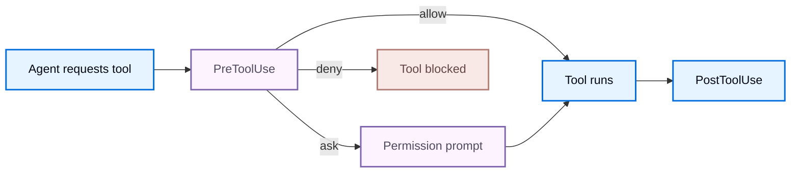

Hooks let external programs observe and control Deep Agents Code lifecycle events.

When an event fires, Deep Agents Code finds matching handlers, sends each a JSON payload on stdin, and combines their exit codes and stdout. Use that response to allow, deny, inject context, or continue a turn. The sections below cover configuration, [Events](#events), [Input payload](#input-payload), and [Handler output](#handler-output).

Hooks run with your user permissions and execute arbitrary code from your configuration. Treat hook configuration as executable code and only install hooks from sources you trust.

## Setup

Create `~/.deepagents/hooks.json` for hooks that apply to every project, or `{project_root}/.deepagents/hooks.json` for project-scoped hooks (after you grant [workspace trust](#trust-project-hooks)). Handlers nest in three levels: event name, matcher group, then the handlers that run for that group.

```json title="~/.deepagents/hooks.json"
{
  "hooks": {
    "PreToolUse": [
      {
        "matcher": "Bash",
        "hooks": [
          {
            "type": "command",
            "command": "~/.deepagents/hooks/block-rm.sh",
            "timeout": 600
          }
        ]
      }
    ],
    "SessionStart": [
      {
        "matcher": "startup|resume",
        "hooks": [
          {
            "type": "command",
            "command": "~/.deepagents/hooks/load-context.sh"
          }
        ]
      }
    ]
  }
}
```

Deep Agents Code loads hook configuration in precedence order:

1. Project hooks from `{project_root}/.deepagents/hooks.json`, after workspace trust is granted.
2. User hooks from `~/.deepagents/hooks.json`.
3. Hooks contributed by enabled plugins.

Every matching handler runs concurrently, and their results are combined in precedence order. Precedence decides which answer wins, not which handlers execute: a lower-precedence handler still runs, and its side effects still happen, even when a higher-precedence handler stops the event.

Run `dcode config path` to inspect the separate project and user hook locations and the workspace trust store.

Hook configuration is snapshotted until `/reload` or a new session. Editing `hooks.json` during a turn does not change the active snapshot. Enabling or disabling a plugin also changes the snapshot, so run `/reload` to pick up its hooks.

### Trust project hooks

Project hooks come from the repository, so they load only after the workspace is trusted:

- Interactive sessions prompt when an untrusted workspace contains `.deepagents/hooks.json`. Trusting the workspace persists the decision for that project root under `~/.deepagents/.state/hooks_trust.json`.
- Denying the prompt skips project hooks for that session and continues with user and plugin hooks.
- Canceling the prompt with `Esc` or `Ctrl+D` aborts startup.
- Headless and CI runs never prompt. Pass `--trust-project-hooks` to opt in for that run.

### Plugin hooks

An enabled plugin contributes the same configuration shape from `hooks/hooks.json`, a manifest `hooks` path, or an inline manifest object. Installing and enabling the plugin is the consent gate: workspace trust governs project hooks only, so it neither grants nor withholds a plugin's hooks. Review a plugin before enabling it, and check the events it declares in the plugin manager. See [Plugins and marketplaces](/oss/deepagents/code/plugins#add-hooks).

Server-owned events are fixed when a session starts, so newly enabled plugin hooks activate at the next startup or `/reload`.

Plugin handlers can reference their own installation paths through these variables:

| Variable | Value |
| --- | --- |
| `${CLAUDE_PLUGIN_ROOT}`, `${PLUGIN_ROOT}` | Installed plugin directory |
| `${CLAUDE_PLUGIN_DATA}`, `${PLUGIN_DATA}` | Writable data directory for the plugin |
| `${CLAUDE_PROJECT_DIR}` | Project root |

Quote these variables in the `command` string, because installation paths can contain spaces: `"command": "\"${CLAUDE_PLUGIN_ROOT}/scripts/format.sh\""`. Prefer the optional `argv` field when you can: Deep Agents Code resolves the variables before launch and skips the shell, so you do not need quoting.

An invalid plugin hook document is skipped on its own and reported as a configuration diagnostic. Other plugins, project hooks, and user hooks keep working.

### Handler fields

Each entry in a matcher group's `hooks` array is a command handler:

<ResponseField name="type" type="string" required>
    Handler type. Only `command` is supported. A command handler runs a subprocess that receives the event JSON on stdin.
</ResponseField>

<ResponseField name="command" type="string" required>
    Shell command to run. Always required. Pipes, redirects, globs, and environment-variable expansion are supported. The event payload is written to stdin as JSON, never interpolated into arguments. When `argv` is also set, this string is not executed through the shell.
</ResponseField>

<ResponseField name="argv" type="list[string]" post={["optional"]}>
    Execute an argument list directly instead of interpreting `command` through a shell. Use this for explicit executable paths and arguments.
</ResponseField>

<ResponseField name="timeout" type="number" post={["optional"]}>
    Per-handler timeout in seconds. The default is 600 seconds, except for `UserPromptSubmit`, which defaults to 30 seconds. A timeout is a non-blocking failure.
</ResponseField>

<ResponseField name="statusMessage" type="string" post={["optional"]}>
    Transient message shown in the UI while the handler runs.
</ResponseField>

Configuring an unsupported handler type or `"async": true` produces a visible configuration error.

### Handler environment

A handler starts in the working directory reported as `cwd` in the payload and inherits the session environment with credential-looking variables removed: any name containing `KEY`, `TOKEN`, `SECRET`, `PASSWORD`, or `APIKEY` is stripped before launch. A handler that needs a credential must read it from a file or a secret manager rather than the inherited environment. Plugin handlers additionally receive their own [plugin path variables](#plugin-hooks).

### Matchers

A matcher filters whether a handler group runs for a given event. Each event matches against one field (see [Events](#events)):

- Omitted, empty, or `*` matches all values for that event.
- A simple name matches exactly (`Bash`).
- `|` or `,` separates exact alternatives (`Edit|Write`).
- Any other value is treated as an unanchored regular expression (`mcp__.*`).

`UserPromptSubmit` and `Stop` have no matcher field. Omit `matcher` for those events, or set it to `*`; any other value is rejected when the configuration loads.

Compile errors invalidate that group and produce a user-visible configuration diagnostic before the session runs.

## Events

Deep Agents Code emits the following events. Client-owned events run in the CLI process. Server-owned events originate in the agent execution path and round-trip to the client so command handlers run where your configuration lives.

| Event | Owner | Exit code 2 effect | Matches on |
| --- | --- | --- | --- |
| `SessionStart` | Client | Diagnostic | `source` |
| `UserPromptSubmit` | Client | Block prompt | none |
| `SessionEnd` | Client | Diagnostic | `reason` |
| `PermissionRequest` | Client | Deny | `tool_name` |
| `Notification` | Client | Diagnostic | `notification_type` |
| `PreToolUse` | Server | Deny | `tool_name` |
| `PostToolUse` | Server | Feedback | `tool_name` |
| `PreCompact` | Server | Block compaction | `trigger` |
| `Stop` | Server | Continue turn | none |
| `SubagentStart` | Server | Diagnostic | `agent_type` |
| `SubagentStop` | Server | Add context | `agent_type` |

`PreToolUse` runs before the permission prompt and before tool execution, which makes it the primary place to allow or deny tools. `Stop` runs before a terminal model response is committed.



The diagram covers the tool-call path only. `PermissionRequest` is a separate client-owned event when Deep Agents Code is about to show a permission prompt.

## Input payload

Every handler receives a JSON object on stdin. All events share a common envelope, plus event-specific fields.

### Common fields

| Field | Description |
| --- | --- |
| `session_id` | Session identifier |
| `transcript_path` | Path to the conversation transcript when available |
| `cwd` | Working directory when the hook is invoked |
| `hook_event_name` | Name of the event that fired |
| `prompt_id` | UUID for the current user prompt, when available |
| `permission_mode` | Permission mode (`default`, `plan`, `acceptEdits`, `auto`, `dontAsk`, `bypassPermissions`), when meaningful |
| `effort` | Object such as `{ "level": "medium" }`, where level is `none`, `low`, `medium`, `high`, `xhigh`, or `max`, when available |
| `agent_id`, `agent_type` | Subagent identity, when available |

`transcript_path` points to a JSONL projection of the conversation written under `~/.deepagents/transcripts`. Subagent events also carry `agent_transcript_path` for the subagent's own transcript. Both files are refreshed before matching handlers run, so a handler can read the conversation up to the current event.

### Event-specific fields

| Event | Fields |
| --- | --- |
| `SessionStart` | `source` (`startup`, `resume`, `clear`, `compact`) and, when available, `model` |
| `UserPromptSubmit` | `prompt` |
| `SessionEnd` | `reason` (`clear`, `resume`, `prompt_input_exit`, `other`) |
| `PermissionRequest` | `tool_name`, `tool_input`, `permission_suggestions` (currently empty) |
| `Notification` | `message`, `notification_type`, and when available `title` |
| `PreToolUse` | `tool_name`, `tool_input`, `tool_use_id` |
| `PostToolUse` | `tool_name`, `tool_input`, `tool_response`, `tool_use_id`, and when available `duration_ms` |
| `PreCompact` | `trigger` (`manual`, `auto`), `custom_instructions` |
| `Stop` | `stop_hook_active`, `last_assistant_message`, `background_tasks`, `session_crons` |
| `SubagentStart` | `agent_id`, `agent_type` |
| `SubagentStop` | `stop_hook_active`, `agent_id`, `agent_type`, `agent_transcript_path`, `last_assistant_message`, `background_tasks`, `session_crons` |

Example `PreToolUse` payload:

```json
{
  "session_id": "abc123",
  "transcript_path": "/Users/you/.deepagents/.../transcript.jsonl",
  "cwd": "/Users/you/my-project",
  "permission_mode": "default",
  "hook_event_name": "PreToolUse",
  "tool_name": "Bash",
  "tool_input": {
    "command": "rm -rf /tmp/build"
  },
  "tool_use_id": "toolu_01ABC"
}
```

### Tool names

Hook scripts see stable public tool names and argument shapes, not internal Deep Agents Code tool names. Match on and read these names in `PreToolUse`, `PostToolUse`, and `PermissionRequest`:

| Public tool name | Notable input fields |
| --- | --- |
| `Bash` | `command`, optional `timeout` in milliseconds |
| `Write` | `file_path`, `content` |
| `Edit` | `file_path`, `old_string`, `new_string`, `replace_all` |
| `Read` | `file_path`, `limit`, `offset` |
| `Glob` | `pattern`, `path` |
| `Grep` | `pattern`, `path`, `glob`, `output_mode`, `head_limit` |
| `LS` | `path` |
| `mcp__<server>__<tool>` | Tool-specific JSON |

## Handler output

Command handlers communicate results through their exit code, stdout, and stderr.

| Exit code | Meaning |
| --- | --- |
| `0` | Success. When stdout contains JSON, it is parsed and applied. |
| `2` | Blocking or feedback path for that event. See the [Events](#events) table Exit code 2 effect column. Stdout JSON is ignored, and stderr is the primary feedback channel. |
| Other nonzero | Non-blocking error. Deep Agents Code logs a diagnostic and continues. |

JSON output is only processed on exit `0` and must be the only content on stdout. Successful non-JSON stdout becomes additional context for `SessionStart` and `UserPromptSubmit`; for other events it produces a diagnostic. Stdout and stderr are each retained up to 100,000 bytes.

### Universal output fields

Any handler may return these top-level fields:

```json
{
  "continue": true,
  "stopReason": "optional user-facing reason when continue is false",
  "suppressOutput": false,
  "systemMessage": "optional message shown to the user",
  "terminalSequence": "optional restricted terminal control sequence",
  "hookSpecificOutput": {
    "hookEventName": "PreToolUse"
  }
}
```

All matching handlers finish before their results are combined. Returning `"continue": false` marks the reduced decision as stopped but does not prevent other matching handlers from running. The first `stopReason` wins in configuration order. `suppressOutput` suppresses only that handler's `systemMessage`.

Event-specific control lives in `hookSpecificOutput` (for tool and permission events) or in top-level `decision` and `reason` (for `Stop`).

### Control tool execution with `PreToolUse`

Return a permission decision to allow, deny, or force a prompt before a tool runs:

```json
{
  "hookSpecificOutput": {
    "hookEventName": "PreToolUse",
    "permissionDecision": "deny",
    "permissionDecisionReason": "Destructive command blocked by hook"
  }
}
```

When multiple hooks match, decisions combine with the precedence `deny > ask > allow`. A deny short-circuits execution before the permission prompt and feeds its reason to the model. An ask forces the permission prompt. An allow suppresses the ordinary prompt but does not override a separate deny or ask. Any `additionalContext` values are passed through in configuration order.

You can also block with exit code `2` and write the reason to stderr.

### Allow or deny with `PermissionRequest`

Return a decision to answer a permission prompt on the user's behalf:

```json
{
  "hookSpecificOutput": {
    "hookEventName": "PermissionRequest",
    "decision": {
      "behavior": "deny",
      "message": "Not allowed in this environment"
    }
  }
}
```

Any deny wins. If no hook denies and at least one allows, the action is allowed. If no hook decides, the normal permission prompt is shown.

### Continue a turn with `Stop`

Return a block decision to keep the agent working instead of ending the turn:

```json
{
  "decision": "block",
  "reason": "Tests are still failing; keep working"
}
```

A block continues the agent turn with your feedback. `Stop.hookSpecificOutput.additionalContext` has the same continuation effect. To avoid infinite loops, check `stop_hook_active` in the payload and stop blocking once your condition is met. Deep Agents Code also enforces a hard cap of eight consecutive continuations.

### Inject context

`SessionStart`, `UserPromptSubmit`, and `SubagentStart` can add context for the model:

```json
{
  "hookSpecificOutput": {
    "hookEventName": "SessionStart",
    "additionalContext": "Current sprint: ENG-1421. Prefer the staging database."
  }
}
```

`UserPromptSubmit` also supports `suppressOriginalPrompt`. `PostToolUse` and `SubagentStop` can append `additionalContext` for the model but cannot undo an action that already ran.

## Unsupported output fields

The following compatibility fields are recognized but not applied. Deep Agents Code emits a diagnostic and continues with the fallback in the Result column. For tool and permission rows, that means the ordinary [PreToolUse](#control-tool-execution-with-pretooluse) or [PermissionRequest](#allow-or-deny-with-permissionrequest) decision path, without mutating tool input or deferring.

| Field or behavior | Result |
| --- | --- |
| `SessionStart.initialUserMessage`, `sessionTitle`, `watchPaths`, `reloadSkills` | Parsed, not applied |
| `UserPromptSubmit.sessionTitle` | Parsed, not applied |
| `PreToolUse.updatedInput` | Mutation ignored; `allow` or `ask` uses the ordinary [PreToolUse](#control-tool-execution-with-pretooluse) decision |
| `PreToolUse.defer` | Uses the ordinary [PreToolUse](#control-tool-execution-with-pretooluse) decision; never treated as allow |
| `PostToolUse.updatedToolOutput`, `updatedMCPToolOutput` | Parsed, not applied |
| `PermissionRequest.updatedInput` | Mutation ignored; an `allow` uses the ordinary [PermissionRequest](#allow-or-deny-with-permissionrequest) decision |
| `PermissionRequest.updatedPermissions` | Parsed, not applied (no permission-rule store) |
| `SubagentStop` block | [Context only](#inject-context); a completed subagent cannot be resumed |

## Examples

<Accordion title="Block destructive Bash commands (PreToolUse)">
```bash title="~/.deepagents/hooks/block-rm.sh"
#!/usr/bin/env bash
command=$(jq -r '.tool_input.command // ""')

if printf '%s' "$command" | grep -Eq 'rm[[:space:]]+.*-[a-zA-Z]*[rf]'; then
  cat <<'JSON'
{
  "hookSpecificOutput": {
    "hookEventName": "PreToolUse",
    "permissionDecision": "deny",
    "permissionDecisionReason": "Recursive or forced rm is blocked by policy"
  }
}
JSON
fi
```

```json title="~/.deepagents/hooks.json"
{
  "hooks": {
    "PreToolUse": [
      {
        "matcher": "Bash",
        "hooks": [
          { "type": "command", "command": "~/.deepagents/hooks/block-rm.sh" }
        ]
      }
    ]
  }
}
```
</Accordion>

<Accordion title="Load project context on session start (SessionStart)">
```bash title="~/.deepagents/hooks/load-context.sh"
#!/usr/bin/env bash
context=$(git -C "$(jq -r '.cwd')" log --oneline -5 2>/dev/null)

jq -n --arg ctx "$context" '{
  hookSpecificOutput: {
    hookEventName: "SessionStart",
    additionalContext: ("Recent commits:\n" + $ctx)
  }
}'
```

```json title="~/.deepagents/hooks.json"
{
  "hooks": {
    "SessionStart": [
      {
        "matcher": "startup|resume",
        "hooks": [
          { "type": "command", "command": "~/.deepagents/hooks/load-context.sh" }
        ]
      }
    ]
  }
}
```
</Accordion>

<Accordion title="Desktop notification when the turn ends on macOS (Stop)">
```json title="~/.deepagents/hooks.json"
{
  "hooks": {
    "Stop": [
      {
        "hooks": [
          {
            "type": "command",
            "command": "osascript -e 'display notification \"Agent finished\" with title \"Deep Agents Code\"'"
          }
        ]
      }
    ]
  }
}
```
</Accordion>

<Accordion title="Python handler that reads the payload">
```python title="~/.deepagents/hooks/handler.py"
import json
import sys


def handle(payload: dict[str, object]) -> None:
    event = payload["hook_event_name"]
    if event == "PreToolUse":
        tool_name = payload["tool_name"]
        print(f"About to run {tool_name}", file=sys.stderr)


if __name__ == "__main__":
    handle(json.load(sys.stdin))
```

```json title="~/.deepagents/hooks.json"
{
  "hooks": {
    "PreToolUse": [
      {
        "matcher": "*",
        "hooks": [
          {
            "type": "command",
            "command": "python3 ~/.deepagents/hooks/handler.py"
          }
        ]
      }
    ]
  }
}
```
</Accordion>

## Troubleshoot hooks

Hook activity is visible in the session, not only in logs:

- A running handler shows its `statusMessage`, or `Running <event> hook` when it sets none. Concurrent handlers share one status slot, so the most recent one is displayed until it finishes.
- A handler's `systemMessage` appears as an informational notice.
- Configuration errors, nonzero exits, timeouts, and unsupported output fields appear as `Hook warning` or `Hook error` notices, once per invocation.
- A permission answer from a hook is attributed to the hook, for example `PermissionRequest hook denied Bash`.
- Set `DEEPAGENTS_CODE_DEBUG=1` to capture every diagnostic, including debug-level entries that are never shown as notices.

## Legacy configuration

Older list-shaped `hooks.json` files are deprecated but still supported. Deep Agents Code automatically migrates equivalent events; events without a safe mapping are skipped with a diagnostic.

## Security

Hooks follow the same trust model as Git hooks or shell aliases: any process that can write to `hooks.json` can run arbitrary commands with your permissions.

- Payload data flows to stdin as JSON, never interpolated into command arguments.
- Credential-looking environment variables are stripped from handler environments.
- Hook configuration remains fixed until `/reload` or a new session.
- Prefer explicit shell executables you control over shell wrappers.
- Only install hooks from sources you trust.

<Warning>
    A hook runs with your user permissions. Treat hook configuration as executable code.
</Warning>

## See also

- [Configuration](/oss/deepagents/code/configuration)
- [Plugins and marketplaces](/oss/deepagents/code/plugins)
- [Data locations](/oss/deepagents/code/configuration#data-locations)
- [CLI reference](/oss/deepagents/code/cli-reference)

---

<div className="source-links">
<Callout icon="terminal-2">
    [Connect these docs](/use-these-docs) to Claude, VSCode, and more via MCP for real-time answers.
</Callout>
<Callout icon="edit">
    [Edit this page on GitHub](https://github.com/langchain-ai/docs/edit/main/src/oss/deepagents/code/hooks.mdx) or [file an issue](https://github.com/langchain-ai/docs/issues/new/choose).
</Callout>
</div>
