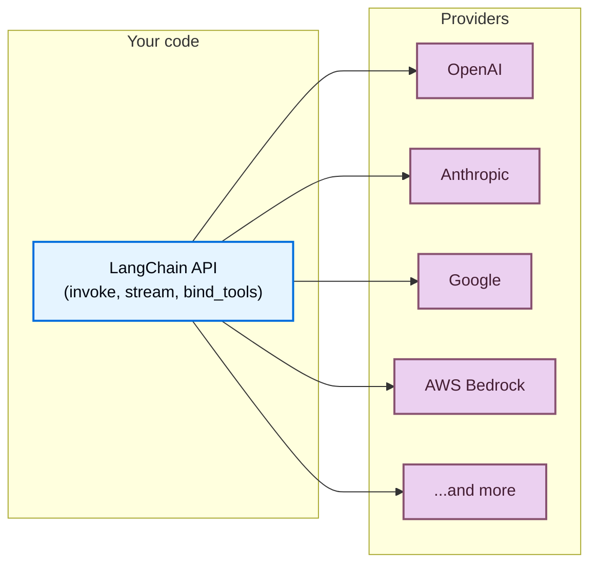

LangChain gives you a single, unified API to work with models from any provider. Install a provider package, pick a model name, and start building—the same code works whether you use OpenAI, Anthropic, Google, or any other supported provider.



## One API for any model

Every LangChain chat model, regardless of provider, implements the same interface. This means you can:

- **Swap providers** without rewriting application logic
- **Compare models** side-by-side with identical code
- **Use advanced features** like [tool calling](/oss/javascript/langchain/tools), [structured output](/oss/javascript/langchain/structured-output), and [streaming](/oss/javascript/langchain/streaming) across all providers


```typescript
import { initChatModel } from "langchain/chat_models/universal";

const openaiModel = await initChatModel("openai:gpt-5.5");
const anthropicModel = await initChatModel("anthropic:claude-opus-4-8");
const googleModel = await initChatModel("google-genai:gemini-3.1-pro-preview");

for (const model of [openaiModel, anthropicModel, googleModel]) {
    const response = await model.invoke("Explain quantum computing in one sentence.");
    console.log(response.text);
}
```


## What is a provider?

A **provider** is a company or platform that hosts AI models and exposes them through an API. Examples include OpenAI, Anthropic, Google, and AWS Bedrock.

In LangChain, each provider has a dedicated **integration package** (for example `langchain-openai`, `langchain-anthropic`) that implements the standard LangChain interface for that provider's models. This means:

- **Dedicated packages** for each provider with proper versioning and dependency management
- **Provider-specific features** are available when you need them (for example OpenAI's Responses API, Anthropic's extended thinking)
- **Automatic API key handling** through environment variables


```bash
npm install @langchain/openai       # For OpenAI models
npm install @langchain/anthropic    # For Anthropic models
npm install @langchain/google-genai # For Google models
```


For a full list of provider packages, see the [integrations page](/oss/javascript/integrations/providers/overview).

## Find model names

Each provider supports specific model names that you pass when initializing a chat model. There are two ways to specify a model:


    <CodeGroup>
    ```typescript Provider prefix format
    import { initChatModel } from "langchain/chat_models/universal";

    const model = await initChatModel("openai:gpt-5.5");
    ```

    ```typescript Direct class instantiation
    import { ChatOpenAI } from "@langchain/openai";

    const model = new ChatOpenAI({ model: "gpt-5.5" });
    ```
    </CodeGroup>


When using [`init_chat_model`](https://reference.langchain.com/javascript/langchain/chat_models/universal/initChatModel) with the `provider:model` format, LangChain automatically resolves the provider and loads the correct integration package. You can also omit the provider prefix if the model name is unambiguous (e.g., `"gpt-5.5"` resolves to OpenAI).

To find available model names for a provider, refer to the provider's own documentation. Here are some popular providers:

| Provider | Where to find model names |
| :--- | :--- |
| [OpenAI](/oss/javascript/integrations/providers/openai) | [OpenAI models page](https://platform.openai.com/docs/models) |
| [Anthropic](/oss/javascript/integrations/providers/anthropic) | [Anthropic models page](https://docs.anthropic.com/en/docs/about-claude/models) |
| [Google](/oss/javascript/integrations/providers/google) | [Google AI models page](https://ai.google.dev/gemini-api/docs/models) |
| [AWS Bedrock](/oss/javascript/integrations/providers/aws) | [Bedrock supported models](https://docs.aws.amazon.com/bedrock/latest/userguide/models-supported.html) |


## Use new models immediately

Because LangChain provider packages pass model names directly to the provider's API, you can use new models the moment a provider releases them (no LangChain update required). Simply pass the new model name:


```typescript
const model = await initChatModel("google_genai:gemini-mythos");
```


New model names work immediately as long as your provider package version supports the API version the model requires. In most cases, model releases are backward-compatible and require no package update.

## Model capabilities

Different providers and models support different features.
For a list of the chat model integrations and their capabilities, see the [chat models integrations page](/oss/javascript/integrations/chat).

## Routers and proxies

**Routers** (also called proxies or gateways) give you access to models from multiple providers through a single API and credential. They can simplify billing, let you switch between models without changing integrations, and offer features like automatic fallbacks and load balancing.

| Provider | Integration | Description |
| :------- | :---------- | :---------- |
| [OpenRouter](https://openrouter.ai/) | [`ChatOpenRouter`](/oss/javascript/integrations/chat/openrouter) | Unified access to models from OpenAI, Anthropic, Google, Meta, and more |
| [FuturMix](https://futurmix.ai/) | [`ChatOpenAI`](https://futurmix.ai/) | Unified AI gateway for 22+ models with OpenAI-compatible API and 99.99% SLA |


Routers are useful when you want to:

- **Access many providers** with a single API key and billing account
- **Switch models dynamically** without managing multiple provider credentials
- **Use fallback models** that automatically retry with a different model if the primary one fails


```typescript
import { initChatModel } from "langchain/chat_models/universal";

const model = await initChatModel("openrouter:anthropic/claude-sonnet-4-6");
const response = await model.invoke("Hello!");
```


## OpenAI-compatible endpoints

Many providers offer endpoints compatible with OpenAI's [Chat Completions API](https://platform.openai.com/docs/api-reference/chat). You can connect to these using [`ChatOpenAI`](/oss/javascript/integrations/chat/openai) with a custom `base_url`:


```typescript
import { ChatOpenAI } from "@langchain/openai";

const model = new ChatOpenAI({
    configuration: { baseURL: "https://your-provider.com/v1" },
    apiKey: "your-api-key",
    model: "provider-model-name",
});
```


<Warning>
    `ChatOpenAI` targets [official OpenAI API specifications](https://github.com/openai/openai-openapi) only. Non-standard response fields from third-party providers are not extracted or preserved. Use a dedicated provider package or router when you need access to non-standard features.
</Warning>

## Next steps

<CardGroup cols={2}>
    <Card title="Models guide" icon="cpu" href="/oss/javascript/langchain/models">
        Learn how to use models: invoke, stream, batch, tool calling, and more.
    </Card>
    <Card title="Chat model integrations" icon="message" href="/oss/javascript/integrations/chat">
        Browse all chat model integrations and their capabilities.
    </Card>
    <Card title="All providers" icon="grid-dots" href="/oss/javascript/integrations/providers/overview">
        See the full list of provider packages and integrations.
    </Card>
    <Card title="Agents" icon="robot" href="/oss/javascript/langchain/agents">
        Build agents that use models as their reasoning engine.
    </Card>
</CardGroup>

---

<div className="source-links">
<Callout icon="terminal-2">
    [Connect these docs](/use-these-docs) to Claude, VSCode, and more via MCP for real-time answers.
</Callout>
<Callout icon="edit">
    [Edit this page on GitHub](https://github.com/langchain-ai/docs/edit/main/src/oss/concepts/providers-and-models.mdx) or [file an issue](https://github.com/langchain-ai/docs/issues/new/choose).
</Callout>
</div>
