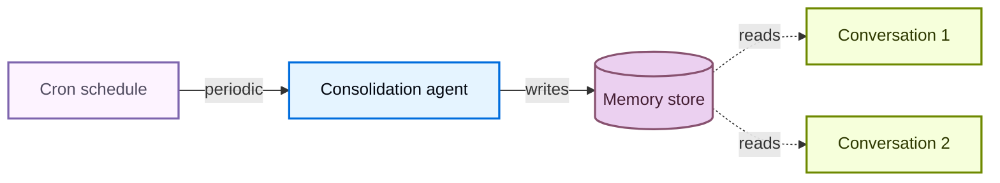

Memory lets your agent learn and improve across conversations. Deep Agents makes memory first class with filesystem-backed memory: the agent reads and writes memory as files, and you control where those files are stored using [backends](/oss/javascript/deepagents/backends).

<Tip>
To generate a repository wiki that coding agents discover through [`AGENTS.md`](https://agents.md/), see [OpenWiki](/oss/openwiki/overview).
</Tip>

<Note>
This page covers **long-term memory**: memory that persists across conversations. For short-term memory (conversation history and scratch files within a single session), see the [context engineering](/oss/javascript/deepagents/context-engineering) guide. Short-term memory is managed automatically as part of the agent's [state](/oss/javascript/langgraph/graph-api#state).


</Note>

## How memory works

1. **Point the agent at memory files.** Pass file paths to `memory=` when creating the agent. You can also pass [skills](/oss/javascript/deepagents/skills) via `skills=` for procedural memory (reusable instructions that tell the agent *how* to perform a task). A [backend](/oss/javascript/deepagents/backends) controls where files are stored and who can access them.
2. **Agent reads memory.** The agent can load memory files into the system prompt at startup, or read them on demand during the conversation. For example, [skills](/oss/javascript/deepagents/skills) use on-demand loading: the agent reads only skill descriptions at startup, then reads the full skill file only when it matches a task. This keeps context lean until a capability is needed.
3. **Agent updates memory (optional).** When the agent learns new information, it can use its built-in `edit_file` tool to update memory files. Updates can happen during the conversation (the default) or in the background between conversations via [background consolidation](#background-consolidation). Changes are persisted and available in the next conversation. Not all memory is writable: developer-defined [skills](/oss/javascript/deepagents/skills) and [organization policies](#organization-level-memory) are typically read-only. See [read-only vs writable memory](#read-only-vs-writable-memory) for details.

The two most common patterns are [agent-scoped memory](#agent-scoped-memory) (shared across all users) and [user-scoped memory](#user-scoped-memory) (isolated per user).

For a generated repository wiki that coding agents discover through [`AGENTS.md`](https://agents.md/), see [OpenWiki](/oss/openwiki/overview).

## Scoped memory

Agent memory can be scoped so the same memory files are accessible to everyone using the agent or memory files can be individual to each user.

### Agent-scoped memory

Give the agent its own persistent identity that evolves over time. Agent-scoped memory is shared across all users, so the agent builds up its own persona, accumulated knowledge, and learned preferences through every conversation. As it interacts with users, it develops expertise, refines its approach, and remembers what works. It can also learn and update [skills](/oss/javascript/deepagents/skills) when it has write access.

The key is the backend namespace: setting it to `(assistant_id,)` means every conversation for this agent reads and writes to the same memory file.


<Note>
Accessing `rt.serverInfo` requires `deepagents>=1.9.0`. On older versions, read the assistant ID from `getConfig().metadata.assistantId` instead.
</Note>


```typescript
import { createDeepAgent, CompositeBackend, StateBackend, StoreBackend } from "deepagents";

const agent = createDeepAgent({
  memory: ["/memories/AGENTS.md"],
  skills: ["/skills/"],
  backend: new CompositeBackend(
    new StateBackend(),
    {
      "/memories/": new StoreBackend({
        namespace: (rt) => [rt.serverInfo.assistantId],  // [!code highlight]
      }),
      "/skills/": new StoreBackend({
        namespace: (rt) => [rt.serverInfo.assistantId],  // [!code highlight]
      }),
    },
  ),
});
```


<Accordion title="Full example: seed memory and invoke">

Populate the store with initial memories, then invoke the agent across two threads to see it remember and update what it learns.


```typescript
import { createDeepAgent, CompositeBackend, StateBackend, StoreBackend, createFileData } from "deepagents";
import { InMemoryStore } from "@langchain/langgraph";

const store = new InMemoryStore();  // Use platform store when deploying to LangSmith

// Seed the memory file
await store.put(
  ["my-agent"],
  "/memories/AGENTS.md",
  createFileData(`## Response style
- Keep responses concise
- Use code examples where possible
`),
);

// Seed a skill
await store.put(
  ["my-agent"],
  "/skills/langgraph-docs/SKILL.md",
  createFileData(`---
name: langgraph-docs
description: Fetch relevant LangGraph documentation to provide accurate guidance.
---

# langgraph-docs

Use the fetch_url tool to read https://docs.langchain.com/llms.txt, then fetch relevant pages.
`),
);

const agent = createDeepAgent({
  memory: ["/memories/AGENTS.md"],
  skills: ["/skills/"],
  backend: (rt) => new CompositeBackend(
    new StateBackend(rt),
    {
      "/memories/": new StoreBackend(rt, {
        namespace: (rt) => ["my-agent"],
      }),
      "/skills/": new StoreBackend(rt, {
        namespace: (rt) => ["my-agent"],
      }),
    },
  ),
  store,
});

// Thread 1: the agent learns a new preference and saves it to memory
const config1 = { configurable: { thread_id: crypto.randomUUID() } };
await agent.invoke({
  messages: [{ role: "user", content: "I prefer detailed explanations. Remember that." }],
}, config1);

// Thread 2: the agent reads memory and applies the preference
const config2 = { configurable: { thread_id: crypto.randomUUID() } };
await agent.invoke({
  messages: [{ role: "user", content: "Explain how transformers work." }],
}, config2);
```


</Accordion>

### User-scoped memory

Give each user their own memory file. The agent remembers preferences, context, and history per user while core agent instructions stay fixed. Users can also have per-user [skills](/oss/javascript/deepagents/skills) if stored in a user-scoped backend.

The namespace uses `(user_id,)` so each user gets an isolated copy of the memory file. User A's preferences never leak into User B's conversations.


```typescript
import { createDeepAgent, CompositeBackend, StateBackend, StoreBackend } from "deepagents";

const agent = createDeepAgent({
  memory: ["/memories/preferences.md"],
  skills: ["/skills/"],
  backend: new CompositeBackend(
    new StateBackend(),
    {
      "/memories/": new StoreBackend({
        namespace: (rt) => [rt.serverInfo.user.identity],
      }),
      "/skills/": new StoreBackend({
        namespace: (rt) => [rt.serverInfo.user.identity],
      }),
    },
  ),
});
```


<Accordion title="Full example: isolated memory across users">

Seed per-user memories and invoke the agent as two different users. Each user sees only their own preferences.


```typescript
import { createDeepAgent, CompositeBackend, StateBackend, StoreBackend, createFileData } from "deepagents";
import { InMemoryStore } from "@langchain/langgraph";

const store = new InMemoryStore();  // Use platform store when deploying to LangSmith

// Seed preferences for two users
await store.put(
  ["user-alice"],
  "/memories/preferences.md",
  createFileData(`## Preferences
- Likes concise bullet points
- Prefers Python examples
`),
);
await store.put(
  ["user-bob"],
  "/memories/preferences.md",
  createFileData(`## Preferences
- Likes detailed explanations
- Prefers TypeScript examples
`),
);

// Seed a skill for Alice
await store.put(
  ["user-alice"],
  "/skills/langgraph-docs/SKILL.md",
  createFileData(`---
name: langgraph-docs
description: Fetch relevant LangGraph documentation to provide accurate guidance.
---

# langgraph-docs

Use the fetch_url tool to read https://docs.langchain.com/llms.txt, then fetch relevant pages.
`),
);

const agent = createDeepAgent({
  memory: ["/memories/preferences.md"],
  skills: ["/skills/"],
  backend: (rt) => new CompositeBackend(
    new StateBackend(rt),
    {
      "/memories/": new StoreBackend(rt, {
        namespace: (rt) => [rt.serverInfo.user.identity],
      }),
      "/skills/": new StoreBackend(rt, {
        namespace: (rt) => [rt.serverInfo.user.identity],
      }),
    },
  ),
  store,
});

// When deployed, each authenticated request resolves
// `rt.serverInfo.user.identity` to the calling user, so Alice and Bob
// automatically see only their own preferences.
await agent.invoke(
  { messages: [{ role: "user", content: "How do I read a CSV file?" }] },
  { configurable: { thread_id: crypto.randomUUID() } },
);
```


</Accordion>

## Advanced usage

On top of the basic configuration options for memory paths and scope, you can also configure more advanced parameters for memory:

| Dimension | Question it answers | Options |
|---|---|---|
| **Duration** | How long does it last? | [Short-term](/oss/javascript/deepagents/context-engineering) (single conversation) or [long-term](#scoped-memory) (across conversations) |
| **Information type** | What kind of information is it? | [Episodic](#episodic-memory) (past experiences), [procedural](/oss/javascript/deepagents/skills) (instructions and skills), or [semantic](/oss/javascript/concepts/memory#semantic-memory) (facts) |
| **Scope** | Who can see and modify it? | [User](#user-scoped-memory), [agent](#agent-scoped-memory), or [organization](#organization-level-memory) |
| **Update strategy** | When are memories written? | During conversation (default) or [between conversations](#background-consolidation) |
| **Retrieval** | How are memories read? | Loaded into prompt (default) or on demand (e.g., [skills](/oss/javascript/deepagents/skills)) |
| **Agent permissions** | Can the agent write to memory? | [Read-write](#read-only-vs-writable-memory) (default) or [read-only](#read-only-vs-writable-memory) (for shared policies) |

### Episodic memory

Episodic memory stores records of past experiences: what happened, in what order, and what the outcome was. Unlike semantic memory (facts and preferences stored in files like `AGENTS.md`), episodic memory preserves the full conversational context so the agent can recall *how* a problem was solved, not just *what* was learned from it. To generate and maintain a repository-level wiki for coding agents, see [OpenWiki](/oss/openwiki/overview).

Deep Agents already use [checkpointers](/oss/javascript/langgraph/checkpointers#checkpoints) which is the mechanism that supports episodic memory: every conversation is persisted as a checkpointed thread.

To make past conversations searchable, wrap thread search in a tool. The `user_id` is pulled from the runtime context rather than passed as a parameter:


```typescript
import { Client } from "@langchain/langgraph-sdk";
import { tool } from "@langchain/core/tools";

const client = new Client({ apiUrl: "<DEPLOYMENT_URL>" });

const searchPastConversations = tool(
  async ({ query }, runtime) => {
    const userId = runtime.serverInfo.user.identity;  // [!code highlight]
    const threads = await client.threads.search({
      metadata: { userId },
      limit: 5,
    });
    const results = [];
    for (const thread of threads) {
      const history = await client.threads.getHistory(thread.threadId);
      results.push(history);
    }
    return JSON.stringify(results);
  },
  {
    name: "search_past_conversations",
    description: "Search past conversations for relevant context.",
  }
);
```


You can scope thread search by user or organization by adjusting the metadata filter:


```typescript
// Search conversations for a specific user
const userThreads = await client.threads.search({
  metadata: { userId },
  limit: 5,
});

// Search conversations across an organization
const orgThreads = await client.threads.search({
  metadata: { orgId },
  limit: 5,
});
```


This is useful for agents that perform complex, multi-step tasks. For example, a coding agent can look back at a past debugging session and skip straight to the likely root cause.

### Organization-level memory

Organization-level memory follows the same pattern as user-scoped memory, but with an organization-wide namespace instead of a per-user one. Use it for policies or knowledge that should apply across all users and agents in an organization.

Organization memory is typically **read-only** to prevent prompt injection via shared state. See [read-only vs writable memory](#read-only-vs-writable-memory) for details.


```typescript
import { createDeepAgent, CompositeBackend, StateBackend, StoreBackend } from "deepagents";

const agent = createDeepAgent({
  memory: [
    "/memories/preferences.md",
    "/policies/compliance.md",
  ],
  backend: new CompositeBackend(
    new StateBackend(),
    {
      "/memories/": new StoreBackend({
        namespace: (rt) => [rt.serverInfo.user.identity],
      }),
      "/policies/": new StoreBackend({
        namespace: (rt) => [rt.context.orgId],
      }),
    },
  ),
});
```


Populate organization memory from your application code:


```typescript
import { Client } from "@langchain/langgraph-sdk";
import { createFileData } from "deepagents";

const client = new Client({ apiUrl: "<DEPLOYMENT_URL>" });

await client.store.putItem(
  [orgId],
  "/compliance.md",
  createFileData(`## Compliance policies
- Never disclose internal pricing
- Always include disclaimers on financial advice
`),
);
```


Use [permissions](/oss/javascript/deepagents/permissions) to enforce that org-level memory is read-only, or [policy hooks](/oss/javascript/deepagents/backends#add-policy-hooks) for custom validation logic.

### Background consolidation

By default, the agent writes memories during the conversation (hot path). An alternative is to process memories **between conversations** as a background task, sometimes called **sleep time compute**. A separate deep agent reviews recent conversations, extracts key facts, and merges them with existing memories.

| Approach | Pros | Cons |
|---|---|---|
| **Hot path** (during conversation) | Memories available immediately, transparent to user | Adds latency, agent must multitask |
| **Background** (between conversations) | No user-facing latency, can synthesize across multiple conversations | Memories not available until next conversation, requires a second agent |

For most applications, the hot path is sufficient. Add background consolidation when you need to reduce latency or improve memory quality across many conversations.

The recommended pattern is to deploy a **consolidation agent** alongside your main agent — a deep agent that reads recent conversation history, extracts key facts, and merges them into the memory store — and trigger it on a [cron schedule](#cron). Pick a cadence that reflects how often your users actually interact with the agent: a chat product with steady daily traffic might consolidate every few hours, while a tool used a handful of times per week only needs to run nightly or weekly. Consolidating much more often than users converse just burns tokens on no-op runs.

#### Consolidation agent

The consolidation agent reads recent conversation history and merges key facts into the memory store. Register it alongside your main agent in `langgraph.json`:


```typescript src/consolidation-agent.ts
import { createDeepAgent } from "deepagents";
import { Client } from "@langchain/langgraph-sdk";
import { tool } from "@langchain/core/tools";

const sdkClient = new Client({ apiUrl: "<DEPLOYMENT_URL>" });

const searchRecentConversations = tool(
  async ({ query }, runtime) => {
    const userId = runtime.serverInfo.user.identity;  // [!code highlight]

    const since = new Date(Date.now() - 6 * 60 * 60 * 1000).toISOString();
    const threads = await sdkClient.threads.search({
      metadata: { userId },
      updatedAfter: since,
      limit: 20,
    });
    const conversations = [];
    for (const thread of threads) {
      const history = await sdkClient.threads.getHistory(thread.threadId);
      conversations.push(history.values.messages);
    }
    return JSON.stringify(conversations);
  },
  {
    name: "search_recent_conversations",
    description: "Search this user's conversations updated in the last 6 hours.",
  }
);

const agent = createDeepAgent({
  model: "google_genai:gemini-3.6-flash",
  systemPrompt: `Review recent conversations and update the user's memory file.
Merge new facts, remove outdated information, and keep it concise.`,
  tools: [searchRecentConversations],
});

export { agent };
```


```json langgraph.json
{
  "dependencies": ["."],
  "graphs": {
    "agent": "./src/agent.ts:agent",
    "consolidation_agent": "./src/consolidation-agent.ts:agent"
  },
  "env": ".env"
}
```


#### Cron

A [cron job](/langsmith/cron-jobs) runs the consolidation agent on a fixed schedule. The agent searches recent conversations and synthesizes them into memory. Match the schedule to your usage patterns so consolidation runs roughly track real activity.



Schedule the consolidation agent with a cron job:


```typescript
import { Client } from "@langchain/langgraph-sdk";

const client = new Client({ apiUrl: "<DEPLOYMENT_URL>" });

const cronJob = await client.crons.create(
  "consolidation_agent",
  {
    schedule: "0 */6 * * *",
    input: { messages: [{ role: "user", content: "Consolidate recent memories." }] },
  },
);
```


<Note>
All cron schedules are interpreted in **UTC**. See [cron jobs](/langsmith/cron-jobs) for details on managing and deleting cron jobs.
</Note>

<Warning>
The cron interval must match the lookback window inside the consolidation agent. The example above runs every 6 hours (`0 */6 * * *`) and the agent's `search_recent_conversations` tool looks back `timedelta(hours=6)` — keep these in sync. If the cron runs more often than the lookback, you'll reprocess the same conversations; if it runs less often, you'll drop memories that fall outside the window.
</Warning>

For more on deploying agents with background processes, see [going to production](/oss/javascript/deepagents/going-to-production).

### Read-only vs writable memory

By default, the agent can both read and write memory files. For shared state like organization policies or compliance rules, you may want to make memory **read-only** so the agent can reference it but not modify it. This prevents prompt injection via shared memory and ensures that only your application code controls what's in the file.

| Permission | Use case | How it works |
|---|---|---|
| **Read-write** (default) | User preferences, agent self-improvement, learned [skills](/oss/javascript/deepagents/skills) | Agent updates files via `edit_file` tool |
| **Read-only** | Organization policies, compliance rules, shared knowledge bases, developer-defined [skills](/oss/javascript/deepagents/skills) | Populate via application code or the [Store API](/langsmith/custom-store). Use [permissions](/oss/javascript/deepagents/permissions) to deny writes to specific paths, or [policy hooks](/oss/javascript/deepagents/backends#add-policy-hooks) for custom validation logic. |

**Security considerations:** If one user can write to memory that another user reads, a malicious user could inject instructions into shared state. To mitigate this:

- **Default to user scope** `(user_id)` unless you have a specific reason to share
- Use **read-only memory** for shared policies (populate via application code, not the agent)
- Add **human-in-the-loop** validation before the agent writes to shared memory. Use an [interrupt](/oss/javascript/langgraph/interrupts) to require human approval for writes to sensitive paths.

To enforce read-only memory, use [permissions](/oss/javascript/deepagents/permissions) to declaratively deny writes to specific paths. For custom validation logic (rate limiting, audit logging, content inspection), use [backend policy hooks](/oss/javascript/deepagents/backends#add-policy-hooks).

### Concurrent writes

Multiple threads can write to memory in parallel, but concurrent writes to the **same file** can cause last-write-wins conflicts. For user-scoped memory this is rare since users typically have one active conversation at a time. For agent-scoped or organization-scoped memory, consider using [background consolidation](#background-consolidation) to serialize writes, or structure memory as separate files per topic to reduce contention.

In practice, if a write fails due to a conflict, the LLM is usually smart enough to retry or recover gracefully, so a single lost write is not catastrophic.

### Multiple agents in the same deployment

To give each agent its own memory in a shared deployment, add `assistant_id` to the namespace:


```typescript
new StoreBackend({
  namespace: (rt) => [
    rt.serverInfo.assistantId,  // [!code highlight]
    rt.serverInfo.user.identity,
  ],
})
```


Use `assistant_id` alone if you only need per-agent isolation without per-user scoping.

<Tip>
Use [LangSmith tracing](/langsmith/trace-with-langgraph) to audit what your agent writes to memory. Every file write appears as a tool call in the trace.
</Tip>

## See also

- [OpenWiki](/oss/openwiki/overview): Generate and maintain repository wikis that coding agents find through `AGENTS.md`
- [Backends](/oss/javascript/deepagents/backends): Choose where memory files are stored
- [Context engineering](/oss/javascript/deepagents/context-engineering): Short-term memory, offloading, and summarization
- [Skills](/oss/javascript/deepagents/skills): On-demand procedural memory

---

<div className="source-links">
<Callout icon="terminal-2">
    [Connect these docs](/use-these-docs) to Claude, VSCode, and more via MCP for real-time answers.
</Callout>
<Callout icon="edit">
    [Edit this page on GitHub](https://github.com/langchain-ai/docs/edit/main/src/oss/deepagents/memory.mdx) or [file an issue](https://github.com/langchain-ai/docs/issues/new/choose).
</Callout>
</div>
