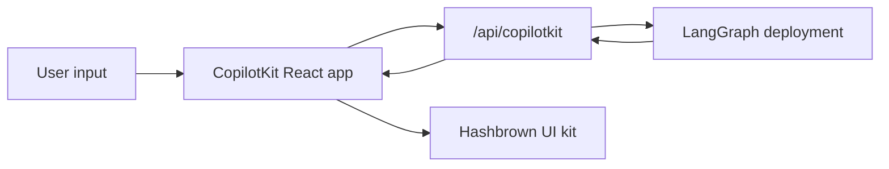

[CopilotKit](https://www.copilotkit.ai/) provides a full React chat runtime and pairs especially well with LangGraph when you want the agent to return **structured UI payloads** instead of only plain text. In this pattern, your LangGraph deployment serves both the graph API and a custom CopilotKit endpoint, while the frontend parses assistant messages into dynamic React components.

On the server, the [copilotkit](https://pypi.org/project/copilotkit/) package provides [`CopilotKitMiddleware`](https://docs.copilotkit.ai) so a LangGraph graph, a LangChain agent, or a [Deep Agent](/oss/javascript/deepagents/overview) can speak the [Agent UI (AG-UI)](https://docs.ag-ui.com/) wire protocol, stream tool and message events to a chat UI, and read or write the shared **CopilotKit** slice of state, with helpers to mount a CopilotKit-compatible HTTP endpoint in front of your graph.

This approach is useful when you want:

- a ready-made chat runtime instead of wiring `stream.messages` yourself
- a custom server endpoint that can add provider-specific behavior next to your deployed graph
- structured generative UI rendered from a constrained component registry

[CopilotKit for LangGraph](https://docs.copilotkit.ai/langgraph) also documents [generative UI](https://docs.copilotkit.ai/langgraph/generative-ui), [human in the loop](https://docs.copilotkit.ai/langgraph/human-in-the-loop) (HITL), and [shared state](https://docs.copilotkit.ai/langgraph/shared-state) on top of the same middleware and clients.

<Info>
  For CopilotKit-specific APIs, UI patterns, and runtime configuration, see the
  [CopilotKit docs](https://docs.copilotkit.ai/langgraph). For a Deep Agent walkthrough, see
  [Deep Agents and CopilotKit](https://docs.copilotkit.ai/langgraph/deep-agents) in the CopilotKit docs.
</Info>

import { ExampleEmbed } from "/snippets/example-embed.jsx"

<ExampleEmbed example="copilotkit" minHeight={700} />

## How it works

At a high level, CopilotKit sits between your React app and the LangGraph deployment. The frontend sends conversation state to a custom `/api/copilotkit` route mounted alongside the graph API, that route forwards the request to LangGraph, and the response comes back with both assistant messages and any structured UI payloads your component registry can render.

1. **Deploy the graph as usual** using LangSmith or using a LangGraph development server.
2. **Extend the deployment with an HTTP app** that mounts a CopilotKit route next to the graph API.
3. **Wrap the frontend in `CopilotKit`** and point it at that custom runtime URL.
4. **Register dynamic UI components** and parse assistant responses into those components at render time.




## Installation

For the backend endpoint:

```bash
bun add @copilotkit/runtime hono
```


For the frontend app:

```bash
bun add @copilotkit/react-core @copilotkit/react-ui @hashbrownai/core @hashbrownai/react
```


## Extend the LangGraph deployment with a custom endpoint

The key idea is that the LangGraph deployment does not only serve graphs. It can also load an HTTP app, which lets you mount extra routes next to the deployment itself.

In `langgraph.json`, point `http.app` at your custom app entrypoint:

```json
{
  "graphs": {
    "copilotkit_shadify": "./src/agents/copilotkit-shadify.ts:agent"
  },
  "http": {
    "app": "./src/api/app.ts:app"
  }
}
```


Then create the Hono app and register the CopilotKit route:

```ts app.ts
import { Hono } from "hono";
import { registerCopilotKit } from "./copilotkit.js";

export const app = new Hono();

registerCopilotKit(app);
```


This custom app is the important extension point: it mounts a CopilotKit-aware runtime without replacing the underlying LangGraph deployment.

Inside that route, create a `CopilotRuntime` and point it back at the deployed graph using `LangGraphAgent`:

```ts expandable copilotkit.ts
import { type Hono } from "hono";

import { createCopilotEndpointSingleRoute, CopilotRuntime } from "@copilotkit/runtime/v2";
import { LangGraphAgent } from "@copilotkit/runtime/langgraph";

const defaultAgentHost = process.env.LANGGRAPH_DEPLOYMENT_URL || "http://127.0.0.1:2024";
const agentUrl = defaultAgentHost.startsWith("http")
  ? defaultAgentHost
  : `http://${defaultAgentHost}`;

class BridgedLangGraphAgent extends LangGraphAgent {
  override prepareRunAgentInput(
    input: Parameters<LangGraphAgent["prepareRunAgentInput"]>[0],
  ): ReturnType<LangGraphAgent["prepareRunAgentInput"]> {
    const prepared = super.prepareRunAgentInput(input);

    return {
      ...prepared,
      context: normalizeCopilotContext(prepared.context) as ReturnType<
        LangGraphAgent["prepareRunAgentInput"]
      >["context"],
    };
  }

  override async getAssistant(): Promise<Awaited<ReturnType<LangGraphAgent["getAssistant"]>>> {
    const assistants = await this.client.assistants.search({
      graphId: this.graphId,
      limit: 100,
    });

    const assistant = assistants.find((candidate) => candidate.graph_id === this.graphId);
    if (assistant) {
      return assistant;
    }

    return super.getAssistant();
  }
}

export function registerCopilotKit(app: Hono) {
  const runtime = new CopilotRuntime({
    agents: {
      default: new BridgedLangGraphAgent({
        deploymentUrl: agentUrl,
        graphId: "copilotkit_shadify",
      }),
    },
  });

  const copilotApp = createCopilotEndpointSingleRoute({
    runtime,
    basePath: "/api/copilotkit",
  });

  app.route("/", copilotApp);
}

function normalizeCopilotContext(context: unknown): unknown {
  if (!Array.isArray(context)) {
    return context;
  }

  const normalizedEntries = context.flatMap((item) => {
    if (!item || typeof item !== "object") {
      return [];
    }

    const entry = item as { description?: unknown; value?: unknown };
    return typeof entry.description === "string" ? [[entry.description, entry.value] as const] : [];
  });

  return Object.fromEntries(normalizedEntries);
}
```

The route adapter is only half of the TypeScript setup. Your LangChain agent also needs middleware that reads the forwarded `output_schema` and turns it into a structured `responseFormat` for the model:

```ts expandable agent.ts
import { createAgent, createMiddleware, toolStrategy } from "langchain";
import { z } from "zod";

import { deepSearchTool, searchWebTool } from "../tools/index.js";

const contextSchema = z.object({
  output_schema: z.unknown().optional(),
});

const structuredOutputMiddleware = createMiddleware({
  name: "CopilotKitStructuredOutput",
  contextSchema,
  wrapModelCall: async (request, handler) => {
    const rawOutputSchema = getRuntimeOutputSchema(request.runtime);
    const schema = normalizeOutputSchema(rawOutputSchema);
    if (!schema) {
      return handler(request);
    }

    const responseFormat = toolStrategy(
      schema as unknown as Parameters<typeof toolStrategy>[0],
      {
        toolMessageContent: "Structured UI response generated.",
      },
    );

    return handler({
      ...request,
      responseFormat,
    });
  },
});

export const agent = createAgent({
  model: process.env.COPILOTKIT_MODEL ?? "google_genai:gemini-3.6-flash",
  contextSchema,
  middleware: [structuredOutputMiddleware],
  tools: [searchWebTool, deepSearchTool],
  systemPrompt: `You are a helpful UI assistant inspired by the CopilotKit Shadify example.

Build rich visual responses with the available UI components when they add value.
Only wrap actual UI layouts inside cards. Plain Markdown answers should stay as Markdown.
Use rows for side-by-side layouts with at most two columns.
Prefer simple, polished outputs over dense dashboards.
When using charts, make labels and values concise and easy to read.
When showing code, prefer the code_block component.
When researching topics, use the available search tools first and then present the result cleanly.`,
});

function normalizeOutputSchema(value: unknown): Record<string, unknown> | null {
  let schema = value;

  if (typeof schema === "string") {
    try {
      schema = JSON.parse(schema);
    } catch {
      return null;
    }
  }

  if (!schema || typeof schema !== "object" || Array.isArray(schema)) {
    return null;
  }

  const normalized = { ...(schema as Record<string, unknown>) };

  if (!normalized.title) {
    normalized.title = "CopilotKitStructuredOutput";
  }

  if (!normalized.description) {
    normalized.description = "Structured response schema for the CopilotKit preview.";
  }

  return normalized;
}

function getRuntimeOutputSchema(runtime: {
  context?: { output_schema?: unknown };
  configurable?: Record<string, unknown>;
}): unknown {
  if (runtime.context?.output_schema !== undefined) {
    return runtime.context.output_schema;
  }

  const configurable = runtime.configurable;
  if (!configurable || typeof configurable !== "object" || Array.isArray(configurable)) {
    return undefined;
  }

  return configurable.output_schema;
}
```

This middleware is what makes `useAgentContext({ description: "output_schema", ... })` useful on the frontend. The CopilotKit runtime forwards the schema, and the agent turns it into the structured output contract the model must follow.


The result is a clean separation of concerns:

- LangGraph still owns graph execution and persistence
- CopilotKit owns the chat-facing runtime contract
- your custom endpoint glues them together inside one deployment


Follow the CopilotKit documentation for [LangGraphHttpAgent](https://docs.copilotkit.ai/langgraph) or `LangGraphAgent` in the Node **CopilotRuntime**; the **Python** graph and middleware still define tool behavior and agent logic.
:::

## Structure the frontend app

On the frontend, wrap your app in `CopilotKit` and point it at the custom runtime URL:

```tsx
import { CopilotKit } from "@copilotkit/react-core";
import { CopilotChat, useAgentContext } from "@copilotkit/react-core/v2";
import { s } from "@hashbrownai/core";

import { useChatKit } from "@/components/chat/chat-kit";
import { chatTheme } from "@/lib/chat-theme";

export function App() {
  return (
    <CopilotKit runtimeUrl={import.meta.env.VITE_RUNTIME_URL ?? "/api/copilotkit"}>
      <Page />
    </CopilotKit>
  );
}

function Page() {
  const chatKit = useChatKit();

  useAgentContext({
    description: "output_schema",
    value: s.toJsonSchema(chatKit.schema),
  });

  return <CopilotChat {...chatTheme} />;
}
```

There are two important pieces here:

- `runtimeUrl="/api/copilotkit"` sends the chat to your custom backend route rather than directly to the raw LangGraph API
- `useAgentContext(...)` sends the UI schema to the agent so the model knows what structured output format it should produce

## Register the dynamic components

The component registry lives in `useChatKit()`. This is where you define the set of components the agent is allowed to emit, such as cards, rows, columns, charts, code blocks, and buttons.

```tsx
import { s } from "@hashbrownai/core";
import { exposeComponent, exposeMarkdown, useUiKit } from "@hashbrownai/react";

import { Button } from "@/components/ui/button";
import { Card } from "@/components/ui/card";
import { CodeBlock } from "@/components/ui/code-block";
import { Row, Column } from "@/components/ui/layout";
import { SimpleChart } from "@/components/ui/simple-chart";

export function useChatKit() {
  return useUiKit({
    components: [
      exposeMarkdown(),
      exposeComponent(Card, {
        name: "card",
        description: "Card to wrap generative UI content.",
        children: "any",
      }),
      exposeComponent(Row, {
        name: "row",
        props: {
          gap: s.string("Tailwind gap size") as never,
        },
        children: "any",
      }),
      exposeComponent(Column, {
        name: "column",
        children: "any",
      }),
      exposeComponent(SimpleChart, {
        name: "chart",
        props: {
          labels: s.array("Category labels", s.string("A label")),
          values: s.array("Numeric values", s.number("A value")),
        },
        children: false,
      }),
      exposeComponent(CodeBlock, {
        name: "code_block",
        props: {
          code: s.streaming.string("The code to display"),
          language: s.string("Programming language") as never,
        },
        children: false,
      }),
      exposeComponent(Button, {
        name: "button",
        children: "text",
      }),
    ],
  });
}
```

This registry becomes the contract between the agent and the UI. The model is not generating arbitrary JSX. It is generating structured data that must validate against the components and props you exposed.

## Render assistant messages as dynamic UI

Once the assistant response arrives, the custom message renderer decides how to display it. In this example:

- assistant messages are parsed as structured JSON against the UI kit schema
- valid structured output is rendered as real React components
- user messages are rendered as ordinary chat bubbles

```tsx
import type { AssistantMessage } from "@ag-ui/core";
import type { RenderMessageProps } from "@copilotkit/react-ui";
import { useJsonParser } from "@hashbrownai/react";
import { memo } from "react";

import { useChatKit } from "@/components/chat/chat-kit";
import { Squircle } from "@/components/squircle";

const AssistantMessageRenderer = memo(function AssistantMessageRenderer({
  message,
}: {
  message: AssistantMessage;
}) {
  const kit = useChatKit();
  const { value } = useJsonParser(message.content ?? "", kit.schema);

  if (!value) return null;

  return (
    <div className="group/msg mt-2 flex w-full justify-start">
      <div className="magic-text-output w-full px-1 py-1">{kit.render(value)}</div>
    </div>
  );
});

export function CustomMessageRenderer({ message }: RenderMessageProps) {
  if (message.role === "assistant") {
    return <AssistantMessageRenderer message={message} />;
  }

  return (
    <div className="flex w-full justify-end">
      <Squircle className="w-full max-w-[64ch] px-4 py-3">
        <pre>{typeof message.content === "string" ? message.content : JSON.stringify(message.content, null, 2)}</pre>
      </Squircle>
    </div>
  );
}
```

This renderer pattern is what makes the integration feel native:

- CopilotKit handles chat state and transport
- the custom renderer decides how assistant payloads become UI
- [Hashbrown](https://hashbrown.dev/) turns validated structured data into concrete React elements

## Resources

- [Deep Agents and CopilotKit](https://docs.copilotkit.ai/langgraph/deep-agents) in the CopilotKit documentation — end-to-end Next.js, dev server, and **Deep Agent** path
- [CopilotKit: LangGraph features](https://docs.copilotkit.ai/langgraph) — generative UI, HITL, shared state
- [LangGraph deployment](/oss/javascript/langgraph/deploy) — production and dev server

## Best practices

- **Keep the custom endpoint thin:** use it to adapt CopilotKit to your graph deployment, not to duplicate business logic already inside the graph
- **Send the schema explicitly:** `useAgentContext` should describe the UI contract every time the page mounts
- **Register a constrained component set:** expose only the components and props you actually want the model to use
- **Treat rendering as a parsing step:** parse assistant content against your schema before rendering it
- **Keep user messages plain:** only assistant messages need the structured renderer; user messages can stay normal chat bubbles

---

<div className="source-links">
<Callout icon="terminal-2">
    [Connect these docs](/use-these-docs) to Claude, VSCode, and more via MCP for real-time answers.
</Callout>
<Callout icon="edit">
    [Edit this page on GitHub](https://github.com/langchain-ai/docs/edit/main/src/oss/langchain/frontend/integrations/copilotkit.mdx) or [file an issue](https://github.com/langchain-ai/docs/issues/new/choose).
</Callout>
</div>
