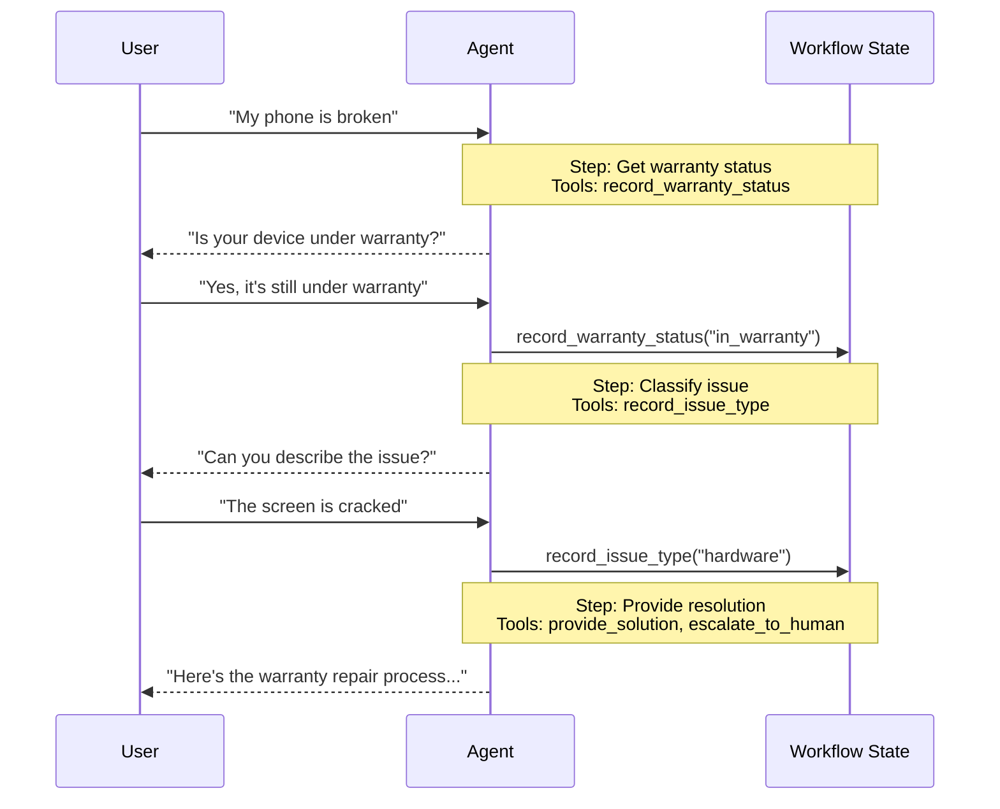

In the **handoffs** architecture, behavior changes dynamically based on state. The core mechanism: [tools](/oss/javascript/langchain/tools) update a state variable (e.g., `current_step` or `active_agent`) that persists across turns, and the system reads this variable to adjust behavior—either applying different configuration (system prompt, tools) or routing to a different [agent](/oss/javascript/langchain/agents). This pattern supports both handoffs between distinct agents and dynamic configuration changes within a single agent.

<Tip>
The term **handoffs** was coined by [OpenAI](https://openai.github.io/openai-agents-python/handoffs/) for using tool calls (e.g., `transfer_to_sales_agent`) to transfer control between agents or states.
</Tip>



## Key characteristics

* State-driven behavior: Behavior changes based on a state variable (e.g., `current_step` or `active_agent`)
* Tool-based transitions: Tools update the state variable to move between states
* Direct user interaction: Each state's configuration handles user messages directly
* Persistent state: State survives across conversation turns

## When to use

Use the handoffs pattern when you need to enforce sequential constraints (unlock capabilities only after preconditions are met), the agent needs to converse directly with the user across different states, or you're building multi-stage conversational flows. This pattern is particularly valuable for customer support scenarios where you need to collect information in a specific sequence—for example, collecting a warranty ID before processing a refund.

## Basic implementation

The core mechanism is a [tool](/oss/javascript/langchain/tools) that returns a [`Command`](/oss/javascript/langgraph/graph-api#command) to update state, triggering a transition to a new step or agent:


```typescript
import { tool, ToolMessage, type ToolRuntime } from "langchain";
import { Command } from "@langchain/langgraph";
import { z } from "zod";

const transferToSpecialist = tool(
  async (_, config: ToolRuntime<typeof StateSchema>) => {
    return new Command({
      update: {
        messages: [
          new ToolMessage({  // [!code highlight]
            content: "Transferred to specialist",
            tool_call_id: config.toolCallId  // [!code highlight]
          })
        ],
        currentStep: "specialist"  // Triggers behavior change
      }
    });
  },
  {
    name: "transfer_to_specialist",
    description: "Transfer to the specialist agent.",
    schema: z.object({})
  }
);
```


<Note>
**Why include a `ToolMessage`?** When an LLM calls a tool, it expects a response. The `ToolMessage` with matching `tool_call_id` completes this request-response cycle—without it, the conversation history becomes malformed. This is required whenever your handoff tool updates messages.
</Note>

For a complete implementation, see the tutorial below.

<Card
    title="Tutorial: Build customer support with handoffs"
    icon="users"
    href="/oss/javascript/langchain/multi-agent/handoffs-customer-support"
    arrow cta="Learn more"
>
    Learn how to build a customer support agent using the handoffs pattern, where a single agent transitions between different configurations.
</Card>

## Implementation approaches

There are two ways to implement handoffs: **[single agent with middleware](#single-agent-with-middleware)** (one agent with dynamic configuration) or **[multiple agent subgraphs](#multiple-agent-subgraphs)** (distinct agents as graph nodes).

### Single agent with middleware

A single agent changes its behavior based on state. Middleware intercepts each model call and dynamically adjusts the system prompt and available tools. Tools update the state variable to trigger transitions:


```typescript
import { tool, ToolMessage, type ToolRuntime } from "langchain";
import { Command } from "@langchain/langgraph";
import { z } from "zod";

const recordWarrantyStatus = tool(
  async ({ status }, config: ToolRuntime<typeof StateSchema>) => {
    return new Command({
      update: {
        messages: [
          new ToolMessage({
            content: `Warranty status recorded: ${status}`,
            tool_call_id: config.toolCallId,
          }),
        ],
        warrantyStatus: status,
        currentStep: "specialist", // Update state to trigger transition
      },
    });
  },
  {
    name: "record_warranty_status",
    description: "Record warranty status and transition to next step.",
    schema: z.object({
      status: z.string(),
    }),
  }
);
```


<Accordion title="Complete example: Customer support with middleware">


```typescript
import {
  createAgent,
  createMiddleware,
  tool,
  ToolMessage,
  type ToolRuntime,
} from "langchain";
import { Command, MemorySaver, StateSchema } from "@langchain/langgraph";
import { z } from "zod";

// 1. Define state with current_step tracker
const SupportState = new StateSchema({ // [!code highlight]
  currentStep: z.string().default("triage"), // [!code highlight]
  warrantyStatus: z.string().optional(),
});

// 2. Tools update currentStep via Command
const recordWarrantyStatus = tool(
  async ({ status }, config: ToolRuntime<typeof SupportState.State>) => {
    return new Command({ // [!code highlight]
      update: { // [!code highlight]
        messages: [ // [!code highlight]
          new ToolMessage({
            content: `Warranty status recorded: ${status}`,
            tool_call_id: config.toolCallId,
          }),
        ],
        warrantyStatus: status,
        // Transition to next step
        currentStep: "specialist", // [!code highlight]
      },
    });
  },
  {
    name: "record_warranty_status",
    description: "Record warranty status and transition",
    schema: z.object({ status: z.string() }),
  }
);

// 3. Middleware applies dynamic configuration based on currentStep
const applyStepConfig = createMiddleware({
  name: "applyStepConfig",
  stateSchema: SupportState, // [!code highlight]
  wrapModelCall: async (request, handler) => {
    const step = request.state.currentStep || "triage"; // [!code highlight]

    // Map steps to their configurations
    const configs = {
      triage: {
        prompt: "Collect warranty information...",
        tools: [recordWarrantyStatus],
      },
      specialist: {
        prompt: `Provide solutions based on warranty: ${request.state.warrantyStatus}`,
        tools: [provideSolution, escalate],
      },
    };

    const config = configs[step as keyof typeof configs];
    return handler({
      ...request,
      systemPrompt: config.prompt,
      tools: config.tools,
    });
  },
});

// 4. Create agent with middleware
const agent = createAgent({
  model,
  tools: [recordWarrantyStatus, provideSolution, escalate],
  middleware: [applyStepConfig], // [!code highlight]
  checkpointer: new MemorySaver(), // Persist state across turns  // [!code highlight]
});
```


</Accordion>

### Multiple agent subgraphs

Multiple distinct agents exist as separate nodes in a graph. Handoff tools navigate between agent nodes using `Command.PARENT` to specify which node to execute next.

<Warning>
Subgraph handoffs require careful **[context engineering](/oss/javascript/langchain/context-engineering)**. Unlike single-agent middleware (where message history flows naturally), you must explicitly decide what messages pass between agents. Get this wrong and agents receive malformed conversation history or bloated context. See [Context engineering](#context-engineering) below.
</Warning>


```typescript
import {
  tool,
  ToolMessage,
  AIMessage,
  type ToolRuntime,
} from "langchain";
import { Command, StateSchema, MessagesValue } from "@langchain/langgraph";

const CustomState = new StateSchema({
  messages: MessagesValue,
});

const transferToSales = tool(
  async (_, runtime: ToolRuntime<typeof CustomState.State>) => {
    const lastAiMessage = runtime.state.messages // [!code highlight]
      .reverse() // [!code highlight]
      .find(AIMessage.isInstance); // [!code highlight]

    const transferMessage = new ToolMessage({ // [!code highlight]
      content: "Transferred to sales agent", // [!code highlight]
      tool_call_id: runtime.toolCallId, // [!code highlight]
    }); // [!code highlight]
    return new Command({
      goto: "sales_agent",
      update: {
        activeAgent: "sales_agent",
        messages: [lastAiMessage, transferMessage].filter(Boolean), // [!code highlight]
      },
      graph: Command.PARENT,
    });
  },
  {
    name: "transfer_to_sales",
    description: "Transfer to the sales agent.",
    schema: z.object({}),
  }
);
```


<Accordion title="Complete example: Sales and support with handoffs">

This example shows a multi-agent system with separate sales and support agents. Each agent is a separate graph node, and handoff tools allow agents to transfer conversations to each other.


```typescript
import {
  StateGraph,
  START,
  END,
  StateSchema,
  MessagesValue,
  Command,
  ConditionalEdgeRouter,
  GraphNode,
} from "@langchain/langgraph";
import { createAgent, AIMessage, ToolMessage } from "langchain";
import { tool, ToolRuntime } from "@langchain/core/tools";
import { z } from "zod/v4";

// 1. Define state with active_agent tracker
const MultiAgentState = new StateSchema({
  messages: MessagesValue,
  activeAgent: z.string().optional(),
});

// 2. Create handoff tools
const transferToSales = tool(
  async (_, runtime: ToolRuntime<typeof MultiAgentState.State>) => {
    const lastAiMessage = [...runtime.state.messages] // [!code highlight]
      .reverse() // [!code highlight]
      .find(AIMessage.isInstance); // [!code highlight]
    const transferMessage = new ToolMessage({ // [!code highlight]
      content: "Transferred to sales agent from support agent", // [!code highlight]
      tool_call_id: runtime.toolCallId, // [!code highlight]
    }); // [!code highlight]
    return new Command({
      goto: "sales_agent",
      update: {
        activeAgent: "sales_agent",
        messages: [lastAiMessage, transferMessage].filter(Boolean), // [!code highlight]
      },
      graph: Command.PARENT,
    });
  },
  {
    name: "transfer_to_sales",
    description: "Transfer to the sales agent.",
    schema: z.object({}),
  }
);

const transferToSupport = tool(
  async (_, runtime: ToolRuntime<typeof MultiAgentState.State>) => {
    const lastAiMessage = [...runtime.state.messages] // [!code highlight]
      .reverse() // [!code highlight]
      .find(AIMessage.isInstance); // [!code highlight]
    const transferMessage = new ToolMessage({ // [!code highlight]
      content: "Transferred to support agent from sales agent", // [!code highlight]
      tool_call_id: runtime.toolCallId, // [!code highlight]
    }); // [!code highlight]
    return new Command({
      goto: "support_agent",
      update: {
        activeAgent: "support_agent",
        messages: [lastAiMessage, transferMessage].filter(Boolean), // [!code highlight]
      },
      graph: Command.PARENT,
    });
  },
  {
    name: "transfer_to_support",
    description: "Transfer to the support agent.",
    schema: z.object({}),
  }
);

// 3. Create agents with handoff tools
const salesAgent = createAgent({
  model: "google_genai:gemini-3.6-flash",
  tools: [transferToSupport],
  systemPrompt:
    "You are a sales agent. Help with sales inquiries. If asked about technical issues or support, transfer to the support agent.",
});

const supportAgent = createAgent({
  model: "google_genai:gemini-3.6-flash",
  tools: [transferToSales],
  systemPrompt:
    "You are a support agent. Help with technical issues. If asked about pricing or purchasing, transfer to the sales agent.",
});

// 4. Create agent nodes that invoke the agents
const callSalesAgent: GraphNode<typeof MultiAgentState.State> = async (state) => {
  const response = await salesAgent.invoke(state);
  return response;
};

const callSupportAgent: GraphNode<typeof MultiAgentState.State> = async (state) => {
  const response = await supportAgent.invoke(state);
  return response;
};

// 5. Create router that checks if we should end or continue
const routeAfterAgent: ConditionalEdgeRouter<{ InputSchema: typeof MultiAgentState.State; Nodes: "sales_agent" | "support_agent" }> = (state) => {
  const messages = state.messages ?? [];

  // Check the last message - if it's an AIMessage without tool calls, we're done
  if (messages.length > 0) {
    const lastMsg = messages[messages.length - 1];
    if (lastMsg instanceof AIMessage && !lastMsg.tool_calls?.length) { // [!code highlight]
      return END; // [!code highlight]
    } // [!code highlight]
  }

  // Otherwise route to the active agent
  const active = state.activeAgent ?? "sales_agent";
  return active as "sales_agent" | "support_agent";
};

const routeInitial: ConditionalEdgeRouter<{ InputSchema: typeof MultiAgentState.State; Nodes: "sales_agent" | "support_agent" }> = (state) => {
  // Route to the active agent based on state, default to sales agent
  return (state.activeAgent ?? "sales_agent") as
    | "sales_agent"
    | "support_agent";
};

// 6. Build the graph
const builder = new StateGraph(MultiAgentState)
  .addNode("sales_agent", callSalesAgent)
  .addNode("support_agent", callSupportAgent);
  // Start with conditional routing based on initial activeAgent
  .addConditionalEdges(START, routeInitial, [
    "sales_agent",
    "support_agent",
  ])
  // After each agent, check if we should end or route to another agent
  .addConditionalEdges("sales_agent", routeAfterAgent, [
    "sales_agent",
    "support_agent",
    END,
  ]);
  builder.addConditionalEdges("support_agent", routeAfterAgent, [
    "sales_agent",
    "support_agent",
    END,
  ]);

const graph = builder.compile();
const result = await graph.invoke({
  messages: [
    {
      role: "user",
      content: "Hi, I'm having trouble with my account login. Can you help?",
    },
  ],
});

for (const msg of result.messages) {
  console.log(msg.content);
}
```


</Accordion>

<Tip>
Use **single agent with middleware** for most handoffs use cases—it's simpler. Only use **multiple agent subgraphs** when you need bespoke agent implementations (e.g., a node that's itself a complex graph with reflection or retrieval steps).
</Tip>

#### Context engineering

With subgraph handoffs, you control exactly what messages flow between agents. This precision is essential for maintaining valid conversation history and avoiding context bloat that could confuse downstream agents. For more on this topic, see [context engineering](/oss/javascript/langchain/context-engineering).

**Handling context during handoffs**

When handing off between agents, you need to ensure the conversation history remains valid. LLMs expect tool calls to be paired with their responses, so when using `Command.PARENT` to hand off to another agent, you must include both:

1. **The `AIMessage` containing the tool call** (the message that triggered the handoff)
2. **A `ToolMessage` acknowledging the handoff** (the artificial response to that tool call)

Without this pairing, the receiving agent will see an incomplete conversation and may produce errors or unexpected behavior.

The example below assumes only the handoff tool was called (no parallel tool calls):


```typescript
const transferToSales = tool(
  async (_, runtime: ToolRuntime<typeof MultiAgentState.State>) => {
    // Get the AI message that triggered this handoff
    const lastAiMessage = runtime.state.messages.at(-1);

    // Create an artificial tool response to complete the pair
    const transferMessage = new ToolMessage({
      content: "Transferred to sales agent",
      tool_call_id: runtime.toolCallId,
    });

    return new Command({
      goto: "sales_agent",
      update: {
        activeAgent: "sales_agent",
        // Pass only these two messages, not the full subagent history
        messages: [lastAiMessage, transferMessage],
      },
      graph: Command.PARENT,
    });
  },
  {
    name: "transfer_to_sales",
    description: "Transfer to the sales agent.",
    schema: z.object({}),
  }
);
```


<Note>
**Why not pass all subagent messages?** While you could include the full subagent conversation in the handoff, this often creates problems. The receiving agent may become confused by irrelevant internal reasoning, and token costs increase unnecessarily. By passing only the handoff pair, you keep the parent graph's context focused on high-level coordination. If the receiving agent needs additional context, consider summarizing the subagent's work in the ToolMessage content instead of passing raw message history.
</Note>

**Returning control to the user**

When returning control to the user (ending the agent's turn), ensure the final message is an `AIMessage`. This maintains valid conversation history and signals to the user interface that the agent has finished its work.

## Implementation considerations

As you design your multi-agent system, consider:

* **Context filtering strategy**: Will each agent receive full conversation history, filtered portions, or summaries? Different agents may need different context depending on their role.
* **Tool semantics**: Clarify whether handoff tools only update routing state or also perform side effects. For example, should `transfer_to_sales()` also create a support ticket, or should that be a separate action?
* **Token efficiency**: Balance context completeness against token costs. Summarization and selective context passing become more important as conversations grow longer.

---

<div className="source-links">
<Callout icon="terminal-2">
    [Connect these docs](/use-these-docs) to Claude, VSCode, and more via MCP for real-time answers.
</Callout>
<Callout icon="edit">
    [Edit this page on GitHub](https://github.com/langchain-ai/docs/edit/main/src/oss/langchain/multi-agent/handoffs.mdx) or [file an issue](https://github.com/langchain-ai/docs/issues/new/choose).
</Callout>
</div>
