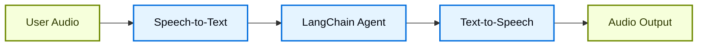
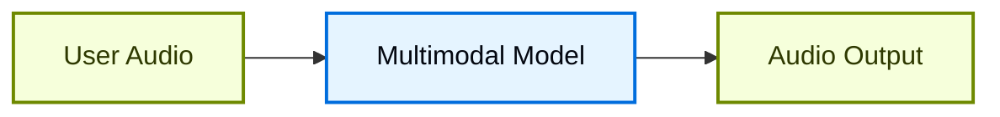

## Overview

Chat interfaces have dominated how we interact with AI, but recent breakthroughs in multimodal AI are opening up exciting new possibilities. High-quality generative models and expressive text-to-speech (TTS) systems now make it possible to build agents that feel less like tools and more like conversational partners.

Voice agents are one example of this. Instead of relying on a keyboard and mouse to type inputs into an agent, you can use spoken words to interact with it. This can be a more natural and engaging way to interact with AI, and can be especially useful for certain contexts.

### What are voice agents?

Voice agents are [agents](/oss/javascript/langchain/agents) that can engage in natural spoken conversations with users. These agents combine speech recognition, natural language processing, generative AI, and text-to-speech technologies to create seamless, natural conversations.

They're suited for a variety of use cases, including:

- Customer support
- Personal assistants
- Hands-free interfaces
- Coaching and training

### How do voice agents work?

At a high level, every voice agent needs to handle three tasks:

1. **Listen** - capture audio and transcribe it
2. **Think** - interpret intent, reason, plan
3. **Speak** - generate audio and stream it back to the user

The difference lies in how these steps are sequenced and coupled. In practice, production agents follow one of two main architectures:

#### 1. STT > Agent > TTS architecture (The "Sandwich")

The Sandwich architecture composes three distinct components: speech-to-text (STT), a text-based LangChain agent, and text-to-speech (TTS).



**Pros:**
- Full control over each component (swap STT/TTS providers as needed)
- Access to latest capabilities from modern text-modality models
- Transparent behavior with clear boundaries between components

**Cons:**
- Requires orchestrating multiple services
- Additional complexity in managing the pipeline
- Conversion from speech to text loses information (e.g., tone, emotion)

#### 2. Speech-to-Speech architecture (S2S)

Speech-to-speech uses a multimodal model that processes audio input and generates audio output natively.



**Pros:**
- Simpler architecture with fewer moving parts
- Typically lower latency for simple interactions
- Direct audio processing captures tone and other nuances of speech

**Cons:**
- Limited model options, greater risk of provider lock-in
- Features may lag behind text-modality models
- Less transparency in how audio is processed
- Reduced controllability and customization options

This guide demonstrates the **sandwich architecture** to balance performance, controllability, and access to modern model capabilities. The sandwich can achieve sub-700ms latency with some STT and TTS providers while maintaining control over modular components.

### Demo Application overview

We'll walk through building a voice-based agent using the sandwich architecture. The agent will manage orders for a sandwich shop. The application will demonstrate all three components of the sandwich architecture, using [AssemblyAI](https://www.assemblyai.com/) for STT and [Cartesia](https://cartesia.ai/) for TTS (although adapters can be built for most providers).

An end-to-end reference application is available in the [voice-sandwich-demo](https://github.com/langchain-ai/voice-sandwich-demo) repository. We will walk through that application here.

The demo uses WebSockets for real-time bidirectional communication between the browser and server. The same architecture can be adapted for other transports like telephony systems (Twilio, Vonage) or WebRTC connections.

### Architecture

The demo implements a streaming pipeline where each stage processes data asynchronously:

**Client (Browser)**
- Captures microphone audio and encodes it as PCM
- Establishes WebSocket connection to the backend server
- Streams audio chunks to the server in real-time
- Receives and plays back synthesized speech audio


**Server (Node.js)**


- Accepts WebSocket connections from clients
- Orchestrates the three-step pipeline:
  - [Speech-to-text (STT)](#1-speech-to-text): Forwards audio to the STT provider (e.g., AssemblyAI), receives transcript events
  - [Agent](#2-langchain-agent): Processes transcripts with LangChain agent, streams response tokens
  - [Text-to-speech (TTS)](#3-text-to-speech): Sends agent responses to the TTS provider (e.g., Cartesia), receives audio chunks

- Returns synthesized audio to the client for playback


The pipeline uses async iterators to enable streaming at each stage. This allows downstream components to begin processing before upstream stages complete, minimizing end-to-end latency.


## Setup

For detailed installation instructions and setup, see the [repository README](https://github.com/langchain-ai/voice-sandwich-demo#readme).

## 1. Speech-to-text

The STT stage transforms an incoming audio stream into text transcripts. The implementation uses a producer-consumer pattern to handle audio streaming and transcript reception concurrently.

### Key concepts

**Producer-Consumer Pattern**: Audio chunks are sent to the STT service concurrently with receiving transcript events. This allows transcription to begin before all audio has arrived.

**Event Types**:
- `stt_chunk`: Partial transcripts provided as the STT service processes audio
- `stt_output`: Final, formatted transcripts that trigger agent processing

**WebSocket Connection**: Maintains a persistent connection to AssemblyAI's real-time STT API, configured for 16kHz PCM audio with automatic turn formatting.

### Implementation


```typescript
import { AssemblyAISTT } from "./assemblyai";
import type { VoiceAgentEvent } from "./types";

async function* sttStream(
  audioStream: AsyncIterable<Uint8Array>
): AsyncGenerator<VoiceAgentEvent> {
  const stt = new AssemblyAISTT({ sampleRate: 16000 });
  const passthrough = writableIterator<VoiceAgentEvent>();

  // Producer: pump audio chunks to AssemblyAI
  const producer = (async () => {
    try {
      for await (const audioChunk of audioStream) {
        await stt.sendAudio(audioChunk);
      }
    } finally {
      await stt.close();
    }
  })();

  // Consumer: receive transcription events
  const consumer = (async () => {
    for await (const event of stt.receiveEvents()) {
      passthrough.push(event);
    }
  })();

  try {
    // Yield events as they arrive
    yield* passthrough;
  } finally {
    // Wait for producer and consumer to complete
    await Promise.all([producer, consumer]);
  }
}
```


The application implements an AssemblyAI client to manage the WebSocket connection and message parsing. See below for implementations; similar adapters can be constructed for other STT providers.

<Accordion title="AssemblyAI Client">


```typescript
export class AssemblyAISTT {
  protected _bufferIterator = writableIterator<VoiceAgentEvent.STTEvent>();
  protected _connectionPromise: Promise<WebSocket> | null = null;

  async sendAudio(buffer: Uint8Array): Promise<void> {
    const conn = await this._connection;
    conn.send(buffer);
  }

  async *receiveEvents(): AsyncGenerator<VoiceAgentEvent.STTEvent> {
    yield* this._bufferIterator;
  }

  protected get _connection(): Promise<WebSocket> {
    if (this._connectionPromise) return this._connectionPromise;

    this._connectionPromise = new Promise((resolve, reject) => {
      const params = new URLSearchParams({
        sample_rate: this.sampleRate.toString(),
        format_turns: "true",
      });
      const url = `wss://streaming.assemblyai.com/v3/ws?${params}`;
      const ws = new WebSocket(url, {
        headers: { Authorization: this.apiKey },
      });

      ws.on("open", () => resolve(ws));

      ws.on("message", (data) => {
        const message = JSON.parse(data.toString());
        if (message.type === "Turn") {
          if (message.turn_is_formatted) {
            this._bufferIterator.push({
              type: "stt_output",
              transcript: message.transcript,
              ts: Date.now()
            });
          } else {
            this._bufferIterator.push({
              type: "stt_chunk",
              transcript: message.transcript,
              ts: Date.now()
            });
          }
        }
      });
    });

    return this._connectionPromise;
  }
}
```


</Accordion>

## 2. LangChain agent

The agent stage processes text transcripts through a LangChain [agent](/oss/javascript/langchain/agents) and streams the response tokens. In this case, we stream all [text content blocks](/oss/javascript/langchain/messages#content-block-reference) generated by the agent.

### Key concepts

**Streaming Responses**: The agent uses [`stream_events(version="v3")`](/oss/javascript/langchain/streaming) with `stream.messages` to emit response tokens as they are generated, rather than waiting for the complete response. This enables the TTS stage to begin synthesis immediately.

**Conversation Memory**: A [checkpointer](/oss/javascript/langchain/short-term-memory) maintains conversation state across turns using a unique thread ID. This allows the agent to reference previous exchanges in the conversation.

### Implementation


```typescript
import { createAgent } from "langchain";
import { HumanMessage } from "@langchain/core/messages";
import { MemorySaver } from "@langchain/langgraph";
import { tool } from "@langchain/core/tools";
import { z } from "zod";

// Define agent tools
const addToOrder = tool(
  async ({ item, quantity }) => {
    return `Added ${quantity} x ${item} to the order.`;
  },
  {
    name: "add_to_order",
    description: "Add an item to the customer's sandwich order.",
    schema: z.object({
      item: z.string(),
      quantity: z.number(),
    }),
  }
);

const confirmOrder = tool(
  async ({ orderSummary }) => {
    return `Order confirmed: ${orderSummary}. Sending to kitchen.`;
  },
  {
    name: "confirm_order",
    description: "Confirm the final order with the customer.",
    schema: z.object({
      orderSummary: z.string().describe("Summary of the order"),
    }),
  }
);

// Create agent with tools and memory
const agent = createAgent({
  model: "claude-haiku-4-5",
  tools: [addToOrder, confirmOrder],
  checkpointer: new MemorySaver(),
  systemPrompt: `You are a helpful sandwich shop assistant.
Your goal is to take the user's order. Be concise and friendly.
Do NOT use emojis, special characters, or markdown.
Your responses will be read by a text-to-speech engine.`,
});

async function* agentStream(
  eventStream: AsyncIterable<VoiceAgentEvent>
): AsyncGenerator<VoiceAgentEvent> {
  // Generate unique thread ID for conversation memory
  const threadId = crypto.randomUUID();

  for await (const event of eventStream) {
    // Pass through all upstream events
    yield event;

    // Process final transcripts through the agent
    if (event.type === "stt_output") {
      const stream = await agent.streamEvents(
        { messages: [new HumanMessage(event.transcript)] },
        {
          configurable: { thread_id: threadId },
          version: "v3",
        }
      );

      // Yield agent response chunks as they arrive
      for await (const message of stream.messages) {
        for await (const token of message.text) {
          yield { type: "agent_chunk", text: token, ts: Date.now() };
        }
      }
    }
  }
}
```


## 3. Text-to-speech

The TTS stage synthesizes agent response text into audio and streams it back to the client. Like the STT stage, it uses a producer-consumer pattern to handle concurrent text sending and audio reception.

### Key concepts

**Concurrent Processing**: The implementation merges two async streams:
- **Upstream processing**: Passes through all events and sends agent text chunks to the TTS provider
- **Audio reception**: Receives synthesized audio chunks from the TTS provider

**Streaming TTS**: Some providers (such as [Cartesia](https://cartesia.ai/)) begin synthesizing audio as soon as it receives text, enabling audio playback to start before the agent finishes generating its complete response.

**Event Passthrough**: All upstream events flow through unchanged, allowing the client or other observers to track the full pipeline state.

### Implementation


```typescript
import { CartesiaTTS } from "./cartesia";

async function* ttsStream(
  eventStream: AsyncIterable<VoiceAgentEvent>
): AsyncGenerator<VoiceAgentEvent> {
  const tts = new CartesiaTTS();
  const passthrough = writableIterator<VoiceAgentEvent>();

  // Producer: read upstream events and send text to Cartesia
  const producer = (async () => {
    try {
      for await (const event of eventStream) {
        passthrough.push(event);
        if (event.type === "agent_chunk") {
          await tts.sendText(event.text);
        }
      }
    } finally {
      await tts.close();
    }
  })();

  // Consumer: receive audio from Cartesia
  const consumer = (async () => {
    for await (const event of tts.receiveEvents()) {
      passthrough.push(event);
    }
  })();

  try {
    // Yield events from both producer and consumer
    yield* passthrough;
  } finally {
    await Promise.all([producer, consumer]);
  }
}
```


The application implements a Cartesia client to manage the WebSocket connection and audio streaming. See below for implementations; similar adapters can be constructed for other TTS providers.

<Accordion title="Cartesia Client">


```typescript
export class CartesiaTTS {
  protected _bufferIterator = writableIterator<VoiceAgentEvent.TTSEvent>();
  protected _connectionPromise: Promise<WebSocket> | null = null;

  async sendText(text: string | null): Promise<void> {
    if (!text || !text.trim()) return;

    const conn = await this._connection;
    const payload = { text, try_trigger_generation: false };
    conn.send(JSON.stringify(payload));
  }

  async *receiveEvents(): AsyncGenerator<VoiceAgentEvent.TTSEvent> {
    yield* this._bufferIterator;
  }

  protected _generateContextId(): string {
    const timestamp = Date.now();
    const counter = this._contextCounter++;
    return `ctx_${timestamp}_${counter}`;
  }

  protected get _connection(): Promise<WebSocket> {
    if (this._connectionPromise) return this._connectionPromise;

    this._connectionPromise = new Promise((resolve, reject) => {
      const params = new URLSearchParams({
        api_key: this.apiKey,
        cartesia_version: this.cartesiaVersion,
      });
      const url = `wss://api.cartesia.ai/tts/websocket?${params.toString()}`;
      const ws = new WebSocket(url);

      ws.on("open", () => {
        resolve(ws);
      });

      ws.on("message", (data: WebSocket.RawData) => {
        const message: CartesiaTTSResponse = JSON.parse(data.toString());
        if (message.data) {
          this._bufferIterator.push({
            type: "tts_chunk",
            audio: message.data,
            ts: Date.now(),
          });
        } else if (message.error) {
          throw new Error(`Cartesia error: ${message.error}`);
        }
      });
    });

    return this._connectionPromise;
  }
}
```

</Accordion>

### LangSmith

Many of the applications you build with LangChain will contain multiple steps with multiple invocations of LLM calls. As these applications get more complex, it becomes crucial to be able to inspect what exactly is going on inside your chain or agent. The best way to do this is with [LangSmith](https://smith.langchain.com?utm_source=docs&utm_medium=cta&utm_campaign=langsmith-signup&utm_content=oss-langchain-voice-agent).

After you sign up at the link above, make sure to set your environment variables to start logging traces:

```shell
export LANGSMITH_TRACING="true"
export LANGSMITH_API_KEY="..."
```


## Putting it all together

The complete pipeline chains the three stages together:


```typescript
// using https://hono.dev/
app.get("/ws", upgradeWebSocket(async () => {
  const inputStream = writableIterator<Uint8Array>();

  // Chain the three stages
  const transcriptEventStream = sttStream(inputStream);
  const agentEventStream = agentStream(transcriptEventStream);
  const outputEventStream = ttsStream(agentEventStream);

  // Process pipeline and send TTS audio to client
  const flushPromise = (async () => {
    for await (const event of outputEventStream) {
      if (event.type === "tts_chunk") {
        currentSocket?.send(event.audio);
      }
    }
  })();

  return {
    onMessage(event) {
      // Push incoming audio into pipeline
      const data = event.data;
      if (Buffer.isBuffer(data)) {
        inputStream.push(new Uint8Array(data));
      }
    },
    async onClose() {
      inputStream.cancel();
      await flushPromise;
    },
  };
}));
```


Each stage processes events independently and concurrently: audio transcription begins as soon as audio arrives, the agent starts reasoning as soon as a transcript is available, and speech synthesis begins as soon as agent text is generated. This architecture can achieve sub-700ms latency to support natural conversation.

For more on building agents with LangChain, see the [Agents guide](/oss/javascript/langchain/agents).

---

<div className="source-links">
<Callout icon="terminal-2">
    [Connect these docs](/use-these-docs) to Claude, VSCode, and more via MCP for real-time answers.
</Callout>
<Callout icon="edit">
    [Edit this page on GitHub](https://github.com/langchain-ai/docs/edit/main/src/oss/langchain/voice-agent.mdx) or [file an issue](https://github.com/langchain-ai/docs/issues/new/choose).
</Callout>
</div>
