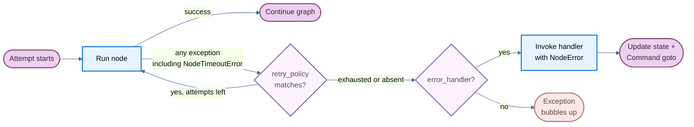

When a node fails—from a slow external API, a transient network error, or an unhandled exception—LangGraph gives you three composable mechanisms to respond:

- [**Retries**](#retries) — automatically re-run failed attempts based on exception type and backoff settings
- [**Timeouts**](#timeouts) — cap how long a single attempt may run
- [**Error handling**](#error-handling) — run a recovery function after all retries are exhausted


Use [**`setNodeDefaults`**](#graph-defaults) to configure these mechanisms once for all nodes instead of repeating them on every `addNode` call.


These compose in a fixed order: when a node attempt raises any exception (including [`NodeTimeoutError`](https://reference.langchain.com/javascript/langchain-langgraph/index/NodeTimeoutError) from a timeout), the retry policy decides whether to retry. Only after retries are exhausted does the error handler run.

For stopping a run cleanly at a superstep boundary and resuming later, see [Graceful shutdown](#graceful-shutdown).


<Note>
Per-node timeouts and node-level error handlers require `@langchain/langgraph>=1.4.0`.
</Note>




## Retries

A retry policy automatically re-runs a failed node attempt based on exception type and backoff settings.


Pass `retryPolicy` to [`addNode`](https://reference.langchain.com/javascript/classes/_langchain_langgraph.index.StateGraph.html#addNode):

```typescript
import { StateGraph } from "@langchain/langgraph";

const graph = new StateGraph(State)
  .addNode("callApi", callApi, { retryPolicy: { maxAttempts: 3 } })
  .compile();
```


### Default behavior


Retries are opt-in. A node retries only when it has a `retryPolicy` configured, either directly or through graph defaults with [`setNodeDefaults`](#graph-defaults). An empty policy (`{}`) is enough. Without a policy, the first failure ends the attempt and LangGraph does not call `retryOn`.

If the policy omits `retryOn`, LangGraph uses a built-in handler that retries thrown errors except:

- Abort and cancellation errors: `error.name === "AbortError"`, or `error.message` starts with `"Cancel"` or `"AbortError"`
- `GraphValueError`, matched by `error.name`
- Aborted connections: `error.code === "ECONNABORTED"`
- HTTP client errors with status 400, 401, 402, 403, 404, 405, 406, 407, or 409, read from `error.response?.status` or `error.status` for clients such as `fetch`, Axios, and similar clients
- OpenAI-style quota errors: `error.error?.code === "insufficient_quota"`

Other HTTP statuses, including 408 and 5xx responses, are retryable unless you override `retryOn`. [`NodeTimeoutError`](https://reference.langchain.com/javascript/langchain-langgraph/index/NodeTimeoutError) is not on this blocklist, so it is retryable when a retry policy is configured.

Some failures bypass `retryOn`. Graph control-flow errors, such as `GraphInterrupt` and `Command` routing, bubble up without retrying. An aborted run signal also stops the retry loop, even if `retryOn` would return `true`.


### Parameters


| Parameter | Type | Default | Description |
| --------- | ---- | ------- | ----------- |
| `maxAttempts` | `number` | `3` | Maximum number of attempts, including the first. |
| `initialInterval` | `number` | `500` | Milliseconds before the first retry. |
| `backoffFactor` | `number` | `2.0` | Multiplier applied to the interval after each retry. |
| `maxInterval` | `number` | `128000` | Maximum milliseconds between retries. |
| `jitter` | `boolean` | `true` | Add random jitter to the interval. |
| `retryOn` | `(error: unknown) => boolean` | built-in handler (when policy is set) | Callable returning `true` for retryable exceptions. Only used when `retryPolicy` is configured. |
| `logWarning` | `boolean` | `true` | Whether to log a warning when a retry is attempted. |


### Custom retry logic


Pass a callable to `retryOn`. Unlike Python, there is no exported `defaultRetryOn` helper—implement your own predicate:

```typescript
import { StateGraph } from "@langchain/langgraph";

class MyCustomError extends Error {}

const graph = new StateGraph(State)
  .addNode("callApi", callApi, {
    retryPolicy: {
      maxAttempts: 3,
      retryOn: (error: unknown) => {
        if (error instanceof MyCustomError) return false;
        // Retry on other errors
        return true;
      },
    },
  })
  .compile();
```


### Inspect retry state

Use execution info inside a node to inspect the current attempt number. This is useful for switching to a fallback when the primary call keeps failing:


```typescript
import { StateGraph, StateSchema, START, END, type Runtime } from "@langchain/langgraph";
import * as z from "zod";

const State = new StateSchema({
  result: z.string(),
});

const myNode = async (state: typeof State.State, runtime: Runtime<typeof State>) => {
  if ((runtime.executionInfo?.nodeAttempt ?? 1) > 1) {  // [!code highlight]
    return { result: await callFallbackApi() };
  }
  return { result: await callPrimaryApi() };
};

const graph = new StateGraph(State)
  .addNode("myNode", myNode, { retryPolicy: { maxAttempts: 3 } })
  .addEdge(START, "myNode")
  .addEdge("myNode", END)
  .compile();
```

`executionInfo` exposes the following fields:

| Attribute | Type | Description |
| --------- | ---- | ----------- |
| `nodeAttempt` | `number` | Current attempt number (1-indexed). `1` on the first try, `2` on the first retry, etc. |
| `nodeFirstAttemptTime` | `number \| undefined` | Unix timestamp (ms) of when the first attempt started. Constant across retries. |
| `threadId` | `string \| undefined` | Thread ID for the current execution. `undefined` without a checkpointer. |
| `runId` | `string \| undefined` | Run ID for the current execution. `undefined` when not provided in config. |
| `checkpointId` | `string` | Checkpoint ID for the current execution. |
| `checkpointNs` | `string` | Checkpoint namespace for the current execution. |
| `taskId` | `string` | Task ID for the current execution. |

`executionInfo` is available even without a retry policy—`nodeAttempt` defaults to `1`.


## Timeouts


<Note>
Requires `@langchain/langgraph>=1.4.0`.
</Note>

The `timeout` parameter on [`addNode`](https://reference.langchain.com/javascript/classes/_langchain_langgraph.index.StateGraph.html#addNode) caps how long a single node attempt may run. Pass a number (milliseconds) or a [`TimeoutPolicy`](https://reference.langchain.com/javascript/langchain-langgraph/index/TimeoutPolicy) for separate run and idle limits:

```typescript
import { StateGraph, type TimeoutPolicy } from "@langchain/langgraph";

// Simple wall-clock cap (60 seconds)
new StateGraph(State).addNode("callModel", callModel, { timeout: 60_000 });

// Separate run and idle limits
new StateGraph(State).addNode("callModel", callModel, {
  timeout: { runTimeout: 120_000, idleTimeout: 30_000 },
});
```


### Run timeout


`runTimeout` is a hard wall-clock cap on a single attempt. It is never refreshed, regardless of node activity:

```typescript
const graph = new StateGraph(State)
  .addNode("callModel", callModel, {
    timeout: { runTimeout: 120_000 },
  })
  .compile();
```


When the limit is exceeded, LangGraph raises [`NodeTimeoutError`](https://reference.langchain.com/javascript/langchain-langgraph/index/NodeTimeoutError), clears any writes from the failed attempt, and lets the retry policy decide whether to retry.

### Idle timeout


`idleTimeout` is a progress-resetting cap. It fires only when the node stops making observable progress for the specified duration—unlike `runTimeout`, the clock resets whenever the node produces a progress signal:

```typescript
const graph = new StateGraph(State)
  .addNode("callModel", callModel, {
    timeout: { idleTimeout: 30_000 },
  })
  .compile();
```


You can set `runTimeout` and `idleTimeout` together. Whichever fires first cancels the attempt.


#### Progress signals


Under the default `refreshOn: "auto"`, the idle clock resets on any of the following:

- State writes through the graph write path
- Custom stream output via `runtime.writer`
- Child-task scheduling
- Any LangChain callback event from the node or its descendants (LLM tokens, tool calls, chain start/end, etc.)


#### Heartbeat mode


Set `refreshOn: "heartbeat"` to narrow the refresh source to explicit `runtime.heartbeat()` calls only. This is useful when you want a strict idle definition that isn't reset by chatty subordinates:

```typescript
const graph = new StateGraph(State)
  .addNode("callModel", callModel, {
    timeout: { idleTimeout: 30_000, refreshOn: "heartbeat" },
  })
  .compile();
```


#### Manual heartbeats

For long-running work that doesn't naturally emit progress signals, call `runtime.heartbeat()` to manually reset the idle clock:


```typescript
import {
  StateGraph,
  StateSchema,
  START,
  END,
  type Runtime,
} from "@langchain/langgraph";
import * as z from "zod";

const State = new StateSchema({
  result: z.string(),
});

const longRunningNode = async (
  state: typeof State.State,
  runtime: Runtime<typeof State>
) => {
  for (const batch of fetchBatches()) {
    process(batch);
    runtime.heartbeat?.(); // [!code highlight]
  }
  return { result: "done" };
};

const graph = new StateGraph(State)
  .addNode("longRunningNode", longRunningNode, {
    timeout: { idleTimeout: 30_000, refreshOn: "heartbeat" },
  })
  .addEdge(START, "longRunningNode")
  .addEdge("longRunningNode", END)
  .compile();
```


`runtime.heartbeat()` is a no-op outside an idle-timed attempt, so you can call it unconditionally.

### NodeTimeoutError

When a timeout fires, LangGraph raises [`NodeTimeoutError`](https://reference.langchain.com/javascript/langchain-langgraph/index/NodeTimeoutError) with structured context about which limit was hit:


| Attribute | Type | Description |
| --------- | ---- | ----------- |
| `node` | `string` | Name of the node whose execution timed out. |
| `elapsed` | `number` | Milliseconds elapsed before the timeout fired. |
| `kind` | `"idle" \| "run"` | Which timeout fired. |
| `timeout` | `number` | The value (ms) of the timeout that fired. |
| `idleTimeout` | `number \| undefined` | The configured idle timeout (milliseconds), if any. |
| `runTimeout` | `number \| undefined` | The configured run timeout (milliseconds), if any. |

Use `isNodeTimeoutError(error)` to narrow caught errors in TypeScript.


`NodeTimeoutError` is retryable by default. Combining `timeout` with a retry policy works out of the box—the timeout clock resets on each new attempt, and writes from a timed-out attempt are cleared before the next retry:


```typescript
const graph = new StateGraph(State)
  .addNode("callModel", callModel, {
    timeout: { idleTimeout: 30_000 },
    retryPolicy: { maxAttempts: 3 },
  })
  .compile();
```


### Dynamic timeouts with Send

When using [`Send`](https://reference.langchain.com/javascript/langchain-langgraph/index/Send) to dispatch nodes dynamically (for example, in map-reduce patterns), you can pass a timeout directly on the `Send` to override the target node's static timeout for that specific push:


```typescript
import { Send } from "@langchain/langgraph";

const fanOut = (state: typeof State.State) =>
  state.items.map(
    (item) =>
      new Send("processItem", { item }, { timeout: { idleTimeout: 15_000 } })
  );
```


If the timeout is omitted on the `Send`, the target node's timeout (set at [`addNode`](https://reference.langchain.com/javascript/classes/_langchain_langgraph.index.StateGraph.html#addNode) time) applies. This lets you set a default timeout on the node and tighten it for individual calls.


## Error handling


<Note>
Requires `@langchain/langgraph>=1.4.0`.
</Note>


An error handler runs after a node fails and all retries are exhausted. It receives the current state and can update it or route to a different node using [`Command`](https://reference.langchain.com/javascript/langchain-langgraph/index/Command). This is useful for compensation flows (Saga patterns) where you want to recover gracefully rather than abort the entire graph.


Pass `errorHandler` to [`addNode`](https://reference.langchain.com/javascript/classes/_langchain_langgraph.index.StateGraph.html#addNode) on [`StateGraph`](https://reference.langchain.com/javascript/langchain-langgraph/index/StateGraph) only (not the base `Graph` class):

```typescript
import {
  StateGraph,
  StateSchema,
  START,
  Command,
  NodeError,
} from "@langchain/langgraph";
import * as z from "zod";

class ConnectionError extends Error {}

const State = new StateSchema({
  status: z.string(),
});

const chargePayment = () => {
  throw new Error("payment gateway timeout");
};

const paymentErrorHandler = (
  state: typeof State.State,
  error: NodeError
) =>
  new Command({
    update: { status: `compensated: ${error.error.message}` },
    goto: "finalize",
  });

const finalize = (state: typeof State.State) => state;

const graph = new StateGraph(State)
  .addNode("chargePayment", chargePayment, {
    retryPolicy: {
      maxAttempts: 3,
      retryOn: (err) => err instanceof ConnectionError,
    },
    errorHandler: paymentErrorHandler,
  })
  .addNode("finalize", finalize)
  .addEdge(START, "chargePayment")
  .compile();
```


The handler fires only after the retry policy is exhausted, or immediately if no retry policy is configured. The retry policy and the error handler stay decoupled: configure when to retry and when to compensate independently.

### NodeError


Error handlers receive failure context through a typed `error: NodeError` parameter:

```typescript
import { Command, NodeError } from "@langchain/langgraph";

const myHandler = (state: typeof State.State, error: NodeError) => {
  console.log(`Node ${error.node} failed with: ${error.error.message}`);
  return new Command({
    update: { status: "recovered" },
    goto: "nextStep",
  });
};
```

[`NodeError`](https://reference.langchain.com/javascript/langchain-langgraph/index/NodeError) is a class with two fields:

| Attribute | Type | Description |
| --------- | ---- | ----------- |
| `node` | `string` | Name of the node whose execution failed. |
| `error` | `Error` | The exception thrown by the failed node. |

The `error: NodeError` parameter is opt-in. Handlers that don't need failure context can omit the second argument and accept only `state`.


### Route with Command

Error handlers can return a [`Command`](https://reference.langchain.com/javascript/langchain-langgraph/index/Command) to update state and route to a specific node, enabling Saga / compensation patterns:


```typescript
import {
  StateGraph,
  StateSchema,
  START,
  Command,
  NodeError,
} from "@langchain/langgraph";
import * as z from "zod";

class ConnectionError extends Error {}

const State = new StateSchema({
  status: z.string(),
});

const reserveInventory = () => ({ status: "reserved" });

const chargePayment = () => {
  throw new Error("payment timeout");
};

const paymentErrorHandler = (
  state: typeof State.State,
  error: NodeError
) =>
  new Command({
    update: {
      status: `compensated_after_${error.node}: ${error.error.message}`,
    },
    goto: "finalize",
  });

const finalize = (state: typeof State.State) => state;

const graph = new StateGraph(State)
  .addNode("reserveInventory", reserveInventory)
  .addNode("chargePayment", chargePayment, {
    retryPolicy: {
      maxAttempts: 3,
      retryOn: (err) => err instanceof ConnectionError,
    },
    errorHandler: paymentErrorHandler,
  })
  .addNode("finalize", finalize)
  .addEdge(START, "reserveInventory")
  .addEdge("reserveInventory", "chargePayment")
  .compile();
```

`chargePayment` retries on `ConnectionError` up to 3 times. If retries are exhausted (or the error isn't a `ConnectionError`), the handler compensates by updating state and routing to `finalize` instead of aborting the graph.


### Resume-safe failures

<Note>
Failure provenance is checkpointed. If the graph is interrupted or the process crashes after a node fails but before the handler completes, the handler sees the same `NodeError` context when the graph resumes from its checkpoint.
</Note>

### Behavior with `interrupt()`

<Warning>
`interrupt()` raised inside a node is **not** routed to the error handler. Interrupts use the `GraphBubbleUp` mechanism to pause graph execution for human-in-the-loop workflows, bypassing both retry policies and error handlers. The graph pauses as usual.
</Warning>

### Subgraph failures

If a node wraps a subgraph and the subgraph raises an unhandled exception, that exception surfaces to the parent node. If the parent node has an error handler, the handler fires with the subgraph's exception in `error.error`.


## Graph defaults

<Note>
Requires `@langchain/langgraph>=1.4.0`.
</Note>

Instead of repeating the same `retryPolicy`, `errorHandler`, `timeout`, or `cachePolicy` on every `addNode` call, use [`setNodeDefaults`](https://reference.langchain.com/javascript/langchain-langgraph/index/StateGraph#member-setNodeDefaults) to configure graph-wide defaults in one place:

```typescript
import { StateGraph, START, NodeError } from "@langchain/langgraph";

const defaultErrorHandler = (
  state: typeof State.State,
  error: NodeError
) => ({ status: `handled: ${error.error.message}` });

const graph = new StateGraph(State)
  .setNodeDefaults({
    retryPolicy: { maxAttempts: 3 },
    errorHandler: defaultErrorHandler,
    timeout: { runTimeout: 30_000 },
    cachePolicy: { ttl: 60 },
  })
  .addNode("stepA", stepA)
  .addNode("stepB", stepB)
  .addEdge(START, "stepA")
  .compile();
```

Both `stepA` and `stepB` now share the same retry policy, error handler, timeout, and cache policy without any duplication.

### Precedence

Per-node values passed directly to `addNode()` always override defaults set by `setNodeDefaults()`. Defaults are resolved at `compile()` time, so you can call `setNodeDefaults()` before or after `addNode()` in any order:

```typescript
import { StateGraph, START } from "@langchain/langgraph";

const graph = new StateGraph(State)
  .setNodeDefaults({ errorHandler: defaultErrorHandler })
  .addNode("stepA", stepA) // uses defaultErrorHandler
  .addNode("stepB", stepB, { errorHandler: customErrorHandler }) // overrides default
  .addEdge(START, "stepA")
  .compile();
```

### Default error handler

The `errorHandler` default is particularly valuable when every graph run maps to an external process (for example a background job row) and any unhandled node failure should mark that process as failed, without repeating `errorHandler` on every `addNode`. Per-node handlers still take precedence when a step needs its own compensation logic:

```typescript
import { Command, NodeError, StateGraph, START } from "@langchain/langgraph";

const markProcessFailed = (
  state: typeof State.State,
  error: NodeError
) => {
  // Persist failure on the external process row keyed by processId.
  return { status: `failed at ${error.node}: ${error.error.message}` };
};

const refundPayment = (state: typeof State.State, error: NodeError) =>
  new Command({
    update: { status: `compensated after ${error.node}` },
    goto: "finalize",
  });

const graph = new StateGraph(State)
  .setNodeDefaults({
    retryPolicy: { maxAttempts: 3 },
    errorHandler: markProcessFailed,
  })
  .addNode("fetchData", fetchData) // uses markProcessFailed
  .addNode("chargePayment", chargePayment, {
    errorHandler: refundPayment, // overrides the graph-wide default
  })
  .addNode("finalize", finalize)
  .addEdge(START, "fetchData")
  .addEdge("fetchData", "chargePayment")
  .compile();
```

If `fetchData` fails after retries, `markProcessFailed` runs. If `chargePayment` fails after retries, `refundPayment` runs instead because the per-node handler overrides the default.

### Applicability matrix

Not all defaults apply to all node types. Error-handler nodes (those registered via `addNode(..., { errorHandler })`) are excluded from certain defaults to prevent unsafe behavior:

| `setNodeDefaults` parameter | Applies to regular nodes | Applies to error-handler nodes | Reason |
| ----------------------------- | ------------------------ | ------------------------------ | ------ |
| `retryPolicy` | ✅ | ✅ | Handlers should be retried on transient failures |
| `timeout` | ✅ | ✅ | Stuck handlers should be cancelled like stuck regular nodes |
| `errorHandler` | ✅ | ❌ | Handlers must never catch themselves |
| `cachePolicy` | ✅ | ❌ | Caching handler results is unsafe |

### Scope

Defaults set on a parent graph are **not** inherited by subgraphs. Each graph maintains its own defaults.


## Functional API


The `timeout` option is available on `task` and `entrypoint`; `task` also accepts a `retry` option (not `retryPolicy`):

```typescript
import { entrypoint, task } from "@langchain/langgraph";

const callApi = task(
  {
    name: "callApi",
    timeout: { idleTimeout: 30_000 },
    retry: { maxAttempts: 3 },
  },
  async (url: string) => {
    const response = await fetch(url);
    return response.text();
  }
);

const myWorkflow = entrypoint(
  { name: "myWorkflow", timeout: 60_000 },
  async (inputs: { url: string }) => {
    return await callApi(inputs.url);
  }
);
```

The behavior matches `addNode`: `NodeTimeoutError` is raised on timeout, buffered writes are cleared, and the retry policy decides whether to retry. Error handlers are not available on `task` / `entrypoint` in the JavaScript/TypeScript SDK—use `StateGraph.addNode(..., { errorHandler })` instead.


## Graceful shutdown

Cooperative shutdown lets you stop an in-flight graph run after the current superstep completes and save a resumable checkpoint. This is useful for handling SIGTERM signals or any external supervisor that needs to reclaim resources without losing work.


<Note>
Requires `@langchain/langgraph>=1.4.0`.
</Note>

Create a [`RunControl`](https://reference.langchain.com/javascript/langchain-langgraph/index/RunControl) and pass it as `control` to `invoke` or `stream`. Call `requestDrain()` from any context to signal that the run should stop:

```typescript
import { RunControl, GraphDrained } from "@langchain/langgraph";

const control = new RunControl();

// In a signal handler or supervisor:
// control.requestDrain("sigterm");

try {
  const result = await graph.invoke(inputs, { ...config, control });
} catch (e) {
  if (e instanceof GraphDrained) {
    // The graph stopped early and saved a checkpoint.
    // Resume later with the same config.
    console.log(`Drained: ${e.reason}`);
  } else {
    throw e;
  }
}
```


### Semantics

Drain is cooperative and operates between supersteps, never preempting work that is already running:


| Scenario | Behavior |
| -------- | -------- |
| Node mid-execution | Runs to completion. Drain takes effect on the next superstep. |
| Node with a retry policy currently retrying | Retry loop runs to exhaustion or success. Drain takes effect after. |
| Graph finishes naturally on the same tick as drain | Returns normally. Inspect `control.drainRequested` to distinguish from a normal run. |
| More supersteps remain | Raises `GraphDrained(reason)`. Checkpoint is saved and resumable. |
| Subgraph requests drain | `GraphDrained` bubbles up through the parent and stops it at its own next superstep boundary. |


### Resume after drain


Resume a drained run with `invoke(null, config)` using the same `thread_id`:

```typescript
const result = await graph.invoke(null, config);
```


### Read drain state inside a node

Access drain state through the `runtime` parameter to adjust node behavior before the superstep boundary is reached:


```typescript
import { type Runtime } from "@langchain/langgraph";

const myNode = async (state: typeof State.State, runtime: Runtime<typeof State>) => {
  if (runtime.control?.drainRequested) {
    // Skip expensive work and return a minimal result
    return { status: "skipped", reason: runtime.control.drainReason };
  }
  return { status: await doWork() };
};
```


### SIGTERM hook pattern

The recommended pattern for handling process shutdown:


```typescript
import process from "node:process";
import { RunControl, GraphDrained } from "@langchain/langgraph";

const control = new RunControl();
process.on("SIGTERM", () => control.requestDrain("sigterm"));

try {
  const result = await graph.invoke(inputs, { ...config, control });
} catch (e) {
  if (e instanceof GraphDrained) {
    console.log(`graph drained: ${e.reason}`);
    // Resume on next startup with the same config
  } else {
    throw e;
  }
}
```


<Note>
`requestDrain()` does not cancel in-flight async work. For a hard upper bound, pair drain with a graceful timeout and an `AbortSignal`.
</Note>


## Limitations


- **`setNodeDefaults` is not inherited by subgraphs**: each graph manages its own defaults independently.
- **Error handlers are `StateGraph`-only**: pass `errorHandler` to `StateGraph.addNode`, not the base `Graph` class. Error handlers are not available on `task` / `entrypoint`.
- **One handler per node**: each node can have at most one `errorHandler`.
- **Handler failures bubble up**: if the error handler itself throws, that exception propagates as if the node had no handler.

---

<div className="source-links">
<Callout icon="terminal-2">
    [Connect these docs](/use-these-docs) to Claude, VSCode, and more via MCP for real-time answers.
</Callout>
<Callout icon="edit">
    [Edit this page on GitHub](https://github.com/langchain-ai/docs/edit/main/src/oss/langgraph/fault-tolerance.mdx) or [file an issue](https://github.com/langchain-ai/docs/issues/new/choose).
</Callout>
</div>
