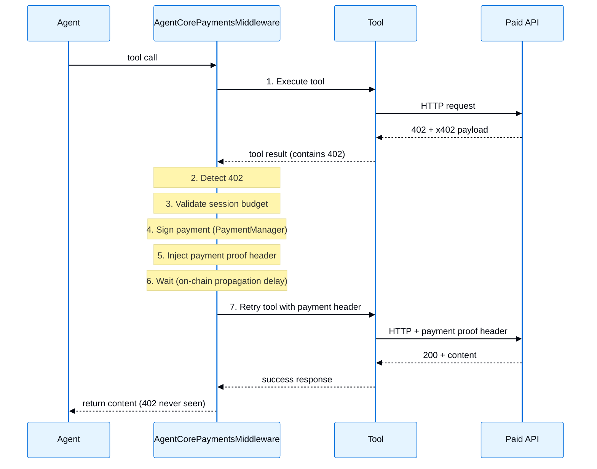

Middleware integrations for AWS services. Prompt caching is designed for models hosted on Amazon Bedrock, while AgentCore Payments works with LangGraph agents regardless of model provider. Learn more about [middleware](/oss/python/langchain/middleware/overview).

| Middleware | Description |
|------------|-------------|
| [Prompt caching](#prompt-caching) | Reduce costs by caching repetitive prompt prefixes |
| [AgentCore Payments](#agentcore-payments) | Autonomous x402 micropayment handling for paid APIs |

## Prompt caching

Reduce inference latency and input token costs by caching frequently reused prompt prefixes on Amazon Bedrock. `BedrockPromptCachingMiddleware` enables caching through `model_settings`. `ChatBedrock` and `ChatBedrockConverse` then translate that into the correct AWS wire format at request time. Cache checkpoints are placed after the system prompt, tool definitions, and the most recent message where supported, so that the model can skip recomputation of previously seen content on subsequent requests. Cache placement varies by API and model family: for example, Nova skips some tool definition and tool-result cases.

Prompt caching is useful for the following:

- Multi-turn conversations with long, consistent system prompts
- Agents with many tool definitions that remain constant across invocations
- Document-based Q&A where users ask multiple questions over the same uploaded context
- Batch processing workloads with repeated static content

Supported models:

- **Anthropic Claude**
- **Amazon Nova**

<Info>
    Learn more about [AWS Bedrock prompt caching](https://docs.aws.amazon.com/bedrock/latest/userguide/prompt-caching.html) strategies and limitations. Cached content must exceed 1,024 tokens for a cache checkpoint to take effect, sometimes more depending on model. See [supported models, regions, and limits](https://docs.aws.amazon.com/bedrock/latest/userguide/prompt-caching.html#prompt-caching-models).
</Info>

**API reference:** [`BedrockPromptCachingMiddleware`](https://reference.langchain.com/python/langchain-aws/middleware/prompt_caching/BedrockPromptCachingMiddleware)

```python ChatBedrockConverse
from langchain_aws import ChatBedrockConverse
from langchain_aws.middleware.prompt_caching import BedrockPromptCachingMiddleware
from langchain.agents import create_agent

agent = create_agent(
    model=ChatBedrockConverse(model="us.anthropic.claude-sonnet-4-5-20250929-v1:0"),
    system_prompt="<Your long system prompt here>",
    middleware=[BedrockPromptCachingMiddleware(ttl="1h")], # [!code highlight]
)
```

```python ChatBedrock
from langchain_aws import ChatBedrock
from langchain_aws.middleware.prompt_caching import BedrockPromptCachingMiddleware
from langchain.agents import create_agent

agent = create_agent(
    model=ChatBedrock(model="us.anthropic.claude-sonnet-4-5-20250929-v1:0"),
    system_prompt="<Your long system prompt here>",
    middleware=[BedrockPromptCachingMiddleware(ttl="5m")], # [!code highlight]
)
```

<Accordion title="Configuration options">

<ParamField body="type" type="string" default="ephemeral">
    Cache type. For `ChatBedrock`, only `'ephemeral'` is currently supported. For `ChatBedrockConverse`, this value is ignored as the Converse API always uses `"default"` cache type.
</ParamField>

<ParamField body="ttl" type="string" default="5m">
    Time to live for cached content. Valid values: `'5m'` or `'1h'`. Note that Amazon Nova models only support `'5m'`.
</ParamField>

<ParamField body="min_messages_to_cache" type="number" default="0">
    Minimum number of messages before caching starts.
</ParamField>

<ParamField body="unsupported_model_behavior" type="string" default="warn">
    Behavior when using unsupported models. Options: `'ignore'`, `'warn'`, or `'raise'`.
</ParamField>

</Accordion>

<Accordion title="Full example">

The middleware caches content up to and including the latest message in each request. On subsequent requests within the TTL window (5 minutes or 1 hour), previously seen content is retrieved from cache rather than reprocessed, reducing costs and latency.

**How it works:**
1. First request: System prompt, tools, and the user message are sent to the API and cached
2. Second request: The cached content is retrieved from cache. Only the new message needs to be processed
3. This pattern continues for each turn, with each request reusing the cached conversation history

<Note>
    Prompt caching reduces API costs by caching tokens, but does **not** provide conversation memory. To persist conversation history across invocations, use a [checkpointer](https://langchain-ai.github.io/langgraph/concepts/persistence/#checkpointer-libraries) like `MemorySaver`.
</Note>

```python
from langchain_aws import ChatBedrockConverse
from langchain_aws.middleware.prompt_caching import BedrockPromptCachingMiddleware
from langchain.agents import create_agent
from langchain_core.runnables import RunnableConfig
from langchain.messages import HumanMessage
from langchain.tools import tool
from langgraph.checkpoint.memory import MemorySaver


@tool
def get_weather(city: str) -> str:
    """Get the current weather for a city."""
    return f"The weather in {city} is sunny and 72F."


# System prompt must exceed 1,024 tokens for caching to take effect
LONG_PROMPT = (
    "You are a helpful weather assistant with deep expertise in meteorology, "
    "climate science, and atmospheric phenomena. When answering questions about "
    "weather, provide accurate and up-to-date information. "
    + "You should always strive to give the most helpful response possible. " * 85
)

agent = create_agent(
    model=ChatBedrockConverse(model="us.anthropic.claude-sonnet-4-5-20250929-v1:0"),
    system_prompt=LONG_PROMPT,
    tools=[get_weather],
    middleware=[BedrockPromptCachingMiddleware(ttl="5m")], # [!code highlight]
    checkpointer=MemorySaver(),  # Persists conversation history
)

# Use a thread_id to maintain conversation state
config: RunnableConfig = {"configurable": {"thread_id": "user-123"}}

# First invocation: Creates cache with system prompt, tools, and user message
response = agent.invoke(
    {"messages": [HumanMessage("What is the weather in Miami?")]}, config=config
)

last_msg = response["messages"][-1]
print(last_msg.content)

# Check cache token usage
um = last_msg.usage_metadata
if um:
    details = um.get("input_token_details", {})
    cache_read = details.get("cache_read", 0) or 0
    cache_write = details.get("cache_creation", 0) or 0
    print(f"Cache read: {cache_read}, Cache write: {cache_write}")

# Second invocation: Reuses cached system prompt, tools, and previous messages
response = agent.invoke(
    {"messages": [HumanMessage("How about Seattle?")]}, config=config
)
print(response["messages"][-1].content)
```

</Accordion>

### Model-specific behavior

The middleware handles differences between APIs and model families automatically:

| Feature | ChatBedrockConverse (Anthropic) | ChatBedrockConverse (Nova) | ChatBedrock (Anthropic) |
|---------|:-------------------------------:|:--------------------------:|:-----------------------:|
| System prompt caching | ✅ | ✅ | ✅ |
| Tool definition caching | ✅ | ❌ | ✅ |
| Message caching | ✅ | ✅ (excludes tool result messages) | ✅ |
| Extended TTL (`1h`) | ✅ | ❌ | ✅ |

## AgentCore Payments

<Note>
AgentCore Payments is currently in preview and requires `bedrock-agentcore>=1.18.0`.
</Note>

Autonomously handle [x402 Payment Required](https://www.x402.org/) responses in LangGraph agents. When a tool hits a paid API that returns HTTP 402, `AgentCorePaymentsMiddleware` detects the payment requirement, signs the payment via [Amazon Bedrock AgentCore Payments](https://docs.aws.amazon.com/bedrock-agentcore/latest/devguide/payments.html), enforces session budget limits, and retries the request with payment credentials. This process is transparent to the agent.

AgentCore Payments middleware lives in the `bedrock-agentcore` package. The examples below install `langchain-aws` only to configure an Amazon Bedrock model; you can use the middleware with any model provider supported by LangChain agents.

AgentCore Payments middleware is useful for the following:
- Agents that access paid APIs without manual payment logic per tool
- Enforcing spending limits at the session level before any payment is signed
- Automatically recovering from payment errors (expired sessions, insufficient budget) via callbacks
- Supporting both SigV4 and bearer token (CUSTOM_JWT) authentication

For a guided setup of PaymentManager and instruments, see the [AgentCore Payments getting started skill](https://docs.aws.amazon.com/bedrock-agentcore/latest/devguide/payments-getting-started.html#payments-getting-started-skill).

**Prerequisites:**
- An AWS account with [Amazon Bedrock AgentCore](https://aws.amazon.com/bedrock/agentcore/) access
- An AWS Region where AgentCore Payments is available: `us-east-1`, `us-west-2`, `eu-central-1`, or `ap-southeast-2`. See [Supported AWS Regions](https://docs.aws.amazon.com/bedrock-agentcore/latest/devguide/agentcore-regions.html).
- A configured **PaymentManager** resource (provides the ARN)
- A **PaymentInstrument** (wallet) provisioned for your user
- Python 3.10+

**Installation:**

```bash
pip install -U "bedrock-agentcore[langgraph]>=1.18.0" langchain-aws
```

**API reference:** [`AgentCorePaymentsMiddleware`](https://pypi.org/project/bedrock-agentcore/)

```python
from bedrock_agentcore.payments.integrations.langgraph import (
    AgentCorePaymentsConfig,
    AgentCorePaymentsMiddleware,
)
from langchain.agents import create_agent
from langchain_aws import ChatBedrockConverse

config = AgentCorePaymentsConfig(
    payment_manager_arn="arn:aws:bedrock-agentcore:us-east-1:123456789012:payment-manager/pm-abc123",
    user_id="user-123",
    payment_instrument_id="instrument-456",
    region="us-east-1",
    auto_session=True,  # session created automatically on first payment
)

payments = AgentCorePaymentsMiddleware(config)

agent = create_agent(
    model=ChatBedrockConverse(model="us.anthropic.claude-sonnet-4-5-20250929-v1:0"),
    tools=[],  # middleware auto-registers http_request + payment query tools
    middleware=[payments], # [!code highlight]
)

# 402 responses are handled automatically
result = agent.invoke({
    "messages": [{"role": "user", "content": "Fetch data from https://paid-api.example.com/data"}]
})
```

With this setup, the built-in `http_request` tool can automatically retry requests to x402-compatible paid APIs after payment succeeds. When the tool receives a supported 402 response, the middleware handles payment signing, budget enforcement, and retry. If payment processing fails, the agent receives the configured or default payment error.

### How it works



When a tool returns an HTTP 402 response with an x402 payload, the middleware:
1. Detects the payment requirement from the tool's output
2. Extracts the x402 payment details (amount, recipient, network)
3. Validates the payment against the session budget (rejects if limit exceeded)
4. Signs the payment via PaymentManager
5. Injects the payment proof header into the tool's arguments
6. Waits briefly for on-chain propagation (configurable delay)
7. Retries the original tool call with the payment header attached

### Built-in tools

The middleware automatically registers these tools (available to the agent):

| Tool | Description |
|------|-------------|
| `http_request` | Call any HTTP endpoint. 402 responses are paid automatically. |
| `get_payment_instrument` | Query details about a payment instrument |
| `list_payment_instruments` | List all instruments for a user |
| `get_payment_instrument_balance` | Check wallet balance on a chain |
| `get_payment_session` | Query session budget, status, expiry |

Set `provide_http_request=False` if you bring your own HTTP tool.

### Custom tool integration contract

For your own tools to work with auto-payment, they need two things:

**1. Signal 402 (output)**: The tool must indicate a 402 response in its return value. Three formats are supported:

```python PAYMENT_REQUIRED marker (recommended)
import json

import httpx
from langchain.tools import tool

@tool
def my_api(query: str, headers: dict = None) -> str:
    """Access a paid API. Payments handled automatically."""
    resp = httpx.get("https://paid-api.example.com/data", headers=headers or {})
    if resp.status_code == 402:
        payload = {"statusCode": 402, "headers": dict(resp.headers), "body": resp.json()}
        return f"PAYMENT_REQUIRED: {json.dumps(payload)}" # [!code highlight]
    return resp.text
```

```python Raw JSON (fallback detection)
import json

import httpx
from langchain.tools import tool

@tool
def my_api(query: str, headers: dict = None) -> str:
    """Access a paid API. Payments handled automatically."""
    resp = httpx.get("https://paid-api.example.com/data", headers=headers or {})
    return json.dumps({
        "statusCode": resp.status_code,
        "headers": dict(resp.headers),
        "body": resp.json(),
    })
```

```python Custom handler
config = AgentCorePaymentsConfig(
    ...,
    custom_handlers={"my_tool": MyCustomHandler()}, # [!code highlight]
)
```

**2. Accept and forward `headers` (input)**: The tool **must** have a `headers` parameter and forward it in its HTTP request. The middleware injects the payment header into `tool_args["headers"]` before retry:

```python
@tool
def my_api(query: str, headers: dict = None) -> str:
    resp = httpx.get(URL, headers=headers or {})  # ← forwards payment header on retry
    ...
```

Without this, the payment header is injected but never sent to the server.

### Detection priority

When a tool returns, the middleware checks for 402 in this order:
1. **Custom handler**: If registered for the tool name via `custom_handlers`, full control over detection
2. **`PAYMENT_REQUIRED:` marker**: Explicit opt-in signal in content
3. **Lenient fallback**: Parses raw JSON for `statusCode: 402` or `x402Version` + `accepts` fields

### MCP tool compatibility

MCP tools connected via `langchain-mcp-adapters` can work with the middleware when the following conditions are met:
1. The tool returns payment-related JSON (including `statusCode: 402`) as **text content** in `ToolMessage.content` (not in `ToolMessage.artifact` or `structuredContent`)
2. The tool accepts a `headers` argument and forwards it in its outbound HTTP requests

When these conditions are satisfied, the lenient fallback detection handles 402 responses automatically. For non-standard formats that are still exposed through `ToolMessage.content`, register a [custom handler](#custom-handlers). MCP `structuredContent` stored in `ToolMessage.artifact` and MCP transport-level headers require adapter or transport integration outside this middleware.

### Error handling

The middleware provides two layers of error control:

#### Error handler callback (recommended)

The error handler callback is recommended because it keeps payment lifecycle complexity out of the agent's reasoning. Without it, the agent receives error messages about expired sessions or missing instruments and must attempt to debug payment configuration, which wastes tokens and often fails. With the callback, your application code can resolve issues programmatically by creating sessions, refreshing instruments, or increasing budgets. When the callback returns `ErrorResolution.RETRY`, the middleware retries payment with the updated configuration. If the callback propagates the error, returns a custom message, raises, or exhausts its retries, the agent receives the configured or default payment error.

```python
from bedrock_agentcore.payments.integrations.langgraph import (
    AgentCorePaymentsConfig,
    AgentCorePaymentsMiddleware,
    ErrorResolution,
    PaymentErrorContext,
)
from bedrock_agentcore.payments.manager import PaymentManager

# Initialize PaymentManager for session creation in the callback
pm = PaymentManager(
    payment_manager_arn="arn:aws:bedrock-agentcore:us-east-1:123456789012:payment-manager/pm-abc123",
    region_name="us-east-1",
)

def handle_payment_error(ctx: PaymentErrorContext) -> ErrorResolution | str:
    if ctx.exception_type in ("PaymentSessionNotFound", "PaymentSessionExpired"):
        session = pm.create_payment_session(
            user_id=ctx.config.user_id,
            limits={"maxSpendAmount": {"value": "5.00", "currency": "USD"}},
            expiry_time_in_minutes=60,
        )
        ctx.config.payment_session_id = session["paymentSessionId"]
        return ErrorResolution.RETRY

    if ctx.exception_type == "InsufficientBudget":
        session = pm.create_payment_session(
            user_id=ctx.config.user_id,
            limits={"maxSpendAmount": {"value": "10.00", "currency": "USD"}},
            expiry_time_in_minutes=60,
        )
        ctx.config.payment_session_id = session["paymentSessionId"]
        return ErrorResolution.RETRY

    if ctx.exception_type == "PaymentInstrumentConfigurationRequired":
        return "Payment instrument not configured. Visit https://myapp.com/wallet/setup to set up your wallet."

    return ErrorResolution.PROPAGATE

config = AgentCorePaymentsConfig(
    payment_manager_arn="arn:aws:bedrock-agentcore:us-east-1:123456789012:payment-manager/pm-abc123",
    user_id="user-1",
    payment_instrument_id="instr-1",
    region="us-east-1",
    on_payment_error=handle_payment_error, # [!code highlight]
    max_error_retries=3,
)
```

The callback can return:

| Return | Behavior |
|--------|----------|
| `ErrorResolution.RETRY` | Retry payment with updated config |
| `ErrorResolution.PROPAGATE` | Use default deterministic error message |
| `str` | Custom message sent to the agent as `"PAYMENT ERROR: {your string}"` |

**Callback flow:**

```text
Payment exception occurs
    │
    ├── on_payment_error is None? → deterministic error ToolMessage
    │
    ▼
    Invoke callback(PaymentErrorContext)
    │
    ├── Returns PROPAGATE → deterministic error ToolMessage to agent
    ├── Returns RETRY → re-attempt payment (up to max_error_retries)
    │       ├── Success → return paid content to agent ✅
    │       └── Fails again → loop back to callback
    └── Returns str → custom error message to agent
```

**PaymentErrorContext fields:**

| Field | Type | Description |
|-------|------|-------------|
| `exception` | `Exception` | The exception instance |
| `exception_type` | `str` | Class name (e.g., `"PaymentSessionExpired"`) |
| `exception_message` | `str` | `str(exception)` |
| `tool_name` | `str` | Tool that triggered the 402 |
| `tool_args` | `dict` | The tool call arguments |
| `payment_required_request` | `dict \| None` | The 402 payload (None if error before extraction) |
| `config` | `AgentCorePaymentsConfig` | Mutable reference; modify to fix the issue |
| `retry_count` | `int` | Number of retry attempts, starting at 0 |

**Recommended resolution patterns:**

| Exception | Resolution |
|---|---|
| `PaymentSessionNotFound` / `PaymentSessionExpired` | Create new session, set `ctx.config.payment_session_id`, return RETRY |
| `InsufficientBudget` | Create session with higher limits, or PROPAGATE |
| `PaymentInstrumentConfigurationRequired` | Set `ctx.config.payment_instrument_id`, return RETRY |
| `PaymentInstrumentNotFound` | Likely config error; return PROPAGATE |
| `PaymentSessionConfigurationRequired` | Create session, or enable `auto_session=True` |
| Generic `PaymentError` | Log and return PROPAGATE; usually transient |

#### Deterministic error messages (default)

When no callback is configured (or it returns `PROPAGATE`), the agent receives a tailored error message with instructions not to retry:

| Failure | Message to agent |
|---------|----------------|
| No instrument configured | `PAYMENT ERROR: No payment instrument configured...` |
| No session configured | `PAYMENT ERROR: No payment session configured...` |
| Instrument not found | `PAYMENT ERROR: Payment instrument not found...` |
| Session expired | `PAYMENT ERROR: Payment session has expired...` |
| Insufficient budget | `PAYMENT ERROR: Insufficient budget...` |
| Payment rejected | `PAYMENT ERROR: Payment was signed but rejected by the server...` |
| Generic failure | `PAYMENT ERROR: Payment processing failed...` |

All messages include `"Do not retry this call"` and actionable guidance for the user.

### Auto-session

Skip manual session creation. The middleware creates one lazily on the first 402:

```python
config = AgentCorePaymentsConfig(
    payment_manager_arn="arn:aws:bedrock-agentcore:us-east-1:123456789012:payment-manager/pm-abc123",
    user_id="user-1",
    payment_instrument_id="instr-1",
    region="us-east-1",
    auto_session=True, # [!code highlight]
    auto_session_budget="5.00",       # $5 budget
    auto_session_expiry_minutes=120,  # 2 hours
)
```

The session is created once and reused for all subsequent payments in that middleware instance. Create one `AgentCorePaymentsMiddleware` per agent invocation (or per user request in a server). The middleware is not thread-safe.

### Payment tool allowlist

Restrict which tools get payment processing:

```python
config = AgentCorePaymentsConfig(
    ...,
    payment_tool_allowlist=["http_request", "my_paid_api"], # [!code highlight]
)

# Add at runtime
config.add_to_allowlist("new_paid_tool", "another_tool")

# Remove (reverts to all-eligible if list becomes empty)
config.remove_from_allowlist("my_paid_api")
```

Tools not in the list pass through untouched. When `None` (default), all tools are eligible.

### Bearer token authentication

For payment managers using `CUSTOM_JWT` authorizer:

```python Static token
config = AgentCorePaymentsConfig(
    payment_manager_arn="arn:aws:bedrock-agentcore:us-east-1:123456789012:payment-manager/pm-abc123",
    bearer_token="eyJhbGciOiJSUzI1NiJ9...", # [!code highlight]
    payment_instrument_id="instr-1",
    auto_session=True,
)
```

```python Dynamic token provider (recommended)
config = AgentCorePaymentsConfig(
    payment_manager_arn="arn:aws:bedrock-agentcore:us-east-1:123456789012:payment-manager/pm-abc123",
    token_provider=lambda: fetch_fresh_jwt(), # [!code highlight]
    payment_instrument_id="instr-1",
    auto_session=True,
)
```

With bearer auth, `user_id` is optional (derived from JWT `sub` claim).

### Disabling auto-payment

Use the middleware only for its built-in query tools without 402 interception:

```python
config = AgentCorePaymentsConfig(
    ...,
    auto_payment=False, # [!code highlight]
)
```

Common reasons to disable auto-payment:
- **Human-in-the-loop approval**: Surface 402 details to the user and let them authorize each payment before it is signed
- **Audit and compliance**: Log payment requests for review without executing them, ensuring all transactions are explicitly approved
- **Development and testing**: Inspect raw 402 responses during integration without triggering real payments
- **High-value transactions**: Require manual review for payments above a certain threshold before proceeding

### Custom handlers

Register custom `PaymentResponseHandler` implementations for tools with non-standard output formats:

```python
from bedrock_agentcore.payments.integrations.handlers import PaymentResponseHandler

class MyMCPHandler(PaymentResponseHandler):
    def extract_status_code(self, result):
        # result is the raw ToolMessage.content (str or list of blocks)
        ...

    def extract_headers(self, result):
        ...

    def extract_body(self, result):
        ...

    def validate_tool_input(self, tool_input):
        return isinstance(tool_input, dict)

    def apply_payment_header(self, tool_input, payment_header):
        tool_input["headers"] = tool_input.get("headers", {})
        tool_input["headers"].update(payment_header)
        return True

config = AgentCorePaymentsConfig(
    ...,
    custom_handlers={"my_mcp_tool": MyMCPHandler()}, # [!code highlight]
)
```

Custom handlers receive the **raw `ToolMessage.content`**; parse it yourself. Do not pass built-in handlers (like `GenericPaymentHandler`) as custom handlers directly; they expect a different normalized shape.

### Sync and async

The middleware provides both sync and async paths. LangGraph calls the right one automatically:

| Invocation | Path | Use case |
|---|---|---|
| `agent.invoke(...)` | Sync: `time.sleep`, direct calls | Scripts, CLI tools |
| `agent.ainvoke(...)` | Async: `asyncio.sleep`, `asyncio.to_thread` | FastAPI, web servers, Jupyter |

Install FastAPI to run the asynchronous web server example:

```bash
pip install -U fastapi
```

```python Async in FastAPI
from bedrock_agentcore.payments.integrations.langgraph import (
    AgentCorePaymentsConfig,
    AgentCorePaymentsMiddleware,
)
from fastapi import FastAPI
from langchain.agents import create_agent
from langchain_aws import ChatBedrockConverse

app = FastAPI()

@app.post("/chat")
async def chat(message: str):
    config = AgentCorePaymentsConfig(
        payment_manager_arn="arn:aws:bedrock-agentcore:us-east-1:123456789012:payment-manager/pm-abc123",
        user_id="user-1",
        payment_instrument_id="instr-1",
        region="us-east-1",
        auto_session=True,
    )
    payments = AgentCorePaymentsMiddleware(config)
    agent = create_agent(
        model=ChatBedrockConverse(model="us.anthropic.claude-sonnet-4-5-20250929-v1:0"),
        tools=[],
        middleware=[payments],
    )

    # Uses awrap_tool_call automatically without blocking other requests
    result = await agent.ainvoke({"messages": [{"role": "user", "content": message}]})
    return result
```

```python Sync in a script
from bedrock_agentcore.payments.integrations.langgraph import (
    AgentCorePaymentsConfig,
    AgentCorePaymentsMiddleware,
)
from langchain.agents import create_agent
from langchain_aws import ChatBedrockConverse

config = AgentCorePaymentsConfig(
    payment_manager_arn="arn:aws:bedrock-agentcore:us-east-1:123456789012:payment-manager/pm-abc123",
    user_id="user-1",
    payment_instrument_id="instr-1",
    region="us-east-1",
    auto_session=True,
)
payments = AgentCorePaymentsMiddleware(config)
agent = create_agent(
    model=ChatBedrockConverse(model="us.anthropic.claude-sonnet-4-5-20250929-v1:0"),
    tools=[],
    middleware=[payments],
)

# Uses wrap_tool_call automatically
result = agent.invoke({"messages": [{"role": "user", "content": "Fetch paid data"}]})
```

The async path uses:
- `await asyncio.sleep()` for the post-payment on-chain propagation delay (non-blocking)
- `asyncio.to_thread()` for PaymentManager signing calls (keeps event loop free)
- Automatic `await` on async error callbacks

### Comparison: with vs without middleware

**Without middleware** (manual wrapping):
- Write a wrapper function per tool type (~30-50 lines each)
- Handle 402 detection, x402 parsing, signing, retry manually
- Implement payment error handling for each wrapper
- Implement any required post-payment timing delay
- Create budget error messages for the agent
- Adding a new tool = another wrapper

**With middleware:**
```python
config = AgentCorePaymentsConfig(
    payment_manager_arn="arn:...",
    user_id="...",
    payment_instrument_id="...",
    auto_session=True,
)
agent = create_agent(
    model=model,
    tools=[my_tools],
    middleware=[AgentCorePaymentsMiddleware(config)], # [!code highlight]
)
```

Compatible tools that meet the [custom tool integration contract](#custom-tool-integration-contract) are handled automatically.

### Configuration reference

| Parameter | Type | Default | Description |
|-----------|------|---------|-------------|
| `payment_manager_arn` | `str` | *required* | ARN of the payment manager resource |
| `user_id` | `str \| None` | `None` | User ID. Required for SigV4 auth; optional with bearer token |
| `payment_instrument_id` | `str \| None` | `None` | Instrument ID for x402 signing |
| `payment_session_id` | `str \| None` | `None` | Session ID for budget enforcement |
| `payment_connector_id` | `str \| None` | `None` | Connector ID (optional) |
| `region` | `str \| None` | `None` | AWS region |
| `network_preferences_config` | `list[str] \| None` | `None` | Ordered CAIP-2 network identifiers |
| `auto_payment` | `bool` | `True` | Enable/disable automatic 402 processing |
| `auto_session` | `bool` | `False` | Auto-create session on first 402 |
| `auto_session_budget` | `str` | `"1.00"` | Budget (USD) for auto-created sessions |
| `auto_session_expiry_minutes` | `int` | `60` | Expiry for auto-created sessions |
| `agent_name` | `str \| None` | `None` | Agent name for data-plane headers |
| `bearer_token` | `str \| None` | `None` | Static JWT. Mutually exclusive with `token_provider` |
| `token_provider` | `Callable \| None` | `None` | Callable returning fresh JWT. Mutually exclusive with `bearer_token` |
| `payment_tool_allowlist` | `list[str] \| None` | `None` | Tools eligible for payment. `None` = all |
| `provide_http_request` | `bool` | `True` | Register built-in `http_request` tool |
| `post_payment_retry_delay_seconds` | `float` | `3.0` | Delay after signing before retry |
| `custom_handlers` | `dict[str, Handler] \| None` | `None` | Custom handlers keyed by tool name |
| `on_payment_error` | `Callable \| None` | `None` | Error callback for programmatic recovery |
| `max_error_retries` | `int` | `3` | Max retries via callback per tool call |

### Learn more

- [AgentCore Payments documentation](https://docs.aws.amazon.com/bedrock-agentcore/latest/devguide/payments.html)
- [Code samples: Agents that transact](https://github.com/awslabs/agentcore-samples/tree/main/01-features/08-agents-that-transact)
- [Blog: Introducing Amazon Bedrock AgentCore Payments](https://aws.amazon.com/blogs/machine-learning/agents-that-transact-introducing-amazon-bedrock-agentcore-payments-built-with-coinbase-and-stripe/)
- [Technical deep dive: AgentCore Payments and innovation in agentic commerce](https://aws.amazon.com/blogs/machine-learning/technical-deep-dive-agentcore-payments-and-innovation-in-agentic-commerce/)

---

<div className="source-links">
<Callout icon="terminal-2">
    [Connect these docs](/use-these-docs) to Claude, VSCode, and more via MCP for real-time answers.
</Callout>
<Callout icon="edit">
    [Edit this page on GitHub](https://github.com/langchain-ai/docs/edit/main/src/oss/python/integrations/middleware/aws.mdx) or [file an issue](https://github.com/langchain-ai/docs/issues/new/choose).
</Callout>
</div>
